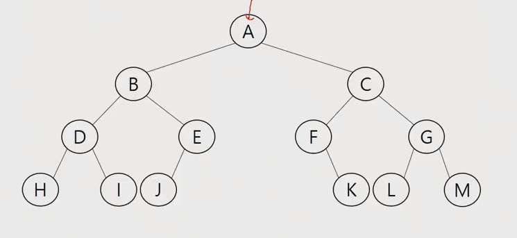
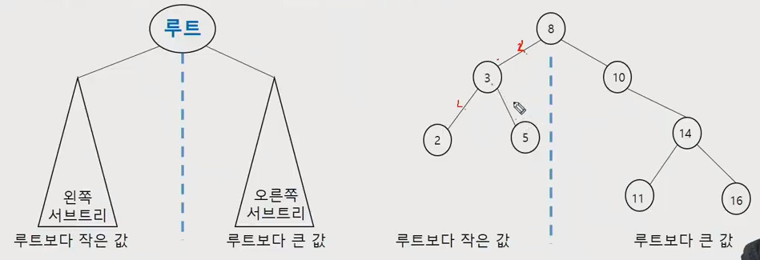
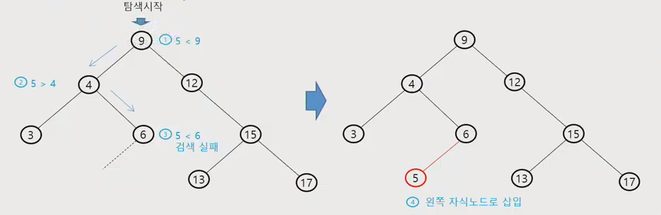

# APS 210405 - 트리/이진트리


## 트리

- 비선형구조
- 원소 간 부모 자식관계를 1:N 관계로 가진 자료구조
- 원소들 간에 계층관계를 가지는 계층형 자료구조 
- 상위에서 하위로 내려가며 확장하는 나무 모양의 구조
- 노드 중 최상위 노드를 루트라고 하고, 각 노드들은 개별의 서브 트리로 구성이 가능하다.
- 최하단에 있는 노드들을 리프노드라고 한다.

<br>

---


### 트리 - 핵심 용어 - 트리의 핵심 요소이므로 반드시 알아둘 것

- 노드(node) - 트리의 원소 - 그래프의 vertex와 거의 유사
- 간선(edge) - 부모 노드와 자식 노드를 연결하는 선
- 루트(root) 노드 - 트리의 최상단 노드(시작점) + 부모가 없음
- 형제(sibling) 노드 - 같은 부모 노드의 자식 노드들
- 조상 노드 - 간선을 따라 루트 노드까지 이르는 경로에 있는 모든 노드들(부모들)
- 서브 트리(subtree) - 부모 노드와 연결된 간선을 끊었을 때 생성되는 트리(즉 특정 지점을 루트로 한 트리)
- 자손 노드 - 서브 트리에 있는 하위 레벨의 노드들 - (특정 지점을 루트로 한 서브 트리를 생성 했을 때 그 밑에 있는 모든 노드들)

- 차수(degree) 
  - 노드의 차수 - 현재 노드에 연결된 자식 노드의 수
  - 트리의 차수 - 트리에 있는 노드의 차수 중에서 가장 큰 값 (전체 트리 중에서 자식을 가장 많이 가진 곳의 갯수)
  - 단말 노드(리프 노드) - 차수가 0인 노드. 즉 자식 노드가 없는 노드
- 높이(level, height) - 최상단(루트)을 1로 시작하는 사람도 있고 0으로 시작하는 사람도 있음 - 주로 0으로 쓴다.
  - 노드의 높이 - 루트에서 해당 노드에 이르는 간선의 수. 노드의 레벨 
  - 트리의 높이 - 트리에 있는 노드의 높이 중에서 가장 큰 값. 최대 레벨

<br>

---


## 이진트리

- 모든 노드들이 2개의 서브트리를 갖는 트리
- 각 노드가 자식 노드를 **최대 2개**까지 가질 수 있음(0, 1, 2)
  - 왼쪽 자식 노드(left child node)
  - 오른쪽 자식 노드(right child node)
- 레벨 i 에서의 노드의 최대 개수는 2의 i제곱
- 높이가 h인 이진 트리가 가질 수 있는 노드의 최소 개수는 (h+1)개가 되며, 최대 개수는 2의 h+1 제곱 - 1

<br>

---

### 이진트리 - 종류

#### 포화 이진 트리(Full Binary Tree)

- 모든 레벨에 노드가포화상태로 꽉 차 있는 이진 트리
- 높이가 h 일 때, 최대의 노드 개수인 2의 h+1 제곱 - 1 개의 노드를 가진 이진 트리
- 루트를 1번으로 하여 2의 h+1 제곱 - 1 까지 정해진 위치에 대한 노드 번호를 가짐


#### 완전 이진 트리(Complete Binary Tree)

- 높이가 h 이고 노드 수가 n개일 때, 포화 이진 트리의 노드 번호 1번부터 n번까지 빈 자리가 없는 이진 트리
- 꽉 차진 않더라도 중간에 빈 것은 없어야함


#### 편향 이진 트리(Skewed Binary Tree)

- 높이 h에 대한 최소 개수의 노드를 가지면서 한 쪽 방향의 자식 노드만을 가진 이진 트리
- 왼쪽 편향, 오른쪽 편향 2가지만 존재, 사실 비선형구조의 장점이 없어지는 결과라서 실제로 사용되는 일은 적을 듯?(리스트 처음부터 끝까지 찾는 것과 차이가 없음)

<br>

---


### 이진트리 - 순회(traversal)

- 순회란 트리의 노드들을 체계적으로 방문하는 것 - 트리는 선후 관계가 없는 비선형 구조이므로 탐색 순서에 기준을 두고 진행해야 모든 노드가 문제없이 순회 가능
- v - 루트, l - 왼쪽 서브트리, r - 오른쪽 서브트리 기준
- 3가지의 기본적인 순회 방법
  - 전위 순회(preorder traversal)  - 부모 노드 방문 후, 자식 노드를 좌, 우 순서로 방문한다. vlr
  - 중위 순회(inorder traversal) - 왼쪽 자식 노드, 부모 노드, 오른쪽 자식 노드 순으로 방문 - lvr
  - 후위 순회(postorder traversal) - 자식 노드를 좌, 우 순서로 방문 후, 부모 노드 방문 - lrv


#### 전위 순회 알고리즘

```python
def preorder_traverse(n):
    if n: # 해당 노드가 존재 한다면
        visit(n) # print(n.item) - 부모 처리
        preorder_traverse(n.left) # 왼쪽 자식 처리
        prtorder_traverse(n.right) # 오른쪽 자식 처리
```


#### 중위 순회 알고리즘

```python
def inorder_traverse(n):
    if n: # 해당 노드가 존재 한다면    
        inorder_traverse(n.left) # 왼쪽 자식 처리
        visit(n) # print(n.item) - 부모 처리
        inorder_traverse(n.right) # 오른쪽 자식 처리      
```


#### 후위 순회 알고리즘

```python
def postorder_traverse(n):
    if n: # 해당 노드가 존재 한다면    
        postorder_traverse(n.left) # 왼쪽 자식 처리
        postorder_traverse(n.right) # 오른쪽 자식 처리
        visit(n) # print(n.item) - 부모 처리
```


### 이진트리 - 순회 연습 문제



####  순회에 따른 결과

- 전위 순회 - A-B-D-H-I-E-J-C-F-K-G-L-M
- 중위 순회 - H-D-I-B-J-E-A-F-K-C-L-G-M
- 후위 순회 - H-I-D-J-E-B-K-F-L-M-G-C-A


### 이진트리의 표현 - 배열을 통한 구현

- 위에서 아래로, 좌에서 우로 번호를 매겨가며 노드를 생성 - 노드를 구분해서 접근을 쉽게하기 위해(배열 인덱스로 바로 접근)
- 매겨놓은 노드번호를 매개로 한 성질
  - 노드 번호가 i 인 노드의 부모 노드 번호? [i/2]
  - 노드 번호가 i 인 노드의 왼쪽 자식 노드 번호? 2*i
  - 노드 번호가 i 인 노드의 오른쪽 자식 노드 번호? 2*i+1
  - 레벨 n의 노드 번호 시작 번호는? 2의 n 제곱


#### 알고리즘

- 수학 문제를 풀더라도 공식이나 문제 유형에 따른 적절한 방법을 알면 쉽게 풀 수 있듯이, 알고리즘도 다양한 개념 및 문제를 풀어봄으로써 적절한 공식, 방법을 배울 수 있다.
- ~~한 문제일 땐 이것을 사용하는 것이 유용하다. 그러한 기법들을 배우는 것 - 오늘은 트리

- 이진트리를 사용하는 이유 - 기계어 처럼 0, 1 2가지로만 가능해서 단순하고 간단함. 또한 추후에 구현을 배열로 할 경우 리스트로 하는데 구현에 있어서 메모리 낭비가 덜하고 구현하기 쉬운편이므로 주로 사용하게 됨. (만약 100진트리라면? 구현할 때 리스트를 매번 매 자식 노드 마다 100칸 공간 확보 -> 사용 안하면 메모리 낭비) 
- 이후 이진트리의 표현, 구현법, 개념 다시 한번 정리
- 트리는 그래프와 크게 다르지 않지만(정점, 간선) 상하 관계(부모, 자식)가 존재하고 좌, 우로 나누어 진다는 것이 차이가 있다.
- int(-3/2) -> 1 -3//2 -> -2(float) 
- [-1.5] -> -2 [1.5] -> 1


#### 연습문제

트리의


## 이진 탐색 트리

- 탐색작업을 효율적으로 하기 위한 자료구조
- 이진 트리 이므로 각 노드는 최대 2개의 자식을 가짐
- 모든 원소는 서로 다른 유일한 키를 갖는다.
- key(왼쪽 서브트리) < key(루트 노드) < key(오른쪽 서브트리)
- 왼쪽 서브트리와 오른쪽 서브트리도 이진 탐색 트리다.
- 중위 순회하면 오름차순으로 정렬된 값을 얻을 수 있다.




### 이진 탐색 트리 - 연산

- 루트에서 시작한다.
- 탐색할 키 값 x를 루트 노드의 키 값과 비교한다.
- 찾는 값 = 루트 노드의 값 - 찾았으므로 탐색 종료
- 찾는 값 < 루트 노드의 값 - 루트 노드의 왼쪽 서브트리에 대해서 탐색연산 재실행(재귀 느낌으로)
- 찾는 값 > 루트 노드의 값 - 루트 노드의 오른쪽 서브트리에 대해서 탐색연산 재실행(재귀 느낌으로)
- 해당 값을 찾을 때 까지 위의 조건을 반복, 끝까지 내려 왔음에도 찾지 못함 - 값이 없음
- 이진 탐색트리는 좌우 균형을 잘 맞췄을 경우 log n의 탐색 시간을 가진다.
- 한쪽으로 편향된 탐색트리일 경우(최악) n의 탐색 시간이 걸린다. - 선형과 같음


### 삽입 연산

1. 먼저 탐색 연산을 수행
   - 삽입할 원소와 같은 원소가 트리에 있으면 삽입 할 수 없으므로, 같은 원소가 트리에 있는지 탐색하여 확인한다.
   - 탐색에서 탐색 실패가 결정되는 위치가 삽입 위치가 된다.
2. 탐색 실패한 위치에 원소를 삽입한다.
3. 예시는 5를 삽입하는 예이다.



<br>

---


### 이진 탐색 트리 - 탐색 성능

- 탐색, 삽입, 삭제 시간은 트리의 높이 만큼 시간이 걸린다. O(h),  h - BST의 깊이(height)
- 평균의 경우 - 이진 트리가 균형적으로 생성되어 있는 경우 O(log n)
- 최악의 경우 - 한쪽으로 치우진 편향 이진트리의 경우 O(n) - 선형 순차탐색과 시간복잡도가 같다.
- 검색 알고리즘 간 비교
  - 배열에서의 순차 검색 - O(n)
  - 정렬된 배열에서의 순차 검색 - O(n)
  - 정렬된 배열에서의 이진 탐색 - O(log n) - 고정된 배열 크기와 삽입, 삭제 시 추가 연산이 필요
  - 이진 탐색 트리에서의 평균 - O(log n) - 최악 O(n) 완전 이진 트리나 균형트리로 바꾸면 최악의 경우를 없애줌 -> 레드블랙트리, avt 트리? 
    - 이외에 이론서에서 소개 되는 트리들
    - 다차원 트리? -> KD, KDB 트리, R트리 ...
    - 트리가 아닌 경우 -> 그리드 파일...
  - 해쉬 검색 - O(1) 추가 저장 공간이 필요


### 이진 탐색 트리 - 연산 연습

#### 삭제 연산


### 참고 - 힙(heap)

- 완전 이진 트리에 있는 노드 중에서 키값이 가장 큰 노드나 키값이 가장 작은 노드를 찾기 위해서 만든 자료구조
- 최대 힙(max heap)
  - 키 값이 가장 큰 노드를 찾기 위한 완전 이진 트리
  - {부모노드 키값 > 자식노드 키값}
  - 루트노드 : 키값이 가장 큰 노드
- 최소 힙(max heap)
  - 키 값이 가장 작은 노드를 찾기 위한 완전 이진 트리
  - {부모노드 키값 < 자식노드 키값}
  - 루트노드 : 키값이 가장 작은 노드

- 삽입 - 빈 공간에 삽입 이후 루트까지 올라가며 크기 비교 후 자리 교체
- 삭제 - 루트 원소 삭제 최하단에 있는 값을 루트로 올림 -> 내려가면서 자리 교체(최대 힙이면 자식 중 큰 값과 비교 후 위로, 최소 힙이면 자식 중 작은 값과 비교 후 체인지)

#### 정리2

- 나중에 힙을 통해 정렬 가능?
- 알고리즘에서 트리는 일반적으로 이진 트리를 자주 사용함
- 힙은 동일한 값이 있어도 됨 이진 트리는 안됨