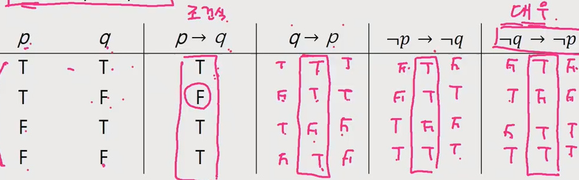

# APS 210407 컴퓨팅 사고력

## 서론 - 프로그래밍과 논리/수학

### 프로그래밍의 어려운 점 두 가지

- 프로그래밍 언어 문법과 라이브러리 사용 - 각 언어마다의 문법이 미묘하게 다름 + 특정 기능을 사용하기 위해선 언어마다 다른 라이브러리를 알아야함
- 논리(Hard Logic)

### 문법과 라이브러리

- 많이 알려진 어려운 점.
- 처음 코드를 보았을 때 무슨 내용인지 어떤 진행을 하는지 알 수 없음

- 능숙해지기 위해 많은 노력이 필요하지만 대부분 훈련의 필요성을 알고 있으므로 별 무리 없이 훈련을 진행함.
- 그러므로 최초에 배울때는 어려움이 있지만 훈련에 비례하여 성장하기 때문에 성취감으로 꾸준히 진행하는 것이 가능한 편

### 논리

- 프로그래밍시 논리적으로 문제를 파악해서 접근하는 것은 개인이 스스로 이러한 사고를 하도록 노력하지 않으면 연습이 되지 않으므로 개인적인 훈련을 하기가 어려움
- 또 훈련의 필요성에 대해서도 정확히 알려지지 않았기 때문에 사람들이 생각보다 해야할 이유를 찾기 어려움

- hard vs soft logic?
- 카드 문제 예시
- 맥주집 문제

#### hard (증명) vs soft (직관) logic

- 맥주집 문제를 풀 때는 직관을 사용한 것
- 직관은 논리적인 느낌을 주는 것
- 직관의 장점은 (익숙한 상황에서) 빠르다는 것
- 직관의 단점은 정확하지 않다는 것 (가끔은 익숙한 상황에서도 틀림)
- 또 다른 단점은 강한 착각을 일으키는 것

- 일상생활에서는 soft logic (직관)을 사용 - 논리적으로 부정확한 표현을 사용하지만, 어떤 의미인지 모든 사람이 이미 알고 있다는 가정이 존재
- 프로그래밍은 hard logic 을 사용 - 프로그래밍 언어의 표현들이 모두 논리학에서 나온 것, 사용되는 수많은 알고리즘들을 이해하기 위해서는 hard logic이 필요

#### 알고리즘을 볼 때 제대로 이해가 안되는 오해의 원인

- soft logic 으로 알고리즘을 이해하려고 하는 것
- 알고리즘 설명을 보고 또 봐도 이해가 안되는 것은 증명을 안봤기 때문
- 증명을 봐도 이해가 안되는 것은 직관으로 이해하려고 하기 때문
- 가끔 직관으로 이해가능한 알고리즘이 있지만 문제가 조금 어려워지면 직관으로 완전한 이해를 얻는 것은 사실상 불가능

#### 논리학에 대해 들어가기 전 알아야할 기초

1. 명제
   - 참이나 거짓을 알 수 있는 식이나 선언적 문장
   - p, q, r ... 로 표현
   - 예) 대한민국의 수도는 서울이다, 1+1=3
2. 진릿값
   - 참이나 거짓을 표현
   - T, F 또는 1, 0
3.  부정 NOT
   - p가 명제일때 명제의 진릿값이 반대
   - ~p 또는 ㄱp로 표기(not p 또는 p의 부정으로 읽음)
4. 논리곱 AND
   - p, q가 명제일 때, p, q 모두 참일 때만 참이 되는 명제
   - p ^ q (p and q, p 그리고 q)
5. 논리합 OR
   - p, q가 명제일 때, p, q 모두 거짓일 때만 거짓이 되는 명제
   - p V q (p or q, p 또는 q)
6. 배타적 논리합 XOR
   - p, q가 명제일 때, p, q 중 하나만 참일 때 참이 되는 명제
   - p  q (p xor q)
7. [합성]
   - 연산자 우선 순위 ㄱ > V,  ^ > ->, <->
   - 항진명제 - 진릿값이 항상 참
   - 모순명제 - 진릿값이 항상 거짓
   - 사건명제 - 항진명제도 모순명제도 아닌 명제
8. 조건명제
   - p, q가 명제일 때, 명제 p가 조건(또는 원인), q가  결론(또는 결과)로 제시되는 명제
   - p -> q (p이면 q이다.)
   - 조건 명제는 항상 q 값에 따라 결과가 결정된다.
   - q가 T 일때는 무조건 T, F일때는 p도 F 여야 T
   - p가 T이고 q가 F 일때만 F 나머지는 다 T
9. 쌍방조건 명제
   - p, q가 명제일 때, 명제 p와 q가 조건(또는 원인)이면서  결론(또는 결과)인 명제
   - p <-> q (p면 q고, q면 p다.)
   - 서로의 진릿값이 같을 때만 T (T, T or F, F)
10. 조건명제 p -> q 의 역, 이, 대우
    - 역 : q -> p
    - 이 : ~p -> ~q
    - 대우 : ~q -> ~p - 대우의 ~p 부분의 진릿값은 p -> q의 진릿값과 같다.

**명제식을 하나의 일반 세계의 상식선에서 생각하지 말고 하나의 논리적 식으로 생각하고 풀기(상식선에서 맞다 틀리다는 생각하지 말고)**

#### 증명

- 증명은 정확한 명제식으로 표현할 수 있는 것이어야 함
- 보통은 정확한 명제식까지 쓰지는 않으나 근본적으로는 명제식으로 바꿀 수 있음
- 증명에 대한 수많은 오해가 p -> q 를 p <-> q 와 혼동하는 것에서 일어남
- 모든 당구공은 색이 같다는 다음 증명에서 잘못된 것은?

#### ??

- 직접증명, 간접증명??

## 오후 웹 코칭

- 순열이나 조합같이 경우의 수 같은 것을 이용한 문제를 풀던가 부분 집합을 이용해 문제를 풀던가
- 알고리즘을 풀다보면 다양한 수학 지식을 가지고있으면 쉽게 접근하여 풀 수 있는 문제가 많다.
- 그러한 알아둬야 할 수학 개념을 모아놓은 과목이 컴퓨팅 사고력
- 오전에 배운 것을 다시 한번 복습 - 개념이 어려워 이해가 어려우므로 다시한번 반복을 통해 이해를 하도록 함
- 알고리즘 문제를 풀 때 여러 기법을 배우기 위해 알고리즘의 효율성이나 명확한 명제를 가진 코드를 구성하기 위해 여러 수학적 지식이 필요 (시간복잡도 계산, 논리식, 이산수학, 선형대수 등)

### 1. 명제 

- 논리의 기본 구성 요소, 의문문, 명령문 등은 포함 안됨 평서문을 기준으로 함, 기준에 따라 참, 거짓이 달라지는 경우 명제가 아님

- 명제에서 타당하면 T, 아니면 F
- 컴퓨터에서 명제가 왜 필요하냐? - 컴퓨터는 하나의 값만 달라져도 결과값이 크게 바뀐다. 그래서 항상 타당한 명제를 기반으로 컴퓨터 조건 등을 작성하게 됨
- 예를 들어 if 조건문을 적을 때 x가 많으면 이라고 적으면 명확한 범위를 모르므로 컴퓨터가 계산할 수 없음 x > 10 과 같이 일정한 범위를 적어놔야 컴퓨터가 인식 가능
- 즉 명제는 참이 되든 거짓이 되든 명확하게 값이 떨어져야 함
- x + 2 = 0 같이 x 의 값에 따라 참, 거짓이 나뉘는 경우 명제가 아님

### 2. 논리연산과 논리연산자

- 단순명제 - 더이상 나눌 수 없는 단위의 명제 - 1+1 = 2
- 합성명제 - 하나 이상의 단순명제가 연산에 의해서 결합되어 만들어진 명제 - 복합명제, 겹명제라고도 함
  - 예 ) 조지 워싱턴은 미국인이고 도쿄는 영국의 수도이다.
- 진리표 - 단순명제나 합성명제의 모든 가능한 진리값을 나열한 표, 단순 명제의 수가 많아 질 수록 자연어로 서술하기 어려우므로 진리표로 작성함 - p, q를 기준 1,1 1,0 0,1 0,0 4가지
- 논리연산자 - 합성명제는 여러 단수명제들을 논리연산자로 연결하여 만들 수 있음, 논리연산자를 이용하여 하나 이상의 명제를 가공하여 또 다른 명제를 만들 수 있음 (논리합 - (or, V),  조건명제(->) 등)
  - 논리합 (V) - `또는` 둘 중 하나라도 참이면 참, 모두 거짓일 때만 거짓
  - 논리곱 (^) - `그리고` 둘 모두 참일 때만 참, 나머지는 모두 거짓
  - 부정 (~) - 명제의 진리값을 반대로 하는 연산 ~p (not p)
  - 조건명제 (->) 어떤 사실의 인과관계를 나타내는 명제 (p이면 q이다) - 진리표 계산시 특이한 점이 보이는데 예시를 통해 제시
    - 조건명제 100점이면 100만원을 준다.
    - 80점인데 100만원을 줬다. -> 100만원일때는 준다고 했지 80만원일 때 안준다고 하진 않았음 자기 마음대로 줘도 되고 안줘도 됨 -> T
    - 100점일 때 100만원을 줬다. -> 조건을 지킴 T
    - 90점인데 100만원을 안줬다. -> 조건을 지킴 T
    - 100점인데 100만원을 안줬다. -> 100점인데 100만원을 안줬으므로 명백한 조건 위배
    - p -> q = ~p V q 와 같은 결과가 나옴(동치)
  - 쌍조건명제 (<->) 두 개의 조건 명제가 결합

### 3. 동치

- 논리적 동치 (=)
  - 조건명제 p -> q 는 역, 이, 대우를 갖음 (q -> p, ~p -> ~q, ~q -> ~p), 어떠한 조건명제는 대우와 동치 관계임(같다) - 진리표를 계산하면 같은 결과 
    - 영희가 서울에 있다면 그녀는 한국에 있는 것이다. = 영희가 한국에 없다면 그녀는 서울에 없는 것이다.

### 2-1 논리적 증명

- 공리(Axiom) - 어떤 특정 명제를 증명하기 위해 전제로 사용되는 기본적인 과정이며 별도의 증명 없이 항상 참이라고 사용되는 명제 (유클리드 기하학, 페아노의 공리, 공리적 집합론 등)

- 증명(proof) - 어떤 명제가 진리라는 것을 주장할 때 그 명제가 참이라는 것을 확정하는 과정

- 컴퓨터 과학에서의 증명
  - 작성된 프로그램이 올바르게 동작하는지 검증 필요 - 검증을 통해 정확성을 높이고 오류를 줄일 수 있음
  - 개발자가 어떤 프로그램을 새로 개발하면 그 프로그램의 속도나 효율성 등 여러 가지 검증 자료를 정리하여 이전의 프로그램보다 향상된 기능을 보여줘야 하는데 이러한 과정을 증명이라 함
  - 증명은 논리적인 식을 통해 주로 이루어 지지만, 때로는 자연어를 이용하기 때문에 해석에 따라 애매 모호한 부분이 발생 가능하므로 자연어를 사용할 때는 모호하지 않는 언어를 선택해야 함

- 정리(theorem) - 공리들을 바탕으로 논리적으로 증명된 결론 (이미 증명이 입증되어 어떠한 공식처럼 사용되는 명제들) 
  - 보조정리(lemma) - 정리를 증명하는 과정에서 사용되는 증명된 명제
  - 따름정리(corollary) -
  - 예시 - 피타고라스의 정리(직각삼각형 세변에 대해  a 제곱, + b 제곱 = c 제곱), 유클리드 정리(소수는 무한히 많다.)

- 증명 방법 - 크게 3가지
  - 수학적 귀납법 - 기본 단계, 귀납가정, 귀납단계를 이용해 자연수 n에 대한 명제의 성질을 증명하는데 유용 (해당 수식이 성립함을 자연수를 통해 증명)
  - 직접 증명법 - 공리와 정의, 그리고 정리를 논리적으로 직접 연결하여 증명하는 방법
  - 간접 증명법 - 증명해야 할 명제를 증명하기 쉬운 형태로 변형하여 증명하는 방법 (대우증명법, 반례증명법 등)
  - 그 외의 증명법 - 전수증명, 조합적 증명법, 컴퓨터 이용 증명법

### 2-2 수학적 귀납법

- 귀납법 - 개개의 사실을 모두 관찰하여 일반화하는 증명방법
- 귀납적 방법을 이용하여 증명하는 것으로 모든 자연수 n에 대해 명제를 증명하는데 유용한 바업
- 먼저 n=1 일 때 명제가 참임을 증명하고 그 다음에는 n = k (임의의 자연수 k)일 때 참이면 n = k+1 일 때도 참임을 증명하는 방식

### 2-3 직접증명법

- 연역법이라고도 함 (이미 증명된 하나 또는 둘 이상의 명제를 전제로 새로운 명제를 만들어내서 증명)
- 명제를 변형하지 않고 증거를 직접 사용하여 증명, 주어진 명제가 참이라고 가정하고 정리와 공리를 이용해 명제가 참이 됨을 증명
- 명제의 함축 p -> q가 참이 됨을 증명하기 위해 명제 p를 참이라고 가정하고, 여러 가지 정리와 식을 이용하여 명제 q 또한 참이 됨을 증명하는 것

### 2-4 간접 증명법

- 주어진 명제가 어려울 때 논리가 어긋나지 않는 범위에서 증명하기 쉬운 명제로 변화시켜 증명하는 방법
- 조건명제 p -> q 를 다양한 형태로 변형하여 증명 - 단 동치인 형태로
- 대우증명법, 모순증명법, 반례증명법, 존재증명법 등
  - 대우증명법
  - 모순증명법 - 주어진 명제를 부정한 뒤 그 식을 전개할 때 결론이 모순임을 보여 명제가 참임을 증명하는 방법, 본 명제 p -> q 에 대한 부정이 거짓임을 증명하여 본 명제가 참임을 증명 (부정 명제가 거짓이면 본 명제는 참)
  - 반례증명법 - 주어진 명제에 모순이 되는 예를 하나 보임으로써 명제가 거짓임을 증명하는 방법, 명제를 거짓이 되게 하는 단 하나의 예라도 존재하면 그 명제는 거짓 (알고리즘 문제를 풀었을때 특정 테스트 케이스만 맞는 경우 반례가 존재함을 의미)

### 2-5 다양한 증명방법

- 전수증명, 조합적 증명법, 컴퓨터를 이용한 증명

## 오후 라이브

## 오후 웹코칭 2

- 시간복잡도? - 알고리즘이 완료되는데 걸리는 대략적인 시간 (연산 횟수)
- 예를 들어 누적합을 단순히 for문으로 돌리면 o(n) 이지만  n = n(n+1)/2 로하면 o(1)로 풀린다.
- 점근적 표기법 - 단순히 적은 량의 데이터면 1초 이내에 처리가 되겠지만 수십, 수백억의 데이터를 다룬다면 어떠한 수식을 쓰냐에 따라 결과 시간이 차이가 날 것 - 그러한 굉장히 큰 데이터에 대해 각 수식 별 대략적인 시간을 표기함으로써 서로 간의 시간을 비교
- 빅-오 표기법 - 점근적 표기법 중에서 가장 많이 쓰이는 표기법
  - 최악의 경우의 알고리즘 수행 시간을 나타냄 
  - 최악의 경우에도 이정도의 시간 성능을 보장하기 때문에 가장 자주 사용하는 알고리즘 성능 표기법
  - 처리에 필요한 시간의 최대치 (아무리 경우가 안좋아도 주어진 빅오 표기 시간 이상으로 시간이 걸리진 않음)
  - 점근적 상한선(upper bound)
  - 기본적으로 수식에서 최고차항을 기준으로 O() 을 정하게됨 2n+c+1 => O(n)
- 점화식?
- 재귀
  - 같은 작업을 반복하되 크기가 점점 줄어드는 경우 재귀를 사용할 수 있음
  - 크기가 줄어들지 않고 같은 재귀를 계속 반복할 경우 무한루프에 빠짐(탈출 조건이 없음)
  - 그래서 재귀함수를 호출할 때는 항상 탈출 조건과 재 실행시 재귀의 범위를 줄여서 실행하는 것이 필요함

