APS 210409

## 오전 라이브 - 문제풀이

### 논리와 증명

- 문제 1-2

- 문제 2-2

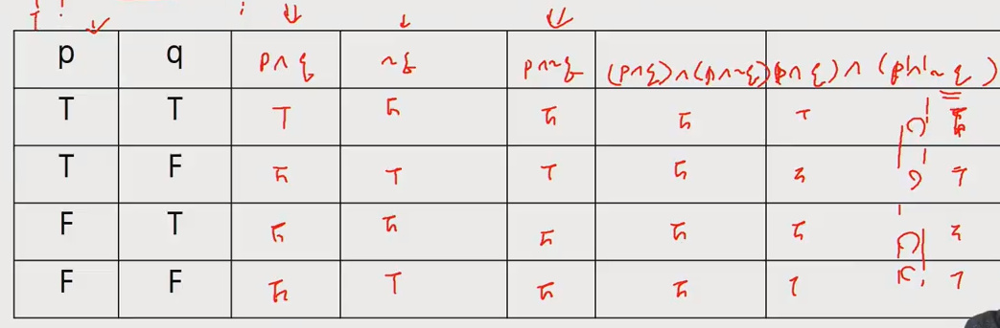

- 문제 3-2 - 드로르간의 법칙 ~(p v q ) = ~p ^ ~q, ~(p ^ q) = ~p v ~q

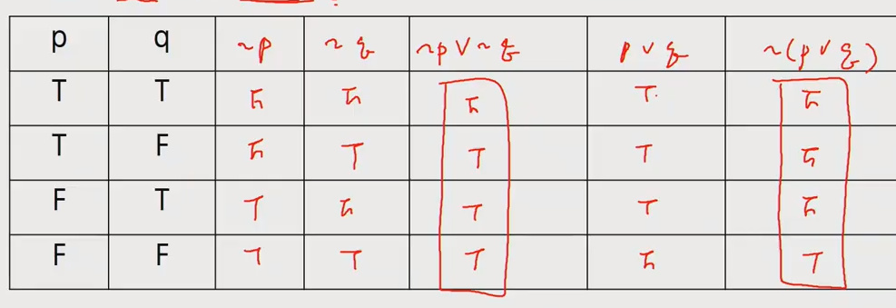

- 4-2 - 분배법칙  p ^ (g v r) =  (p ^ q) v (p ^ r), p v (g & r) =  (p v q) ^ (p v r)
  - 교환법칙 p ^ q =  g ^ p, p v q = q v p ???

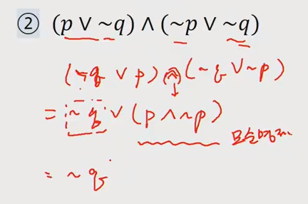

- 5-2, 5-4 

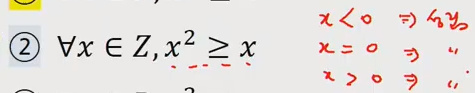

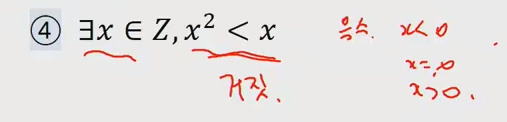

- 7

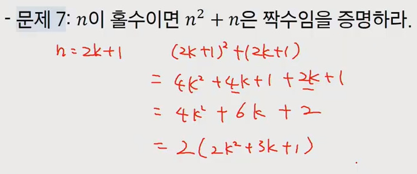

- 9 - 대우를 통한 증명

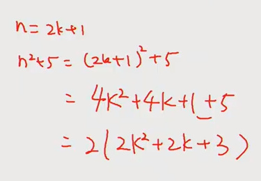

- 11

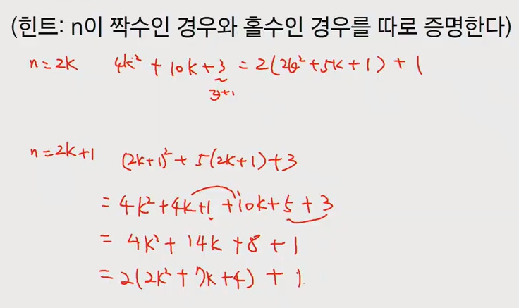

### 수와 표현

- 2

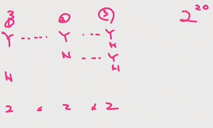

- 3-2, 3-4

- 5-2

  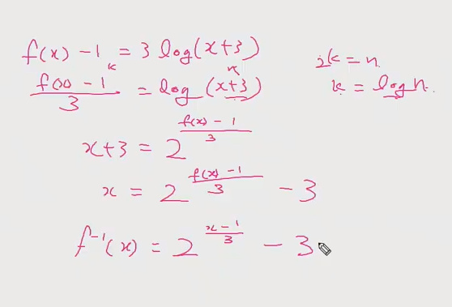

### 집합과 조합론

- 3

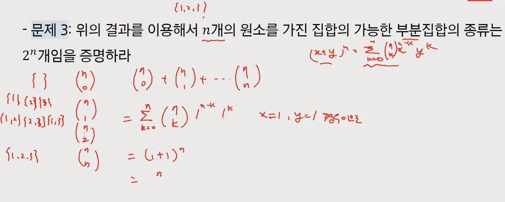

- 10

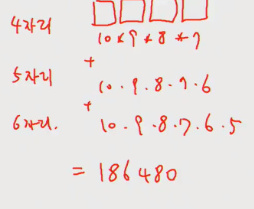

- 13 - 정확히 3개 = 3/2 는 안된다 3/1/1만 가능

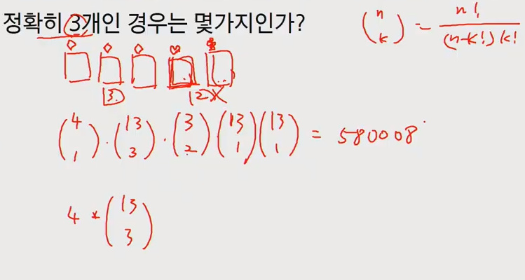

### 기초수식

- 2

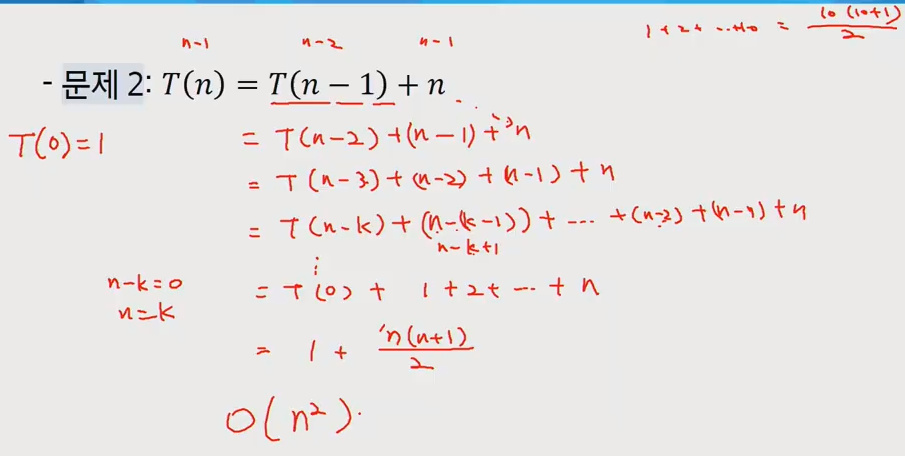

- 4

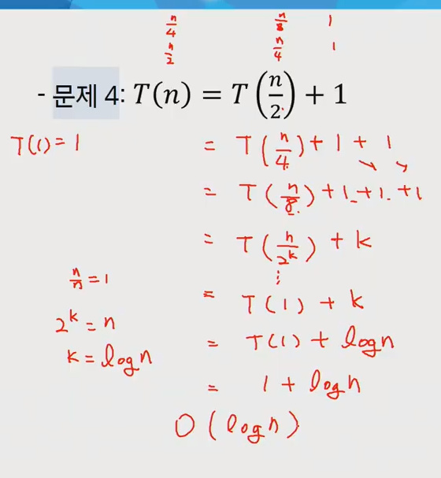

- 6 - 머지소트의 식

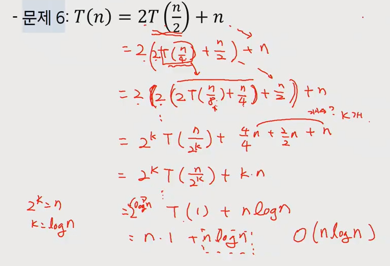

### 과목평가 대비

- 봐야될 것 - 월, 화 - 트리 자료구조, 수,목,금 - 컴퓨팅 사고력(기본지식, 기초지식)
- 3문제 코딩 구현 문제, 1문제는 컴퓨팅 사고력 문제(지금까지 풀었던 문제 중에서) - 2시간
- 3문제 중에 2문제 이상 풀어야 패스 가능(코딩)
- 컴퓨터 사고력 쪽에서 알고리즘 문제 풀이와 직접적인 연관있는 것? 재귀, 동적프로그래밍, 시간복잡도 관련 - 주로 풀었던 문제를 중심으로 살펴보기 - 재귀를 중심으로(dp는 아직 안배워서 출제가능성이 적다)
- 구현 - 새로 배운 내용(풀었던 트리 문제(약 6문제 - 이진힙은 빼도 될듯? 노드합, 이진탐색, 서브트리) 중에서 1문제 - 풀었던 문제들과 큰 차이 없음)
- 델타를 이용한 문제(4방향, 8방향) 상하좌우, 대각선, 한번만 이동하는지 특정 조건을 만족하면 해당 방향으로 끝까지 탐색해 나가는지, 그때 처리하는 방법은?
- 각 2차원 배열에 값이 있고 숫자의 합을 합친다고 했을 때 인풋에 따라 동선이 겹쳐서 만나게되는 중복 된 값이 존재할 때, 어떻게 처리할 것인가? (중복된 값을 제거하는 방법 - visited, 한 번 계산된 값을 아예 0으로 세팅)
- 로봇청소기의 이동경로 최소화?
- 이중리스트가 주어지고 값이 변하지 않았을 때 정해진 위치에서 특정한 범위의 값을 처리하는 과정(범위 최대값, 값 더하기(누적합))
  - 중복되는 값을 어떻게 처리할지 염두해두면서 풀기
- 이중리스트가 주어지되 현재 위치를 변화하며 특정한 목표지점을 찾는과정(최소거리, 최대거리)
  - 객체가 이동한다.(x,y) 좌표를 어딘가에 저장을 해놓고 사용, 중복된 위치에 대한 처리 방법