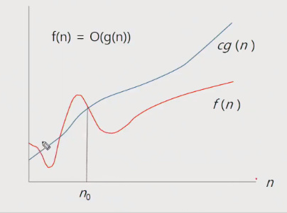

# APS 210412


## 오전 라이브 

### SW 문제 해결


####  코딩 교육 이슈? 

- 어렸을 때 부터 코딩 교육을 통해 논리적인 사고력을 기르려는 전 세계적인 추세


####  프로그래밍 하기 위한 제약조건과 요구 사항

- 프로그래밍 언어의 특성
- 프로그램이 동작할 hw와 os에 관한 지식
- 라이브러리들의 유의 사항들
- 프로그램이 사용할 수 있는 최대 메모리
- 사용자 대응 시간 제한
- 재사용성이 높은 간결한 코드
- ...


#### 문제 해결 역량이란?

- 프로그램을 하기 위한 많은 제약 조건과 요구사항을 이해하고 최선의 방법을 찾아내는 능력

- 프로그램을 사용하는 언어나 라이브러리, 자료구조, 알고리즘에 대한 지식을 적재적소에 퍼즐을 배치하듯 이들을 연결하여 큰 그림을 만드는 능력
- 문제 해결 역량은 추상적인 기술이다.
  - 프로그래밍 언어, 알고리즘처럼 명확히 정의된 실체가 없다.
  - 무작정 알고리즘을 암기하고 문제를 풀어본다고 향상되지 않는다.
- 문제 해결 역량을 향상시키기 위해서 훈련이 필요하다.


#### 문제 해결 능력을 훈련하기 위해서는

- 일부 새로운 언어, 프레임워크, 개발 방법론만을 배워나가는 것만으로 충분하지 않다. 이들을 조합해 나가는 방법을 배워야 하지만 쉽지 않다.
- 경험을 통해서 나아지리라 막연히 짐작만 한다. 그러나 경험에서는 문제 해결 능력을 개발 할 수 있는 상황이 주어지는 것이 아니며 또한 그런 상황에서 자기 개발 하기는 쉽지 않다.
- 상황을 인위적으로 만들어 훈련해야한다. 즉 잘 정제된 추상적인 문제를 이를 해결해 나가면서 문제 해결 능력을 향상시킬 수 있는 훈련이 필요하다.


#### 문제 해결 과정

- 문제를 읽고 이해한다.
- 문제를 익숙한 용어로 재정의한다.
- 어떻게 해결할지 계획을 세운다.
- 계획을 검증한다.
- 프로그램으로 구현한다.
- 어떻게 풀었는지 돌아보고, 개선할 방법이 있는지 찾아본다. (새로운 이론이나 접근 방법, 최적화 방법)


#### 문제 해결 전략

- 직관과 체계적인 접근
- 체계적인 접근을 위한 질문들
  - 비슷한 문제를 풀어본 적이 있나?
  - 단순한 방법에서 시작할 수 있을까?
  - 문제를 단순화 할 수 있을까?
  - 그림으로 그려 볼 수 있을까?
  - 수식으로 표현 할 수 있을까?
  - 문제를 분해 할 수 있을까?
  - 뒤에서부터 생각해 볼 수 있을까?
  - 특정 형태의 답만을 고려할 수 있을까?
  - ...


<br>

---


### 복잡도 분석


#### 알고리즘?

- (명) 알고리즘 : 유한한 단계를 통해 문제를 해결하기 위한 절차나 방법이다. 주로 컴퓨터 용어로 쓰이며, 컴퓨터가 어떤 일을 수행하기 위한 단계적 방법을 말한다.
- 간단하게 다시 말하면 어떠한 문제를 해결하기 위한 절차라고 볼 수 있다.
- 1~100의 합이라도 단순한 1~100까지의 +로 계산하는 법과 100*101/2 로 계산하는 방법이 있다.


#### 알고리즘의 효율

- 공간적 효율성과 시간적 효율성
  - 공간적 효율성은 연산량 대비 얼마나 적은 메모리 공간을 요하는 가
  - 시간적 효율성은 연산량 대비 얼마나 적은 시간을 요하는 가
  - 효율성을 뒤집어 표현하면 복잡도(complexity)가 된다. 복잡도가 높을수록 효율성은 저하된다.
- 시간적 복잡도 분석
  - 하드웨어 환경에 따라 처리시간이 달라진다.
    - 부동소수 처리 프로세서 존재유무(386 이전?), 나눗셈 가속기능 유무
    - 입출력 장비의 성능, 공유여부
  - 소프트웨어 환경에 따라 처리시간이 달라진다.
    - 프로그램 언어의 종류
    - 운영체제, 컴파일러의 종류
  - 이러한 환경적 차이로 인해 분석이 어렵다. - 직접적인 시간 비교는 불가
- 복잡도의 점근적 표기
  - 시간(또는 공간) 복잡도는 입력 크기에 대한 함수로 표기하는데, 이 함수는 주로 여러개의 항을 가지는 다항식이다.
  - 이를 단순한 함수로 표현하기 위해 점근적 표기(Asymptotic notation)을 사용한다.
  - 입력 크기 n이 무한대로 커질 때의 복잡도를 간단히 표현하기 위해 사용하는 표기법이다.
    - 빅오, 빅오메가, 빅세타 등이 존재.


#### 복잡도 표기법

- O(Big-Oh)-표기
  - O-표기는 복잡도의 점근적 상한을 나타낸다.
  - 복잡도가 f(n) = 2n^2-7n+4 이라면, f(n)의 표기는 O(n^2)이다.
  - 먼저 f(n)의 단순화된 표현을 n^2이다.
  - 단순화된 함수 n^2에 임의의 상수 c를 곱한 cn^2이 n이 증감하에 따라 f(n)의 상한이 된다. (단, c>0)
  - 즉 빅오는 단순히 '실행시간이 n^2에 비례'하는 알고리즘이라고 설명하는 것 - 최악의 경우에도 n^2에 비례하여 시간이 끝난다.
  - n이 증가함에 따라 O(g(n))이 점근적 상한이라는 것 (즉, g(n)이 n0보다 큰 모든 n에 대해서 항상 f(n)보다 크다는 것)을 보여준다.



- 빅오메가 표기

  - 최소한 이정도의 시간은 걸린다.
  - n이 증가함에 따라 오메가(g(n))이 점근적 하한이라는 것 (즉, g(n)이 n0보다 큰 모든 n에 대해서 항상 f(n)보다 작다는 것)을 보여준다.

  

- 빅세타 표기
  - 빅오와 빅오메가 표기가 같은 경우에 사용한다.
  - f(n)은 n이 증가함에 따라 n^2과 동일한 증가율을 가진다 라는 의미


- 자주 사용하는 O-표기
  - 상수시간, 로그시간, 제곱시간 등등


#### 왜 효율적인 알고리즘이 필요한가

- 10억 개의 숫자를 정렬하는데 pc에서 O(n^2) 알고리즘은 300여 년이 걸리는 반면에 O(nlogn) 알고리즘은 5분 만에 정렬한다.
- 효율적인 알고리즘은 슈퍼컴퓨터보다 더 큰 가치가 있다.
- 값 비싼 HW의 기술 개발보다 효율적인 알고리즘 개발이 훨씬 더 경제적이다.


<br>

---


### 표준 입출력 방법


#### python3 표준 입출력

- 입력

  - Raw 값의 입력 : input()
    - 받은 입력값을 문자열로 취급
  - Evaludated된 값 입력 : evel(input())
    - 받은 입력값을 평가된 데이터 형으로 취급 - 1 + 2 * 3 = 계산값나옴 - 다만 데이터를 함부 변경하거나 시스템을 건드릴 수 있으므로 거의 사용하지 않음

- 출력

  - print()
    - 표준 출력 함수. 출력값의 마지막에 개행 문자 포함
  - print('text', end='')
    - 출력시 마지막에 개행문자 제외할 시
  - print('%d' % number)
    - Formatting 된 출력 (f-string, .format 도 있음)

  
#### 파일의 내용을 표준 입력으로 읽어오는 방법

- sys를 통해 파이썬 콘솔명령어를 입력함으로써 콘솔에서 직접적으로 무언가 처리를 하도록함 (여기선 입력, 출력)
- 우리가 흔히 쓰는 입력은 키보드 버퍼에서 콘솔로 이동 후 콘솔에서 현재 프로그램으로 데이터를 보내주는 것, 여기서 sys를 통한 stdin은 콘솔이 특정 파일을 현재 프로그램과 연결하여 입력 데이터로 보내주도록 명령하는 것, stdout은 현재 프로그램의 데이터를 꺼내와서(출력) 특정 파일에 저장하도록 하는 것

- import sys
- sys.stdin = open("a.txt", "r")
- 언제 쓰이냐? 파일을 받아서 데이터를 처리할 때
- 또 파이참을 IDE로 사용할 때, 파이참 입력버퍼 사이즈인 1mb를 넘어가면 표준 입력으로 받을 수 없음, 그럴 때 파일 입력을 받아와야 함.


<br>

---


## 오후 코칭

- APS 응용 -> APS 기초를 기반으로한 응용 개념도 있고, 좀 더 새롭고 어려운 개념들도 포함 된 과목
- 오전 라이브에서 배운것 - 문제 해결 능력 이란 무엇이고 왜 훈련해야 하는가? 효율적인 알고리즘이 왜 필요한지, 알고리즘에 대한 개념적 접근, 복잡도 분석 (점근적 표기법 - 빅오, 빅오메가, 빅세타),  파이썬의 표준 입출력, 파일 입출력
- 오후 2시부터 진행할 라이브 강의는 비트 연산에 대해 배움 - 비트 연산을 통한 문제 풀이 접근법 (부분 집합)
- 웹 코칭에서는 비트 연산에 대해 좀 더 상세히 소개 해줄 것
- 비트 연산은 원래 어색한 개념 - 현실세계는 10진법인데 컴퓨터에선 2진법을 쓰기 때문에 2진법으로 바꾸는 것도 어색하고 그것에 따른 계산법도 익숙치 않음
- 비트 연산이 어색함에도 왜 사용하는가? - 연산속도가 빠르다, 특히 부분 집합과 같은 문제에서 효율성이 좋음
- 사용법에 대해 몇 번의 연습만 한다면 특정 유형 문제에 대해 쉽게 풀 수 있기 때문에 이에 대한 개념을 알아두면 좋음


### 비트 연산

```python
arr = [1, 2, 3]
n = len(arr)
k = 0
cnt = 0
for i in range(1 << n): # n = 3이라면 1 >> 10 >> 100 >> 1000 = 8 즉 8번 돌 것 i = 0 ~ 7
    SUM = 0
    sub = []
    for j in range(n): # arr의 크기는 3, j = 0 ~ 2
        '''
        1. i = 0, j = 0, 0 & (1 << 0) => 0 & 1 (False ^ True) => 0(False)
        2. i = 0, j = 1, 0 & (1 << 1) => 00 & 10 => 00(False) => 0
        3. i = 0, j = 2, 0 & (1 << 2) => 000 & 100 => 000(False) => 0
        sub = []
        '''
        '''
        1. i = 1, j = 0, 1 & (1 << 0) => 1 & 1 => 1 => sub.append(1)
        2. i = 1, j = 1, 1 & (1 << 1) => 01 & 10 => 00(False) => 0 
        3. i = 1, j = 2, 1 & (1 << 2) => 001 & 100 => 000(False) => 0
        sub = [1]
        '''
        '''
        1. i = 2, j = 0, 2 & (1 << 0) => 10(10진수 - 2를 2진수 - 10로 바꾼 것) & 1 => 0 
        2. i = 2, j = 1, 2 & (1 << 1) => 10 & 10 => 10(True) => arr[1] => sub.append(2)
        3. i = 2, j = 2, 2 & (1 << 2) => 010 & 100 => 000(False) => 0
        sub = [2]
        '''
        '''
        1. i = 3, j = 0, 3 & (1 << 0) => 11 & 1 => 01 => sub.append(1)
        2. i = 3, j = 1, 3 & (1 << 1) => 11 & 10 => 10 => sub.append(2)
        3. i = 3, j = 2, 3 & (1 << 2) => 011 & 100 => 000(False) => 0
        sub = [1, 2]
        '''
        if i & (1 << j):
            sub.append(arr[j])

   	print(sub)
```


<br>

---


## 오후 라이브


### 비트 연산

#### 비트 연산자

- & - 비트단위로 AND 연산을 한다. - 특정 비트를 0으로 만들 때 사용 (1~2 비트 이상)
  - 1번 비트만 0으로 만드려고 할 때 ~(1 << 1) 11101 그리고 AND 연산
- | - 비트단위로 OR 연산을 한다. - 특정 비트를 1로 만들 때 사용
- ^ - 비트단위로 XOR 연산을 한다. (같은면 0 다르면 1)  - 두 값이 같은지 다른지 체크 가능 (같으면 어느부분까지 같은 지), 특정 비트를 반전시킬 때
- ~ - 단항 연산자로서 피연산자의 모든 비트를 반전시킨다. invert - ~(1 << 1) = ~(0010) = 1101
- << - 피연산자의 비트열을 왼쪽으로 이동시킨다. 1 << 3 = 1000
- '>''>' - 피연산자의 비트 열을 오른쪽으로 이동시킨다. 8 << 3 = 1000 -> 1


#### 1 << n

- 2^n 의 값을 갖는다.
- 원소가 n개일 경우의 모든 부분집합의 수를 의미한다.
- Power set (모든 부분 집합)
  - 공집합과 자기 자신을 포함한 모든 부분 집합
  - 각 원소가 포함되거나 포함되지 않는 2가지 경우의 수를 계산하면 모든 부분 집합의 수가 계산된다.


#### i & (1 << j)

- 계산 결과는 i의 j번째 비트가 1인지 아닌지를 의미한다. - 검사가 가능하다.
- j번 비트가 0인 경우 0, 1인 경우 0이 아닐 수 있다.
- 예제 - 프로그램의 옵션의 설정을 하나의 배열로 관리할 때 특정 범위까지 특정 비트로 값을 관리하도록 준다면?
  - b0 - on/off(1/0), b1,b2 - 0/1/2/3(옵션값 - 예를 들어 그래픽 수준 0 - 최하 1- 하 2 - 중 3 - 상 이런식으로) ..


#### 음수 - 2의 보수

- 1 : 0001 (줄여서 씀 뒤에는 어차피 같으므로)  -> 뒤집기 1110 + 1 = 1111 (-1)
- 16 = 10000 - 0001 = 1111 + 1 (15 + 1) - 0001 = 1111 - 0001 + 1 = 1111
- 음수 양수 모두 쓸 경우 가장 큰 비트는 기호를 나타내게 됨
- 2의 4승일 경우 양수만이면 0 ~ 15, 정수면 -8~7 
- 비트 연산 예제 1
- 비트 연산 예제 2
  - 0x01020304 = 16진수 4자 (01, 02, 03, 04), 8byte
  - 16진수 = 0~15를 표현해야하므로 2진수로 4개 필요 - 4bit = 2byte
  - 01020304 = 00000100 00000011 00000010 00000001 => 04 03 02 01 로 표현이 됨 왜?


#### 엔디안(Endianness)

- 컴퓨터의 메모리와 같은 1차원의 공간에 여러 개의 연속된 대상을 배열하는 방법을 의미하며 hw 아키텍처마다 다르다.
- 주의 : 속도 향상을 위해 바이트 단위와 워드 단위를 변환하여 연산 할 때 올바로 이해하지 않으면 오류를 발생 시킬 수 있다.
- 01020304 라도 어느 컴퓨터냐에 따라 04030201로 빠른 주소에 낮은 자리수를 저장하는 곳도 있고 01020304 처럼 빠른 주소에 높은 자리수를 저장하는 곳도 있음. (네트워크에서 자주 사용하는 개념 빅 엔디안, 리틀엔디안)
- 빅 엔디안
  - 보통 큰 단위가 앞에 나옴 - 네트워크에서 자주 사용
- 리틀 엔디안
  - 작은 단위가 앞에 나옴 - 대다수 데스크탑 컴퓨터
- 엔디안 변환 코드 - 예제 4

```python
def ce(n): # change endian
    p = []
    for i in range(0, 4):
        p.append((n >> (24 - i*8)) & 0xff)
    return p

x = 0x01020304
p = []
for i in range(0, 4):
    p.append((x >> (i*8)) & 0xff)

print("x = %d%d%d%d" % (p[0], p[1], p[2], p[3])) # 04030201
p = ce(x)
print("x = %d%d%d%d" % (p[0], p[1], p[2], p[3])) # 01020304

# 연산자 우선 순위를 모르겠으면 내가 원하는 범위에 괄호치기 - 좀더 확실한 방법
def ce1(n):
    return (n << 24 & 0xff000000) | (n << 8 & 0xff0000) | (n >> 8 & 0xff00) | (n >> 24 & 0xff)
```

- 예제 5 - ^ 를 두 번하면 같은 값을 반환


### 진수

- 2진수, 8진수, 10진수, 16진수
- 10진수 -> 타 진수로 변환
  - 원하는 타진법의 수로 나눈 뒤 나머지를 거꾸로 읽는다.
  - 예제) 149(10) = 10010101(2) = 225(8) = 95(16)
- 타 진수 -> 10진수로 변환
  - 예) 135(8) = 1곱하기(8^2) + 3곱하기(8^1) + 5곱하기(8^0) = 93(10)
  - 소수점이 있을 때의 예) 135.12(8) =  1곱하기(8^2) + 3곱하기(8^1) + 5곱하기(8^0) + 1곱하기(8^-1) + 2곱하기(8^-2) = 93.15625(10)
- 2진수, 8진수, 16진수간 변환
  - 2진법(3자리씩 묶음) <-> 8진법 (3자리씩 나열)
  - 2진법(4자리씩 묶음) <-> 16진법(4자리씩 나열)


### 컴퓨터에서 음의 정수 표현 방법

- 1의 보수 - 부호와 절대값으로 표현된 값을 부호 비트를 제외한 나머지 비트들을 0은 1로, 1은 0로 변환한다.
  - -6 : 1 0 ... 0 1 1 0 - 부호와 절대값 표현
  - -6 : 1 1 ... 1 0 0 1 - 1의 보수 표현
- 2의 보수 - 1의 보수방법으로 표현된 값의 최하위 비트에 1을 더한다. -> 음수 표현에 사용
  - -6 : 1 1 ... 1 0 1 0 - 2의 보수 표현 
  - 2의 보수는 음수 + 양수일 때 더한 값 그대로 결과를 표현할 수 있음


### 실수

#### 2진 실수를 10진수로 변환하는 방법

- 2진수값  곱하기 2^-x = 소수 해당 자리 수의 값


#### 실수의 표현

- 컴퓨터는 실수를 표현하기 위해 부동 소수점 (floating-point) 표기법을 사용한다. (IEEE 754?)
- 부동 소수점 표기 방법은 소수점의 위치를 고정시켜 표현하는 방식이다.
  - 소수점의 위치를 왼쪽의 가장 유효한 숫자 다음으로 고정시키고 밑수의 지수승으로 표현
  - 1001.0011 -> 1.0010011 * 2^3
- 실수를 저장하기 위한 형식
  - 실수는 부호 1비트는 무조건 고정
  - 단정도 실수(32비트)
    - 부호 1비트, 지수 8비트, 가수 23비트  
  - 배정도 실수(64비트)
    - 부호 1비트, 지수 11비트, 가수 52비트
  - 단정도 표현에서의 지수부 익세스 표현

- 실수는 특정 비트에서 값이 잘리므로 값이 세세해 질수록 다른 결과를 가져올 가능성이 높다.