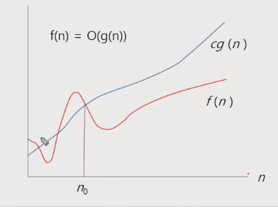
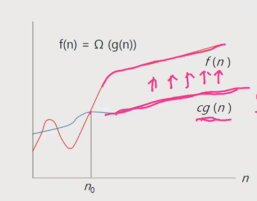

# APS 210412

## 오전 라이브 

### SW 문제 해결

####  코딩 교육 이슈? 

- 어렸을 때 부터 코딩 교육을 통해 논리적인 사고력을 기르려는 전 세계적인 추세

####  프로그래밍 하기 위한 제약조건과 요구 사항

- 프로그래밍 언어의 특성
- 프로그램이 동작할 hw와 os에 관한 지식
- 라이브러리들의 유의 사항들
- 프로그램이

#### 문제 해결 역량이란?

- 프로그램을 사용하는 언어나 라이브러리, 자료구조, 알고리즘에 대한 지식을 적재적소에 퍼즐을 배치하듯 이들을 연결하여 큰 그림을 만드는 능력

#### 문제 해결 능력을 훈련하기 위해서는

- 일부 새로운 언어, 프레임워크, 개발 방법론만을 배워나가는 것만으로 충분하지 않다. 이들을 조합해 나가는 방법을 배워야 하지만 쉽지 않다.
- 경험을 통해서 나아지리라 막연히 짐작만 한다. 그러나 경험에서는 문제 해결 능력을 개발 할 수 있는 상황이 주어지는 것이 아니며 또한 그런 상황에서 자기 개발 하기는 쉽지 않다.
- 상황을 인위적으로 만들어 훈련해야한다. 즉 잘 정제된 추상적인 문제를 이를 해결해 나가면서 문제 해결 능력을 향상시킬 수 있는 훈련이 필요하다.

#### 문제 해결 과정

- 문제를 읽고 이해한다.
- 문제를 익숙한 용어로 재정의한다.
- 어떻게 해결할지 계획을 세운다.
- 계획을 검증한다.
- 프로그램으로 구현한다.
- 어떻게 풀었는지 돌아보고, 개선할 방법이 있는지 찾아본다. (새로운 이론이나 접근 방법, 최적화 방법)

#### 문제 해결 전략

- 직관과 체계적인 접근
- 체계적인 접근을 위한 질문들
  - 비슷한 문제를 풀어본 적이 있나?
  - 단순한 방법에서 시작할 수 있을까?
  - 문제를 단순화 할 수 있을까?
  - 그림으로 그려 볼 수 있을까?
  - 수식으로 표현 할 수 있을까?
  - 문제를 분해 할 수 있을까?
  - 뒤에서부터 생각해 볼 수 있을까?
  - 특정 형태의 답만을 고려할 수 있을까?
  - ...

 

---

### 복잡도 분석

#### 알고리즘?

- (명) 알고리즘 : 유한한 단계를 통해 문제를 해결하기 위한 절차나 방법이다. 주로 컴퓨터 용어로 쓰이며, 컴퓨터가 어떤 일을 수행하기 위한 단계적 방법을 말한다.
- 간단하게 다시 말하면 어떠한 문제를 해결하기 위한 절차라고 볼 수 있다.
- 1~100의 합이라도 단순한 1~100까지의 +로 계산하는 법과 100*101/2 로 계산하는 방법이 있다.

#### 알고리즘의 효율

- 공간적 효율성과 시간적 효율성
  - 공간적 효율성은 연산량 대비 얼마나 적은 메모리 공간을 요하는 가
  - 시간적 효율성은 연산량 대비 얼마나 적은 시간을 요하는 가
  - 효율성을 뒤집어 표현하면 복잡도(complexity)가 된다. 복잡도가 높을수록 효율성은 저하된다.
- 시간적 복잡도 분석
  - 하드웨어 환경에 따라 처리시간이 달라진다.
    - 부동소수 처리 프로세서 존재유무(386 이전?), 나눗셈 가속기능 유무
    - 입출력 장비의 성능, 공유여부
  - 소프트웨어 환경에 따라 처리시간이 달라진다.
    - 프로그램 언어의 종류
    - 운영체제, 컴파일러의 종류
  - 이러한 환경적 차이로 인해 분석이 어렵다. - 직접적인 시간 비교는 불가
- 복잡도의 점근적 표기
  - 시간(또는 공간) 복잡도는 입력 크기에 대한 함수로 표기하는데, 이 함수는 주로 여러개의 항을 가지는 다항식이다.
  - 이를 단순한 함수로 표현하기 위해 점근적 표기(Asymptotic notation)을 사용한다.
  - 입력 크기 n이 무한대로 커질 때의 복잡도를 간단히 표현하기 위해 사용하는 표기법이다.
    - 빅오, 빅오메가, 빅세타 등이 존재.

#### 복잡도 표기법

- O(Big-Oh)-표기
  - O-표기는 복잡도의 점근적 상한을 나타낸다.
  - 복잡도가 f(n) = 2n^2-7n+4 이라면, f(n)의 표기는 O(n^2)이다.
  - 먼저 f(n)의 단순화된 표현을 n^2이다.
  - 단순화된 함수 n^2에 임의의 상수 c를 곱한 cn^2이 n이 증감하에 따라 f(n)의 상한이 된다. (단, c>0)
  - 즉 빅오는 단순히 '실행시간이 n^2에 비례'하는 알고리즘이라고 설명하는 것 - 최악의 경우에도 n^2에 비례하여 시간이 끝난다.
  - n이 증가함에 따라 O(g(n))이 점근적 상한이라는 것 (즉, g(n)이 n0보다 큰 모든 n에 대해서 항상 f(n)보다 크다는 것)을 보여준다.

- 빅오메가 표기

  - 최소한 이정도의 시간은 걸린다.
  - n이 증가함에 따라 오메가(g(n))이 점근적 하한이라는 것 (즉, g(n)이 n0보다 큰 모든 n에 대해서 항상 f(n)보다 작다는 것)을 보여준다.

  

- 빅세타 표기
  - 빅오와 빅오메가 표기가 같은 경우에 사용한다.
  - f(n)은 n이 증가함에 따라 n^2과 동일한 증가율을 가진다 라는 의미

- 자주 사용하는 O-표기
  - 상수시간, 로그시간, 제곱시간 등등

#### 왜 효율적인 알고리즘이 필요한가

- 10억 개의 숫자를 정렬하는데 pc에서 O(n^2) 알고리즘은 300여 년이 걸리는 반면에 O(nlogn) 알고리즘은 5분 만에 정렬한다.
- 효율적인 알고리즘은 슈퍼컴퓨터보다 더 큰 가치가 있다.
- 값 비싼 HW의 기술 개발보다 효율적인 알고리즘 개발이 훨씬 더 경제적이다.

 

---

### 표준 입출력 방법

#### python3 표준 입출력

- 입력

  - Raw 값의 입력 : input()
    - 받은 입력값을 문자열로 취급
  - Evaludated된 값 입력 : evel(input())
    - 받은 입력값을 평가된 데이터 형으로 취급 - 1 + 2 * 3 = 계산값나옴 - 다만 데이터를 함부 변경하거나 시스템을 건드릴 수 있으므로 거의 사용하지 않음

- 출력

  - print()
    - 표준 출력 함수. 출력값의 마지막에 개행 문자 포함
  - print('text', end='')
    - 출력시 마지막에 개행문자 제외할 시
  - print('%d' % number)
    - Formatting 된 출력 (f-string, .format 도 있음)

  
#### 파일의 내용을 표준 입력으로 읽어오는 방법

- sys를 통해 파이썬 콘솔명령어를 입력함으로써 콘솔에서 직접적으로 무언가 처리를 하도록함 (여기선 입력, 출력)
- 우리가 흔히 쓰는 입력은 키보드 버퍼에서 콘솔로 이동 후 콘솔에서 현재 프로그램으로 데이터를 보내주는 것, 여기서 sys를 통한 stdin은 콘솔이 특정 파일을 현재 프로그램과 연결하여 입력 데이터로 보내주도록 명령하는 것, stdout은 현재 프로그램의 데이터를 꺼내와서(출력) 특정 파일에 저장하도록 하는 것

- import sys
- sys.stdin = open("a.txt", "r")
- 언제 쓰이냐? 파일을 받아서 데이터를 처리할 때
- 또 파이참을 IDE로 사용할 때, 파이참 입력버퍼 사이즈인 1mb를 넘어가면 표준 입력으로 받을 수 없음, 그럴 때 파일 입력을 받아와야 함.