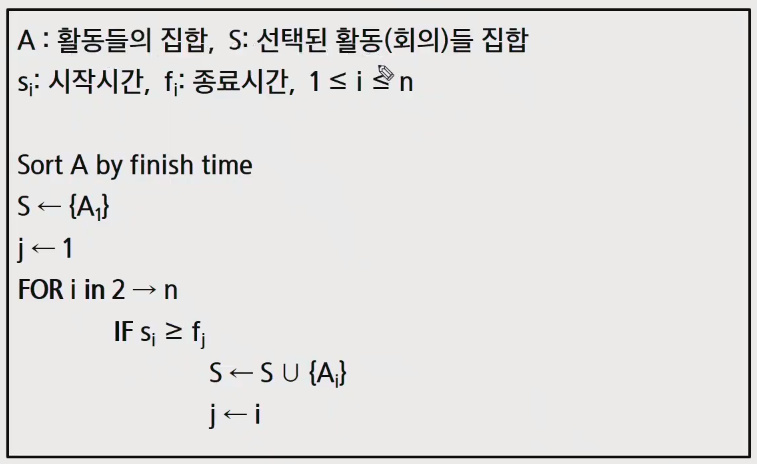

# APS 210414


## 오전 라이브


- 재귀, 완전 검색, 조합적문제, 그리디 알고리즘


### 반복과 재귀 (iteration, recursion)

- 반복과 재귀는 유사한 작업을 수행할 수 있다.
- 반복은 수행하는 작업이 완료될 때 까지 계속 반복 
  - 루프 (for, while 구조)
- 재귀는 주어진 문제의 해를 구하기 위해 동일하면서 더 작은 문제의 해를 이용하는 방법
  - 하나의 큰 문제를 해결할 수 있는(해결하기 쉬운) 더 작은 문제로 쪼개고 결과들을 결합한다.
  - 재귀 함수로 구현
- 저 경우에 재귀가 선형적으로 작동할 것 같은데 그럼 반복문과 시간복잡도가 똑같나요? -> 호출 복귀 시간도 고려를 해야겠네요 답변 감사합니다


#### 반복구조

- (for int i = 0; i < n ; i++)

- 초기화
  - 반복되는 명령문을 실행하기 전에 (한번만) 조건 검사에 사용할 변수의 초기값 설정 (for i = 0)
- 조건검사 (check control expression)
  - 반복문을 탈출하기 위한 조건 - (i < n)
- 반복할 명령문 실행 (action)
  - 실제 우리가 데이터를 처리할 부분
- 업데이트 (loop update)
  - i의 값을 변경시켜서 반복문을 탈출하기 위해 업데이트 해야함 (i++) 
  - 무한 루프가 되지 않게 조건이 거짓이 되게 한다.
- 반복문은 조건검사를 먼저하기 때문에 한번도 실행 되지 않을 수 있다. - do while 같은것으로 처리해야함
- for문은 무한루프 가능성이 적지만 while은 탈출하기 위한 업데이트를 하지 않으면 무한루프에 빠질 수 있으므로 주의


#### 재귀 함수

- 함수 내부에서 직접 혹은 간접적으로 자기 자신을 호출하는 함수
- 일반적으로 재귀적 정의를 이용해서 재귀 함수를 구현한다.
- 따라서, 기본 부분(basis part)와 유도 부분 (inductive part)로 구성된다.
- 재귀적 프로그램을 작성하는 것은 반복 구조에 비해 간결하고 이해하기 쉽다.
  - 그러나, 재귀에 대해 익숙하지 않은 개발자들은 재귀적 프로그램이 어렵다고 느낀다.
- 함수 호출은 프로그램 메모리 구조에서 스택을 사용한다. 따라서 재귀 호출은 반복적인 스택의 사용을 의미하며 메모리 및 속도에서 성능저하가 발생한다.
- 효과적인 프로그램을 개발할 때는 재귀 사용을 추천하지 않지만 - 간단한 완전 검색을 통해 테스트 용으로는 재귀를 통해 구현하는 경우가 종종 있음.
- 팩토리얼 재귀 함수
  - 재귀적 정의
  - n! 에 대한 재귀 함수
  - 팩토리얼 재귀 함수의 호출
    - 함수 호출을 통해 로컬 변수가 만들어 졌다가 사라지는 메모리 공간을 스택이라고 한다.
    - 재귀는 호출을 통해 스택에 쌓아 나가며 종료 조건까지 호출
    - 종료 조건에서 스택 포인터가 하나씩 처리하고 내려가면서 결과를 반환
    - 프로그램을 실행해서 위에서 아래로 내려가면서 처리하는데 함수를 호출하면 해당하는 부분으로 이동 -> 이동시 현재 위치, 여러가지 정보들을 스택에 저장됨 -> 메모리를 꽤 먹음
    - 파이썬의 경우 약 1000번 정도의 스택을 사용하면 자동으로 에러를 내뱉고 종료시킴


#### 반복 또는 재귀?

- 해결할 문제를 고려해서 반복이나 재귀의 방법을 선택
- 재귀는 문제 해결을 위한 알고리즘 설계가 간단하고 자연스럽다.
  - 추상 자료형(list, tree 등)의 알고리즘은 재귀적 구현이 간단하고 자연스러운 경우가 많다.
- 일반적으로, 재귀적 알고리즘은 반복(iterative) 알고리즘 보다 더 많은 메모리와 연산을 필요로 한다. - 해당 지역 변수를 계속 생성해야 하므로
- 입력 값 n이 커질수록 재귀 알고리즘은 반복에 비해 비효율적일 수 있다.


---

<br>


### 브루트 포스 (고지식한 방법)

#### 문제 제시 baby-gin game

- 베이비진 게임 설명
- 예시


- brute-force는 문제를 해결하기 위한 간단하고 쉬운 접근법이다.
  - just-do-it
  - force의 의미는 사람(지능)보다는 컴퓨터의 force를 의미한다.
- 브루트 포스 방법은 대부분의 문제에 적용 가능하다.
- 상대적으로 빠른 시간에 문제 해결(알고리즘 설계)을 할 수 있다.
- 문제에 포함된 자료 (요소, 인스턴스)의 크기가 작다면 유용하다.
- 학술적 또는 교육적 목적을 위해 알고리즘의 효율성을 판단하기 위한 척도로 사용 된다.


#### brute-force 탐색 (sequential search)

- 자료들의 리스트에서 키 값을 찾기 위해 첫 번째 자료부터 비교하면서 진행한다.


- 결과
  - 탐색 성공
  - 탐색 실패


#### 완전 검색으로 시작하라

- 모든 경우의 수를 생성하고 테스트 하기 때문에 수행 속도는 느리지만, 해답을 찾아 내지 못할 확률이 작다.
  - 완전검색은 입력의 크기를 작게 해서 간편하고 빠르게 답을 구하는 프로그램을 작성한다.
- 이를 기반으로 그리디 기법이나 동적 계획법을 이용해서 효율적인 알고리즘을 찾을 수 있다.
- 검정 등에서 주어진 문제를 풀 때, **우선 완전 검색으로 접근하여 해답을 도출한 후, 성능 개선을 위해 다른 알고리즘을 사용하고 해답을 확인하는 것이 바람직하다.**
- 완전 검색을 통한 baby-gin 접근
  - 고려할 수 있는 모든 경우의 수 생성 (모든 경우의 순열 나열)
  - 해답 테스트 하기 
    - 앞의 3자리와 뒤의 3자리를 잘라, run 과 triplet 여부를 테스트하고 최종적으로 베이비 진 여부 판단


#### 완전 검색

- 많은 종류의 문제들이 특정 조건을 만족하는 경우나 요소를 찾는 것이다.
- 또한, 이들은 전형적으로 순열(permutation), 조합(combination), 그리고 부분 집합(subsets)과 같은 조합적 문제들 (combinatorial problems) 과 연관된다.
- 완전 검색은 조합적 문제에 대한 브루트 포스 방법이다.


---

<br>

### 순열 (Permutation)

- 문제 제시 - 여행사 BIG sale!
- 순열 - 서로 다른 것들 중 몇개를 뽑아서 한 줄로 나열하는 것
- 서로 다른 n개 중 r개를 택하는 순열은 아래와 같이 표현한다. nPr
- 그리고 nPr은 다음과 같은 식이 성립한다.
  - nPr = n * (n-1) * (n-2) * ... * (n-r+1)
- nPn = n! 이라고 표기하며 Factorial 이라 부른다.
- 다수의 알고리즘 문제들은 순서화된 요소들의 집합에서 최선의 방법을 찾는 것과 관련 있다. - 순서를 정해주고 그것에 결과를 비교해서 값을 찾아라 
  - 예) TSP (Traveling Salesman Problem) - 도시를 방문할 때 비용이 드는데 가장 적은 비용이 드는 방법을  찾기
- n 개의 요소들에 대해서 n! 개의 순열들이 존재한다.
  - 12! = 479,001,600
  - n > 12 인 경우, 시간 복잡도가 폭발적으로 증가한다.
  - 보통 입력 문제에서 10~12 정도의 인풋케이스로 주어지고 백트래킹 까지 고려했을 경우 최대 16정도 까지 나올 수 있다.


- 단순하게 순열을 생성하는 방법
  - 예) {1, 2, 3}을 포함하는 모든 순열을 생성하는 함수
    - 동일한 숫자가 포함되지 않았을 때, 각 자리 수 별로 loop를 이용해 아래와 같이 구현할 수 있다.

```
For i1 in 1 -> 3
	For i2 in 1 -> 3
		If i2 != i1
			For i3 in 1 -> 3
				If i3 != i1 And i3 != i2
					print(i1, i2, i3)
```


#### 순열 생성 방법

- 사전적 순서 (Lexicographic-Order)
  - {1,2, 3}, n = 3 인 경우 다음과 같이 생성된다.
  - [1 2 3] [1 3 2] [2 1 3] [2 3 1] [3 1 2] [3 2 1]
- 최소 변경을 통한 방법 (Minimum-exchange requirement)
  - 각각의 순열들은 이전의 상태에서 단지 두 개의 요소들 교환을 통해 생성
  - [1 2 3] [3 2 1] [2 3 1] [2 1 3] [3 1 2] [1 3 2]
- 최소한의 변경을 통해 다음 순열을 생성하는 방법
  - 1950년대의 교회의 종소리 패턴하고 유사
  - Johnson-Trotter 알고리즘
- 재귀 호출을 통한 순열 생성


---

<br>


### 부분 집합

- 집합에 포함된 원소들을 선택하는 것이다.
- 다수의 중요 알고리즘 들이 원소들의 그룹에서 최적의 부분 집합을 찾는 것이다.
  - 예) 배낭 짐싸기(knapsack)
- N개의 원소를 포함한 집합
  - 자기 자신과 공집합 포함한 모든 부분집합(power set) 의 개수는 2^n 개
  - 원소의 수가 증가하면 부분집합의 개수는 지수적으로 증가


#### 부분 집합 생성 방법

- 단순하게 모든 부분 집합 생성하는 방법
  - 4개 원소를 포함한 집합에 대한 power set 구하기


- 바이너리 카운팅을 통한 사전적 순서(Lexicographic Order)
  - 부분 집합을 생성하기 위한 가장 자연스러운 방법이다.
  - 바이너리 카운팅은 사전적 순서로 생성하기 위한 가장 간단한 방법이다.
- 바이너리 카운팅 (Binary Counting)
  - 원소 수에 해당하는 N개의 비트열을 이용한다.
  - n번째 비트값이 1이면 n번째 원소가 포함되었음을 의미한다.


- 바이너리 카운팅을 통한 부분 집합 생성 코드 예


---

<br>


### 조합

- 서로 다른 n개의 원소 중 r 개를 순서 없이 골라낸 것을 조합(combination) 이라고 부른다.
- 조합의 수식
  - nCr = nPr / r! = n!/(n-r)!r! 단,(n >= r) 
  - nCr = n-1Cr-1 + n-1Cr -> 재귀적 표현
  - nC0 = 1


#### 재귀 호출을 이용한 조합 생성 알고리즘

- ar[] = n 개의 원소를 가지고 있는 배열
- tr[] = r 개의 크기의 배열, 조합이 임시 저장될 배열


## 오후 웹코칭

- 완전탐색 - 모든 경우에 대해 탐색해보는 것 
  - 장점 - 모든 경우를 구하기 때문에 반드시 정답을 찾을 수 있다.
  - 단점 - 모든 경우를 구하므로 시간이 많이 소요된다. -> 개선하기 위해 불필요한 연산이나 범위를 줄이도록 해야한다.
- 재귀와 반복
  - 재귀에 특성에 대한 복습 (구현이 간편, 스택 메모리를 많이 사용, 느린편, 테스트 코드 작성시 괜찮은 편)

- 연습문제 1, 2


---

<br>


## 오후 라이브

### 조합 이어서


### 그리디 알고리즘

- 문제 제시 - 거스름돈 줄이기
  - 손님이 지불한 금액에서 물건값을 제한 차액(거스름돈)을 지불하는 문제를 생각해보자.
  - 어떻게 하면 손님에게 거스름돈으로 주는 지폐와 동전의 개수를 최소한으로 줄일 수 있을까?


#### 그리디 알고리즘의 개념

- 탐욕 알고리즘은 최적해를 구하는 데 사용되는 근시안적인 방법
- 일반적으로, 머리속에 떠오르는 생각을 검증 없이 바로 구현하면 Greedy 접근이 된다.
- 여러 경우 중 하나를 선택 할 때마다 그 순간에 최적이라고 생각되는 것을 선택해 나가는 방식으로 진행하여 최종적인 해답에 도달한다.
- 각 선택 시점에서 이루어지는 결정은 지역적으로는 최적이지만, 그 선택들을 계속 수집하여 최종적인 해답을 만들었다고 하여, 그것이 최적이라는 보장은 없다.
- 일단,  한번 선택된 것은 번복하지 않는다. 이런 특성 때문에 대부분의 그리디 알고리즘 들은 단순하며, 또한 제한적인 문제들에 적용된다.
- 최적화 문제(optimization) 란 가능한 해들 중에서 가장 좋은 (최대 또는 최소) 해를 찾는 문제이다.


#### 그리디 알고리즘의 동작 과정

- 해 선택 - 현재 상태에서 부분 문제의 최적 해를 구한 뒤, 이를 부분 해 집합(solution set) 에 추가한다.
- 실행 가능성 검사 - 새로운 부분 해 집합이 실행 가능한지를 확인한다. 곧, 문제의 제약 조건을 위반하지 않는 지를 검사한다.
- 해 검사 - 새로운 부분 해 집합이 문제의 해가 되는지를 확인한다. 아직 전체 문제의 해가 완성되지 않았다면 1의 해 선택부터 다시 시작한다.

##### 예시) 탐욕 기법을 적용한 거스름돈 줄이기
- 해 선택 - 여기에서는 멀리 내다볼 것 없이 가장 좋은 해를 선택한다. 단위가 큰 동전으로만 거스름돈을 만들면 동전의 개수가 줄어들므로 현재 고를 수 있는 가장 단위가 큰 동전을 하나 골라 거스름돈에 추가한다.
- 실행 가능성 검사 - 거스름돈이 손님에게 내드려야 할 액수를 초과하는지 확인한다. 초과한다면 마지막에 추가한 동전을 거스름돈에서 빼고, 1로 돌아가서 현재보다 한 단계 작은 단위의 동전을 추가한다.
- 해 검사 - 거스름돈 문제의 해는 당연히 거스름돈이 손님에게 내드려야 하는 액수와 일치하는 셈이다. 더 드려도, 덜 드려도 안되기 때문에 거스름돈을 확인해서 액수에 모자라면 다시 1로 돌아가서 거스름돈에 추가할 동전을 고른다.
- 이렇게 했을 때의 문제점은 최적해를 반드시 구한다는 보장이 없기 때문에 다른 예외가 나올 수 있다.


##### 예시2) 배낭 짐싸기


- 내가 가져온 배낭 안에 최대한 넣을 수 있는 범위 내에서 그 물건들의 가치의 합이 제일 비싸게 만들기
- 배낭 짐싸기에 대한 완전 탐색 방법
  - 완전 검색으로 물건들의 집합 s에 대한 모든 부분집합을 구한다.
  - 부분집합의 총 무게가 w를 초과하는 집합들은 버리고, 나머지 집합에서 총 값이 가장 큰 집합을 선택 할 수 있다.
  - 물건의 개수가 증가하면 시간 복잡도가 지수적으로 증가한다.
    - 크기 n인 부분합의 수 2^n
- 배낭 짐싸기에 대한 탐욕적 방법
  - 1번 - 값이 비싼 방법부터 채운다. 
    - 물건1, 25kg, 10만원
    - 물건2, 3 , 20kg, 14만원 반례 존재


##### 활동 선택 문제

- 시작 시간과 종료시간 (si, fi)이 있는 n개의 활동들의 집합 A = {A1, A2, ..., An}, 1 <= i <= n 에서 서로 겹치지 않는 최대 갯수의 활동들의 집합 s를 구하는 문제
- 문제를 수정해서 보면


- 탐욕 기법의 적용
  - 공집합이 아닌 하위 문제 (subproblem) si,j 가 있고 si,j 에 속한 활동 am 은 종료시간이 가장 빠른 활동이다.
  - 그렇다면,
    - 하위 문제 si,j 에서 종료시간이 가장 빠른 활동 am을 선택한다.
    - si,m 은 공집합이므로, am을 서택하면 공집합이 아닌 하위 문제 sm,j 가 남는다.
    - 위의 두 과정을 반복한다.
  - si,j 를 풀기 위해
    - 종료 시간이 가장 빠른 am 선택
    - si,j = {am} U sm,j 의 해집합


- 탐욕 기법을 적용한 반복 알고리즘
  - 종료 시간이 빠른 순서로 활동들을 정렬한다.
  - 첫 번째 활동(A1)을 선택한다.
  - 선택한 활동(A1)의 종료시간보다 빠른 시작 시간을 가지는 활동을 모두 제거한다.
  - 남은 활동들에 대해 앞의 과정을 반복한다.




### 탐욕 알고리즘의 필수 요소

- 탐욕적 선택 속성
  - 탐욕적 선택은 최적해로 갈 수 있음을 보여라.
    - 즉, 탐욕적 선택은 항상 안전하다.
- 최적 부분 구조
  - 최적화 문제를 정형화하라
    - 하나의 선택을 하면 풀어야 할 하나의 하위 문제가 남는다.
- [원문제의 최적해 = 탐욕적 선택 + 하위 문제의 최적해] 임을 증명하라.


#### 탐욕 기법과 동적 계획법(반복문으로 메모이제이션할 때의)의 비교


#### 대표적인 탐욕 기법의 알고리즘들

- Prim, Kruskal, Dijkstra - 그래프
- Huffman tree & code - 문자열


#### 탐욕 기법을 통한 베이비진 문제 해결


- 알고리즘 예


