# APS 210416 - 문제풀이


### 5188. 최소합

- 접근 방법 1
  - 0, 0에서 출발해 가능한 모든 경로로 이동해본다.
  - 각 칸을 지날 때마다 숫자를 더한다.
  - 쉬운 문제를 프로그램의 진행 방향을 그려보는 연습을 해보는 것을 추천 (연습하지 않으면 실제 사용할 때 잘 그리지 못함)
  - 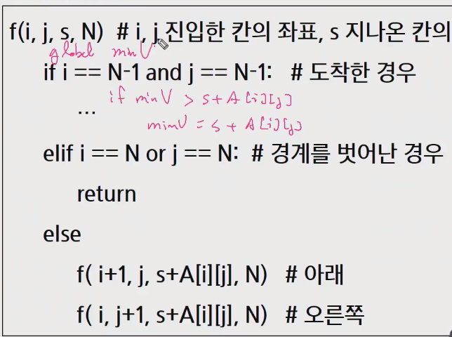

- 접근 방법 2
  - i, j 칸까지 이동한 최소합 Dij는 윗 칸(i-1, j)과 왼쪽 칸(i, j-1) 까지의 최소합 중 작은 값에 i, j 칸의 값을 더한 값이다. (단, 가장 자리가 아닌 경우)
  - 맨 윗 줄은 왼쪽 칸의 최소합, 맨 왼쪽열의 윗쪽칸의 최소합에 i, j 칸의 값을 더한다.
  - 0, 0 까지의 최소합은 0, 0 칸의 값이다.
  - 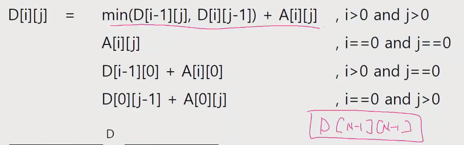

---

<br>

### 5189. 전자카트

- 접근 방법 1

  - 배열의 인덱스와 일치하도록 사무실 0, 나머지 구역은 1부터 N-1.
  - 각 구역의 방문 순서를 순열로 만든다.
    - 항상 0으로 시작하는 순열 - N = 3인 경우, [0, 1, 2], [0, 2, 1]
  - 방문 순서가 만들어지면 배터리 사용량을 구하고 최소값과 비교한다.
    - 마지막 구역 -> 사무실 이동 비용을 더해서 비교해야 한다.
  - 가능한 모든 방문 순서에 대해 반복한다.
  - 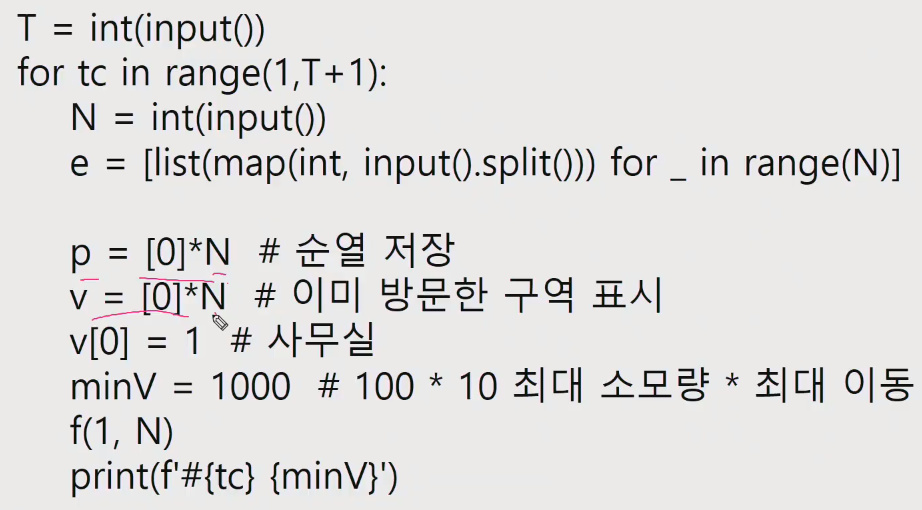

  - 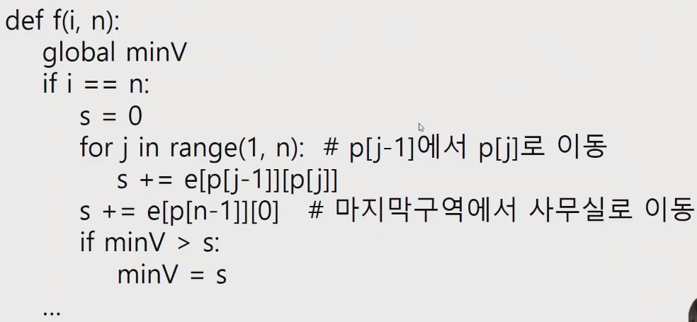
  - 나의 경우 for 문에 0 -> 1 로 가는 것과 마지막 구역 -> 0으로 가는것까지 고려했는데 저렇게 밖에 빼서 넣어 줬으면 쉽게 구현했을듯.. - 여기서 시간 꽤걸렸음
  - 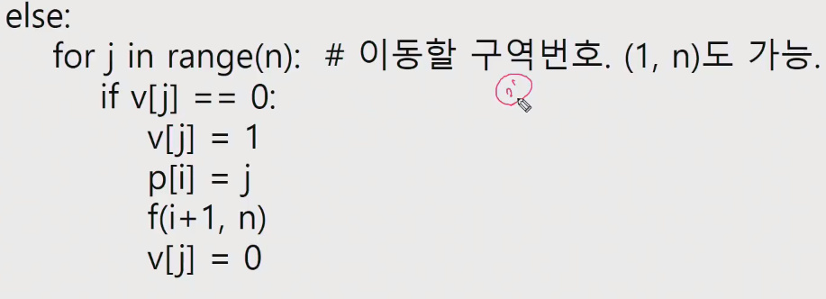

- 접근 방법 2

  - 순열로 구역의 방문 순서 p[i]를 정한다. i>0, p[0] = 0
  - p[i]가 정해질 때 마다 p[i]까지의 배터리 사용량을 구한다.
    - p[i-1]까지의 사용량 s에 e(p[i-1])[p[i]] 를 더한다.
  - p[N-1]이 결정되면 e[N-1] [0] 을 더해 총 사용량을 계산한다.
  - 최소값과 비교하고 더 작으면 최소값을 바꾼다.
  - 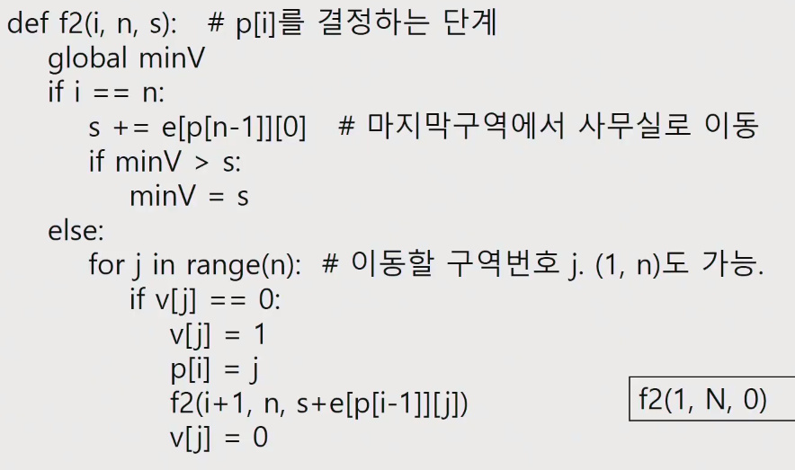
  - 2번 경우는 백트래킹을 통한 불필요한 탐색을 줄일 수 있음
  - 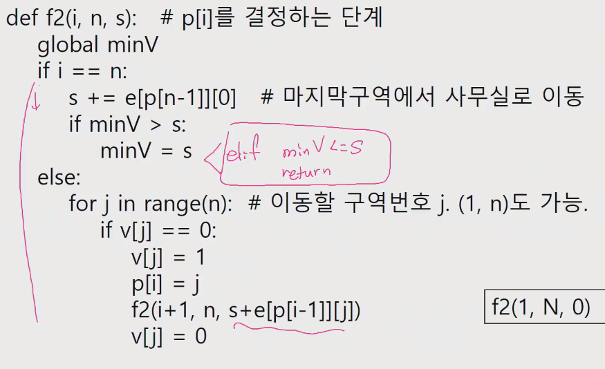
  - elif minV <= s: return 과 같은 처리를 해주면 순열의 크기가 커졌을 때 처리속도에 큰 차이를 보이게된다.

- 접근 방법 3 - 그래프 탐색으로

- 4881 배열 최소합 문제도 순열로 한번 풀어보는것 추천

---

<br>

### 5201. 컨테이너 운반

- 접근 방법 1
  - 무거운 컨테이너 부터 옮겨본다.
  - (1) 화물의 무게를 기준으로 내림차순 정렬한다.
  - (2) 트럭이 가능한 가장 무거운 화물을 옮긴다.
  - (3) 모든 트럭에 대해 (2)를 반복한다.
  - 옮겨진 총 무게를 출력한다.
  - 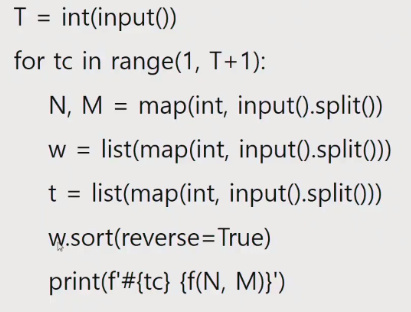
  - 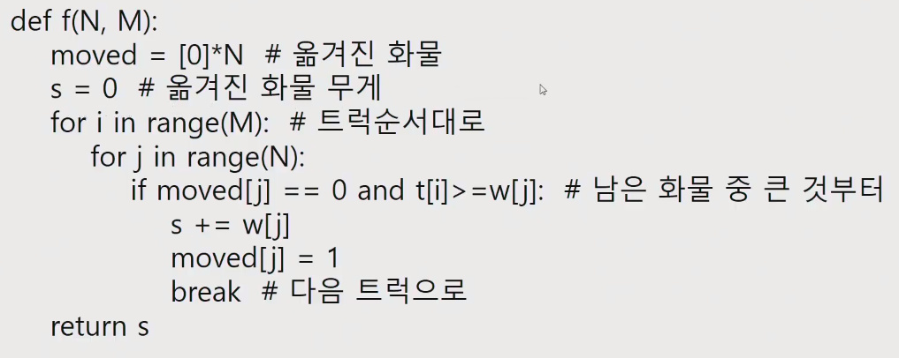


- 접근 방법 2
  - 트럭과 화물을 크기순으로 내림차순 정렬한다.
  - i 트럭과 j 화물을 비교한다.
    - 실을 수 있으면 옮기고 다음 트럭과 다음 화물로 이동한다. i++, j++
    - 실을 수 없으면 다음 화물로 이동한다. j++
  - 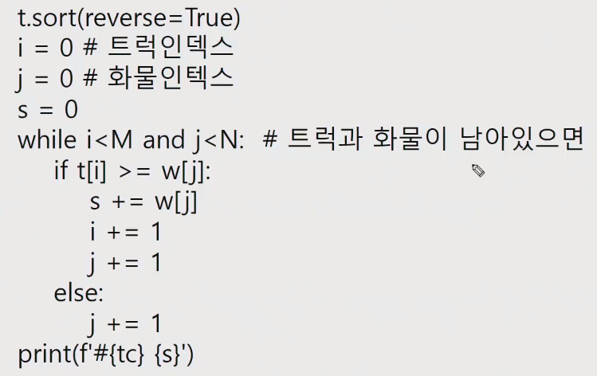

---

<br>

### 5202. 화물 도크

- 회의실 문제와 유사한 문제
- 접근방법
  - 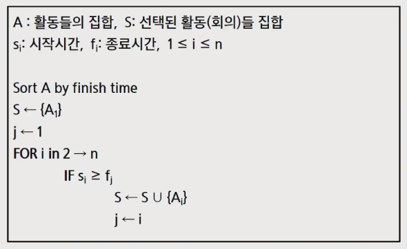
  - 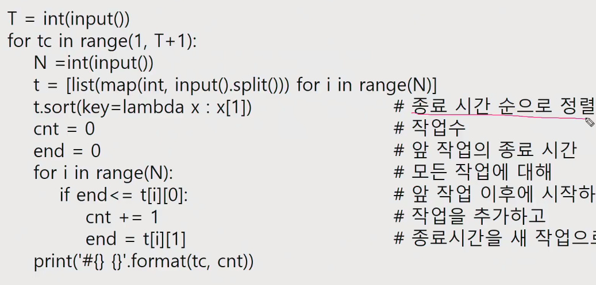

---

<br>


### 5203. 베이비진 게임

- 접근 방법

  - 각 플레이어가 카드를 가져갈 때 마다 run, triplet을 확인한다.
  - 각 플레이어를 위한 카운트 배열을 만들어 사용한다.
  - 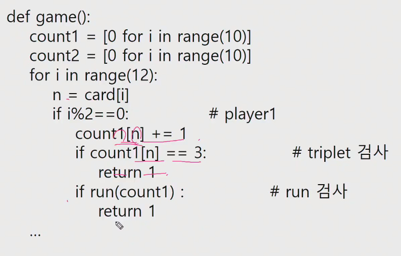

  - 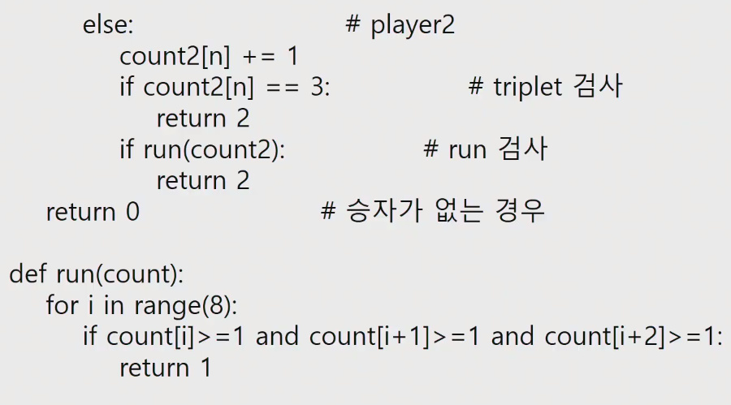


---

<br>


### 4366. 정식이의 은행 업무

- 접근 방법

  - 기억하는 2진수의 각 자리를 바꾼 숫자 목록을 만든다.
  - 기억하는 3진수의 각 자리를 바꾼 숫자와 목록을 비교 한다.

- 교수님 풀이

  - int(x, 2), int(x, 3) 과 같은 내장함수로 2진수 3진수를 바로 변형 가능

  - 내장 함수 없이 할 경우

  - ```
    b = 0
    for x in bit: 
    	b = b*2 + int(x)
    ```

  - 여러 경우의 수를 XOR로 생성

  - 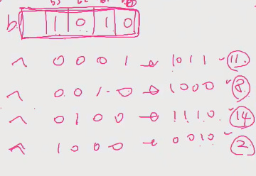

  - 3진수의 경우

    - 0 -> 1, 2  
    - 1 -> 2, 0
    - 2 -> 0, 1
    - 앞의 줄은 (int(x)+1)%3 뒤의 줄은 (int(x)+2)%3 과 같다.

  - ```
    num = 0
    for x in t:
    	num = num * 3 + int(x)
    ```

  - 3진수의 경우의 수를 생성하는 것

- 전체 코드

- 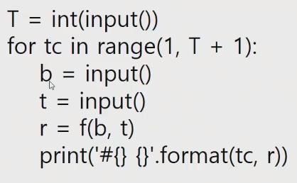

- 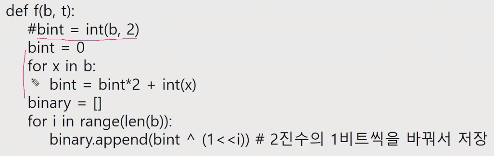

- 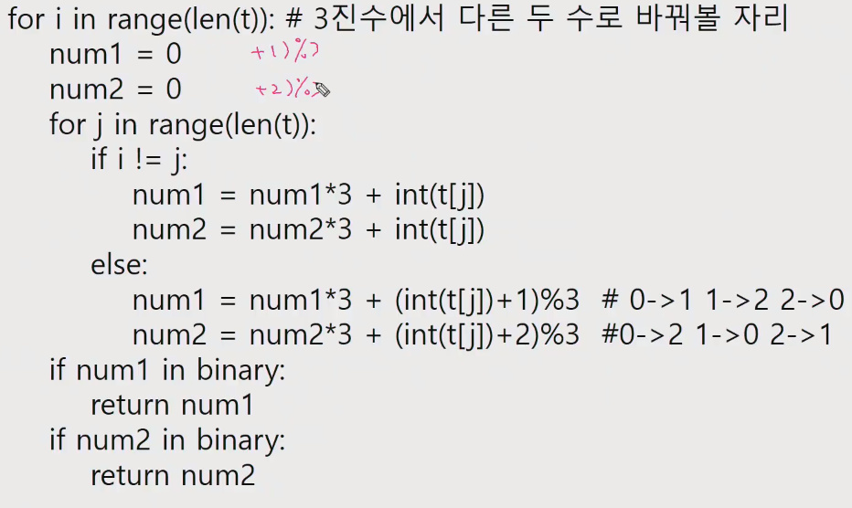


---

<br>

### 2819. 격자판의 숫자 이어 붙이기

- 아이디어 1
  - 배열 s에 7개의 숫자를 채운다.
  - f(n, i, j)에서 s[n]에 격자판 i, j의 숫자를 복사한다.
  - 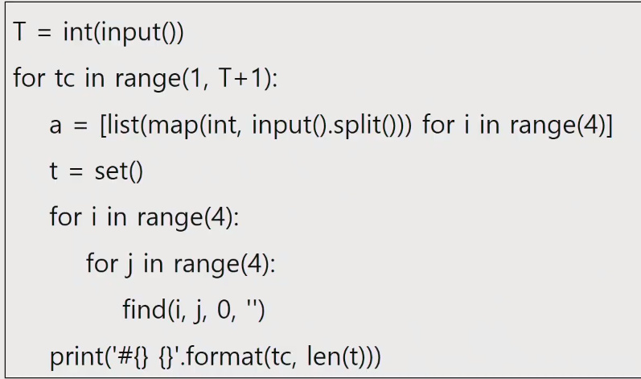
  - 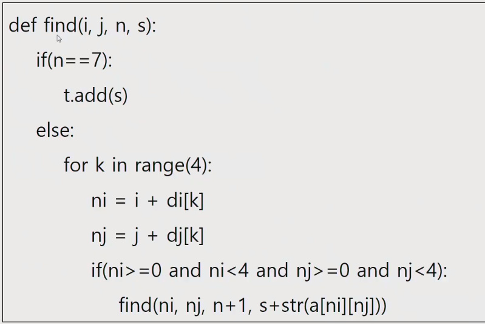


---

<br>


### 1861. 정사각형 방

- 아이디어

  - 각 칸에서 재귀함수를 사용해 이동한 칸 수 세기
    - N이 최대 1000, N * N 인 경우 최대 1000000칸 이동 가능
    - 가능한 재귀 호출 횟수
      - python3는 대략 1000
      - pypy3.6은 대략 2300
  - 재귀함수 사용 불가 (단, 주어진 입력데이터는 이동한 방이 최대 2200이고, pypy이므로 재귀로 가능)
  - sys.setrecursionlimit 재귀 제한 바꾸는거? 이거쓰면 메모리 사용이 심해짐
  - 반복 구조의 탐색으로 이동해 봄.
  - 눈 여겨 볼 조건
    - N개의 정수 Ai, 1, ..., Ai, N (1 <= Ai, j <= N2) 이 공백 하나로 구분되어 주어진다.
    - Ai, j는 모두 서로 다른 수이다.
  - 그림과 같은 갈림길이 생기지 않음.
  - 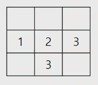

  - 각 칸에서 단순 반복으로  갈 수 있는 칸 만큼 이동 해봄.
    - 제시된 테스트 케이스는 통과하지만 N = 1000 인 경우 시간 초과

- 풀이

  - N*N 까지 인덱스를 가진 v 배열을 만들고 0으로 초기화 한다.
  - 모든 i, j에 대해 A[i] [j] 주변에 A[i] [j] + 1 인 방이 있는지 확인한다.
    - 해당하는 방이 있으면 v [A [i] [j]] 을 1로 표시한다.


- DFS, BFS ? 델타?


### 1486. 장훈이의 작은 선반

- 부분집합이나 조합으로 문제를 접근해보기?
- 선택하냐 안하냐를 재귀로?


## 오후 코칭


- 정사각형방 재설명
  - 재귀?
  - BFS, DFS? - 시간 줄이기 가능(백트래킹)
  - 카운트배열처럼 해서(2차원 배열을)
- 장훈이의 작은 선반
  - 부분집합
  - 조합