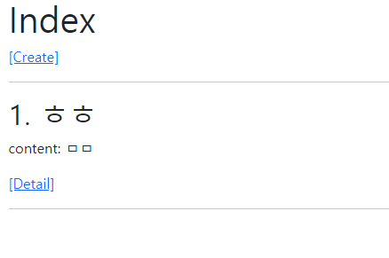
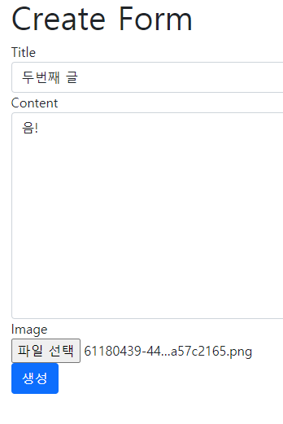
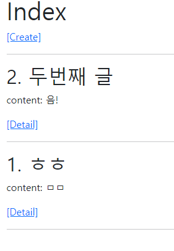
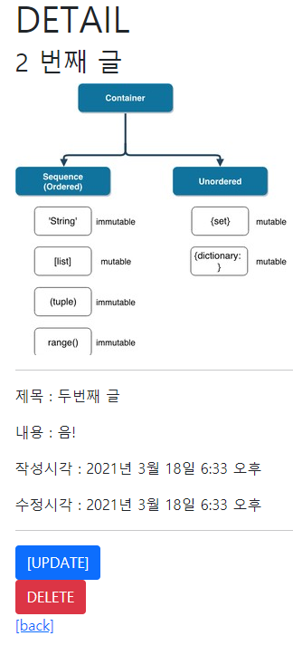
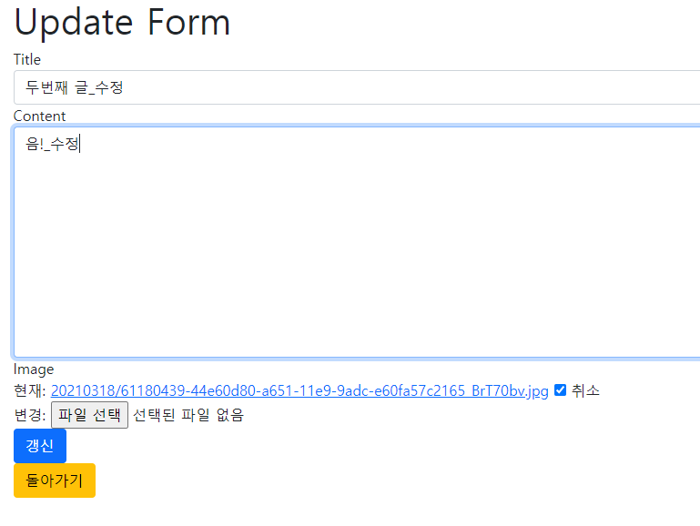
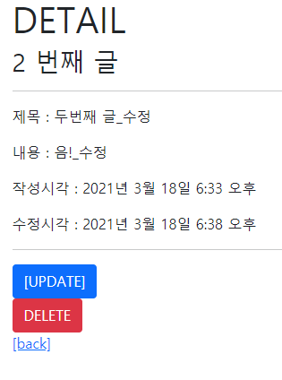
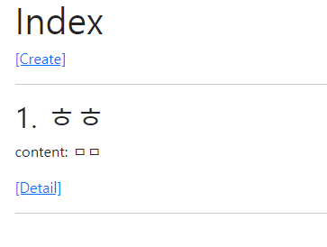

# django_07_workshop


##   Django Project

> Django Model Form을 활용해 CRUD를 모두 갖춘 장고 프로젝트를 제작하고 결과 사진과 코드를 별도의 마크다운 파일에 작성하여 제출하시오.


## 기본 설정

>1) 프로젝트 이름은 crud, 앱 이름은 articles로 설정한다.
>2) 모든 템플릿에서 상속받아 사용할 base.html을 작성한다. base.html이 담긴 templates 디렉토리는 프로젝트 및 앱 디렉토리와 동일한 위치에 생성한다. base.html은 Bootstrap CDN을 포함하고 있어야 한다.


### 1. 기본 프로젝트 폴더 생성 및 세팅

> 프로젝트 생성, 가상 환경 구축, 앱 생성, requirements 생성, settings에 기본 세팅

``` bash
$ django-admin startproject workshop_07
$ python -m venv venv
$ pip install django
$ pip install Pillow
$ pip install django-bootstrap-v5
$ pip install django-imagekit
$ pip freeze > requirements.txt
$ python manage.py startapp articles
```

```python
# settings.py
INSTALLED_APPS = [
    # local apps
    'articles',
	# 3rd party apps
    'bootstrap5',
    'imagekit',
]

TEMPLATES = [
    {
        'BACKEND': 'django.template.backends.django.DjangoTemplates',
        'DIRS': [BASE_DIR / 'workshop_07' / 'templates'],
        'APP_DIRS': True,
        'OPTIONS': {
            'context_processors': [
                'django.template.context_processors.debug',
                'django.template.context_processors.request',
                'django.contrib.auth.context_processors.auth',
                'django.contrib.messages.context_processors.messages',
            ],
        },
    },
]

LANGUAGE_CODE = 'ko-kr'

TIME_ZONE = 'Asia/Seoul'

STATIC_URL = '/static/'

STATIC_ROOT = BASE_DIR / 'staticfiles'

STATICFILES_DIRS = [
    BASE_DIR / 'workshop_07' / 'static',
]

# Media files

# 사용자가 미디어 파일로 접근하기 위한 경로
MEDIA_URL = '/media/'

# 미디어 파일이 업로드 되는 폴더의 위치
MEDIA_ROOT = BASE_DIR / 'media'
```


### 2. models.py 에서 데이터 모델 생성 및 db 생성 + forms 모델폼으로 생성 + Admin에 해당 모델 등록

``` python
# articles/models.py
from django.db import models
from imagekit.models import ProcessedImageField
from imagekit.processors import Thumbnail

class Article(models.Model):
    title = models.CharField(max_length=20)
    content = models.TextField()
    image =  ProcessedImageField(
        blank=True,
        processors=[Thumbnail(300, 300)],
        format='jpeg',
        options={'quality': 90},
        upload_to='%Y%m%d/',
    )
    created_at = models.DateTimeField(auto_now_add=True)
    updated_at = models.DateTimeField(auto_now=True)

# articles/forms.py
from django import forms
from .models import Article

class ArticleForm(forms.ModelForm):

    class Meta:
        model = Article
        fields = '__all__'

# articles/admin.py
from django.contrib import admin
from .models import Article

class ArticleAdmin(admin.ModelAdmin):
    list_display = ('pk', 'title', 'content', 'image', 'created_at', 'updated_at')

admin.site.register(Article, ArticleAdmin)
```

```bash
$ python manage.py makemigrations
$ python manage.py migrate
```


### 3. urls.py

> 메인프로젝트의 urls에는 articles와 연결 및 미디어 파일에 대한 static 연결을 추가해주고, 
>
> articles/urls 에는 각 crud 별 url을 생성합니다.

``` python
# workshop_07/urls.py
from django.contrib import admin
from django.urls import path, include
from django.conf.urls.static import static
from django.conf import settings

urlpatterns = [
    path('admin/', admin.site.urls),
    path('articles/', include('articles.urls')),
] + static(settings.MEDIA_URL, document_root=settings.MEDIA_ROOT)


# articles/urls.py
from django.urls import path
from . import views

app_name = 'articles'

urlpatterns = [
    path('', views.index, name='index'),
    # crud 기능 url 생성
    path('create/', views.create, name='create'),
    path('detail/<int:pk>/', views.detail, name='detail'),
    path('update/<int:pk>/', views.update, name='update'),
    path('delete/<int:pk>/', views.delete, name='delete'),
]
```


### 4. views.py

> articles/views.py  에 기능 별로  함수를 생성

``` python
from django.shortcuts import render, redirect, get_object_or_404
from .models import Article
from .forms import ArticleForm
# 데코레이터로 해당하는 http의 요청만 받게 설정 가능
from django.views.decorators.http import require_safe, require_http_methods, require_POST


# 메인 화면 페이지
@require_safe
def index(request):
    articles = Article.objects.order_by('-pk')
    context = {
        'articles': articles,
    }
    return render(request, 'articles/index.html', context)

# 생성 폼 및 생성 반영 페이지 = C
@require_http_methods(['POST', 'GET'])
def create(request):
    # POST 일 경우 처리
    if request.method == 'POST':
        # request에서 온 데이터를 폼 모델에 맞춰서 인스턴스 생성
        form = ArticleForm(request.POST, request.FILES)
        # 유효성 검사
        if form.is_valid():
            form.save()
            return redirect('articles:index')
    # GET 일 때
    else:
        # 입력 폼이므로 빈 폼으로 생성
        form = ArticleForm()
    # 유효성 검사에 실패했거나, GET 일 경우 생성 페이지로 보내기
    context = {
        'form': form,
    }
    return render(request, 'articles/create.html', context)

# 상세 페이지 = R
@require_safe
def detail(request, pk):
    # 해당 하는 행의 데이터가 있는지 확인 후 데이터 보내기
    article = get_object_or_404(Article, pk=pk)
    context = {
        'article': article,
    }
    return render(request, 'articles/detail.html', context)

# 수정 페이지 및 수정 반영 페이지 = U
# GET, POST 요청만 받을 것
@require_http_methods(['GET', 'POST']) 
def update(request, pk):
    # 해당 하는 행의 데이터가 있는지 확인
    article = get_object_or_404(Article, pk=pk)
    # POST 일 경우 update
    if request.method == 'POST':
        # request에서 온 데이터를 폼 모델에 맞춰서 인스턴스 생성 단, 현재 db에 있는 행을 수정하는 것이므로 인스턴스로 가져오기
        form = ArticleForm(request.POST, request.FILES, instance=article)
        # 유효성 검사
        if form.is_valid():
            form.save()
            return redirect('articles:detail', article.pk)
    # GET 일 때 edit
    else:
        # 현재 db에 있는 행 데이터들을 폼 형식에 맞춰서 가져오기
        form = ArticleForm(instance=article)
    # 유효성 검사에 실패했거나, GET 일 경우 수정 페이지로 보내기
    context = {
        'form': form,
        'article': article,
    }
    return render(request, 'articles/update.html', context)

# 삭제 페이지 = D
# POST 요청 이외에는 메인 페이지로 바로 돌아감
@require_POST
def delete(request, pk):
    # 해당 하는 행의 데이터가 있는지 확인
    article = get_object_or_404(Article, pk=pk)
    # 존재하면 제거
    article.delete()
    # 메인 페이지로 돌아가기
    return redirect('articles:index')
```


### 5. templates

> 메인 페이지에 기본이 되는 base.html 에서 bootstrap과 block을 생성하고, template/articles 에서 필요한 4가지 html(index, create, detail, update)를 만들기

#### workshop_07/template/base.html 

``` django



<!DOCTYPE html>
<html lang="en">
<head>
  <meta charset="UTF-8">
  <meta http-equiv="X-UA-Compatible" content="IE=edge">
  <meta name="viewport" content="width=device-width, initial-scale=1.0">
  <title>Document</title>
  <link href="https://cdn.jsdelivr.net/npm/bootstrap@5.0.0-beta2/dist/css/bootstrap.min.css" rel="stylesheet" integrity="sha384-BmbxuPwQa2lc/FVzBcNJ7UAyJxM6wuqIj61tLrc4wSX0szH/Ev+nYRRuWlolflfl" crossorigin="anonymous">
   <link rel="stylesheet" href=""> 
  
  
</head>
<body>
  <div class="container">
    
    
  </div>

   <script src=""></script> 
  <script src="https://cdn.jsdelivr.net/npm/bootstrap@5.0.0-beta2/dist/js/bootstrap.bundle.min.js" integrity="sha384-b5kHyXgcpbZJO/tY9Ul7kGkf1S0CWuKcCD38l8YkeH8z8QjE0GmW1gYU5S9FOnJ0" crossorigin="anonymous"></script>
</body>
</html>
```


#### articles/templates/articles/index.html

```django




  <h1>Index</h1>
  <a href="">[Create]</a>
  <hr>
  
    <h2>{{ article.pk }}. {{ article.title }}</h2>

    <p>content: {{ article.content }}</p>

    <a href="">[Detail]</a>
    <hr>
  


```


#### articles/templates/articles/create.html

```django



  <h1>Create Form</h1>
  <form action="" method="post" enctype="multipart/form-data">
    
    
  <button class="btn btn-primary">생성</button>
  </form>


```


#### articles/templates/articles/detail.html

```django


  <h1>DETAIL</h1>
  <h3>{{ article.pk }}번째 게시글</h3>
  
    
  
  <hr>
  <p>글 제목 : {{ article.title }}</p>
  <p>글 내용 : {{ article.content }}</p>
  <p>작성시각 : {{ article.created_at }}</p>
  <p>수정시각 : {{ article.updated_at }}</p>
  <hr>
  <a href="" class="btn btn-primary">[UPDATE]</a>
  <form action="" method="POST">
    
    <button class="btn btn-danger">DELETE</button>
  </form>
  <a href="">[back]</a>


```


#### articles/templates/articles/detail.html

```django



  <h1>Update Form</h1>
  <form action="" method="post" enctype="multipart/form-data">
    
     
    <button class="btn btn-primary">갱신</button>
  </form>
  <a href="" class="btn btn-warning">돌아가기</a>
 

```

첫 페이지



생성 페이지




생성 후 메인 페이지




상세 페이지




수정 페이지




수정 후 상세 페이지




삭제 후 메인 페이지

