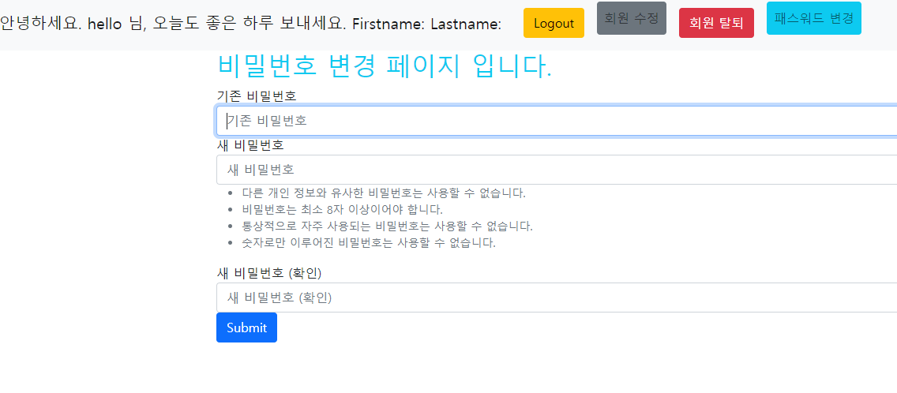
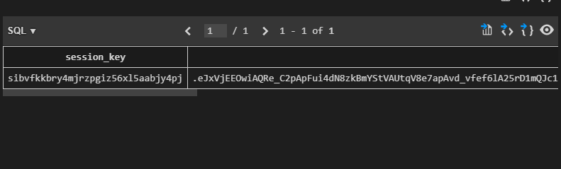
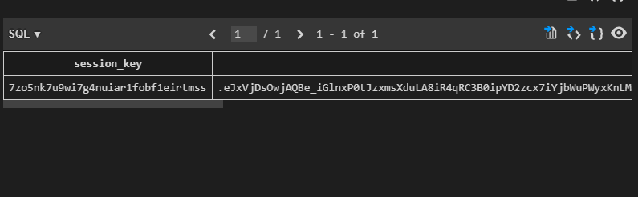

# django_09_workshop


### 1. User Change Password

> /accounts/password/ url을 가지며 유저의 비밀번호 수정 기능을 구현한다.

``` python
# accounts/urls.py
from django.urls import path
from . import views

app_name = 'accounts'

urlpatterns = [
    path('', views.index, name='index'),
    path('password/', views.password, name='password'),
]

# accounts/views.py
@login_required
@require_http_methods(['GET', 'POST'])
def password(request):
    if not request.user.is_authenticated:
        return redirect('accounts:index')
    
    if request.method == 'POST': # 비밀 번호 변경 반영
        form = PasswordChangeForm(request.user, request.POST)
        if form.is_valid():
            form.save()
            # 로그인 상태 유지(새로운 세션 발급)
            update_session_auth_hash(request, request.user)
            return redirect('accounts:index')
    else:  # 비밀번호 변경 폼 제공
        form = PasswordChangeForm(request.user)
    context = {
        'form': form,
    }
    return render(request, 'accounts/password.html', context)
```

```django
<!-- accounts/templates/accounts/password.html -->



    <h2 class="text-info">비밀번호 변경 페이지 입니다.</h2>
  <form action="" method="post">
    
    
    <input class="btn btn-primary" type="submit" value="Submit">
  </form>

```

##### 비밀번호 변경 페이지



##### 비밀번호 변경 전 session 테이블




##### 변경 후 session 테이블



