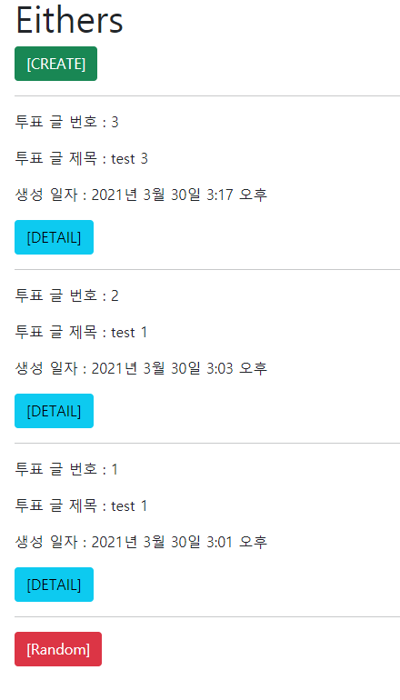
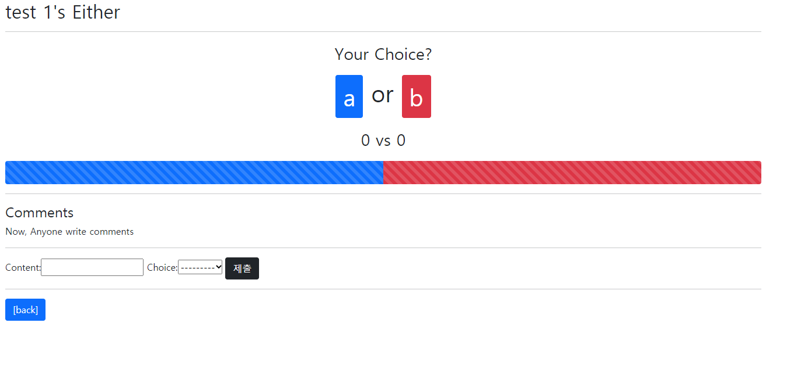
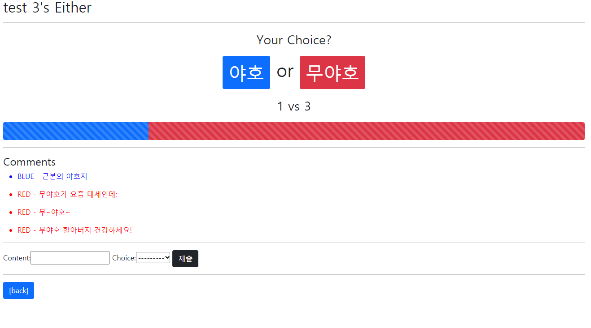
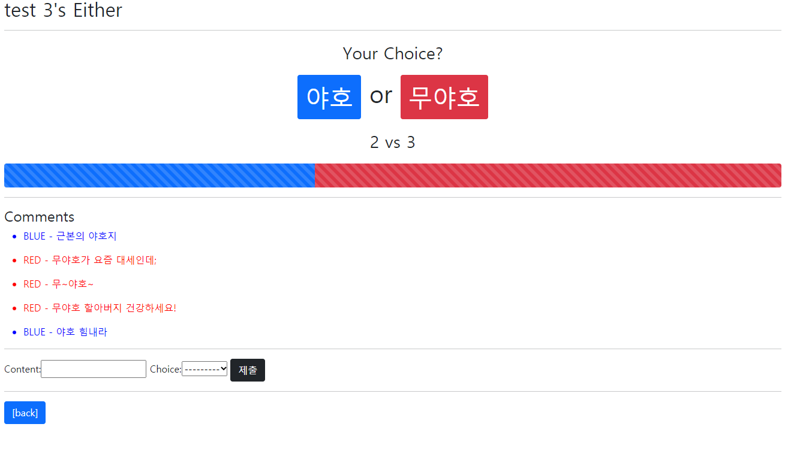

# django_13_workshop


### 1. 투표는 생성 및 조회가 가능합니다.

``` python
# views.py
@require_safe
def index(request):
    # 현재 있는 투표 글 들을 모아서 메인 페이지로 넘겨주기
    eithers = Either.objects.order_by('-pk')
    # 6 - random 링크를 클릭하면 투표 조회페이지가 랜덤으로 렌더링됩니다.
    random_choice = random.randrange(1, len(eithers)+1)
    context = {
        'eithers': eithers,
        'random_choice': random_choice,
    }
    return render(request, 'eithers/index.html', context)

@require_http_methods(['GET', 'POST'])
def create(request):
    # POST 데이터(투표 글) 생성
    if request.method == 'POST':
        form = Either_Form(request.POST)
        if form.is_valid():
            either = form.save()
            return redirect('eithers:detail', either.pk)
    # GET 폼 제공
    else:
        form = Either_Form()
    context = {
        'form': form,
    }
    return render(request, 'eithers/create.html', context)
```


___


### 2. 투표는 주제와 주제에 맞는 항목 2개를 가지고 있습니다.

``` python
# models.py
class Either(models.Model):
    title = models.CharField(max_length=50)
    # 2가지 선택지
    # 2 - 투표는 주제와 주제에 맞는 항목 2개를 가지고 있습니다.
    choice_a = models.CharField(max_length=50)
    choice_b = models.CharField(max_length=50)

    # 나중에 1번에 대한 answer 가 얼마나 있는지 카운트 - 토탈 n/카운트
    # 나중에 0번에 대한 answer 가 얼마나 있는지 카운트 - 토탈 n/카운트

```


___


### 3. 댓글은 생성 및 조회가 가능합니다.

``` python
# views.py
def detail(request, pk):
    # 투표 정보, 댓글 폼, 현재 달린 댓글 내역 모음 을 받아 상세 페이지로 넘겨주기
    either = get_object_or_404(Either, pk=pk)
    comment_form = Comment_Form()
    comments = either.comment_set.all()
    # 7 - 투표 조회 페이지에서는 항목별 댓글 개수를 통해 두 항목간 선택 비율을 출력합니다.
    choice_a = either.comment_set.filter(choice='BLUE').count()
    choice_b = either.comment_set.filter(choice='RED').count()
    if len(comments):
        percent_a = choice_a / len(comments) * 100
        percent_b = choice_b / len(comments) * 100
    else:
        percent_a = 50
        percent_b = 50
    context = {
        'either': either,
        'comment_form': comment_form,
        'comments': comments,
        'choice_a': choice_a,
        'choice_b': choice_b,
        'percent_a': percent_a,
        'percent_b': percent_b,
    }
    return render(request, 'eithers/detail.html', context)

@require_POST
def comment_create(request, pk):
    either = get_object_or_404(Either, pk=pk)
    comment_form = Comment_Form(request.POST)
    if comment_form.is_valid():
        comment = comment_form.save(commit=False)
        comment.either = either
        comment.save()
        return redirect('eithers:detail', either.pk)
    context = {
        'comment_form': comment_form,
        'either': either,
    }
    return render(request, 'eithers/detail.html', context)
```


___


### 4.  댓글은 하나의 투표에 여러 개가 작성 될 수 있습니다.

``` django
<!-- detail.html --> 
 4 - 댓글은 하나의 투표에 여러 개가 작성 될 수 있습니다. 
  <form action="" method="POST">
    
    {{ comment_form }}
    <input class="btn btn-dark" type="submit">
  </form>
  <hr>
```


---


### 5.  댓글은 투표 문제 중 하나를 반드시 선택해야 합니다.

> 

``` python
# models.py
class Comment(models.Model):
    # 답변 - 댓글을 달 투표 글 - 외래키
    either = models.ForeignKey(Either, on_delete=models.CASCADE)
    # 댓글 내용
    content = models.CharField(max_length=200)

    # 선택 - 즉 요는 2개 중에 하나를 선택하도록 만들기 (사용자의 선택만 저장)

    CHOICE_A = 'BLUE'
    CHOICE_B = 'RED'

    CHOICES = [
        # 왼쪽은 실제 db에 저장될 값, 우측은 label 처럼 사용자가 보게 될 텍스트
        (CHOICE_A, 'Blue'),
        (CHOICE_B, 'Red'),
    ]
    # BLUE or RED 선택
    # 5 - 댓글은 투표 문제 중 하나를 반드시 선택해야 합니다.
    choice = models.CharField(
        max_length=4,
        choices=CHOICES,
        # default=CHOICE_A,
    )
```


___


### 6. random 링크를 클릭하면 투표 조회페이지가 랜덤으로 렌더링됩니다.

> 1번 index 함수안에 포함되어 있습니다.

```python
# 6 - random 링크를 클릭하면 투표 조회페이지가 랜덤으로 렌더링됩니다.
random_choice = random.randrange(1, len(eithers)+1)
    context = {
        'eithers': eithers,
        'random_choice': random_choice,
    }
    return render(request, 'eithers/index.html', context)
```


___


### 7. 투표 조회 페이지에서는 항목별 댓글 개수를 통해 두 항목간 선택 비율을 출력합니다.

> view 부분은 3번에, templates는 detail.html에 있습니다.

```python
# views.py
    # 7 - 투표 조회 페이지에서는 항목별 댓글 개수를 통해 두 항목간 선택 비율을 출력합니다.
    choice_a = either.comment_set.filter(choice='BLUE').count()
    choice_b = either.comment_set.filter(choice='RED').count()
    if len(comments):
        percent_a = choice_a / len(comments) * 100
        percent_b = choice_b / len(comments) * 100
    else:
        percent_a = 50
        percent_b = 50
    context = {
        'either': either,
        'comment_form': comment_form,
        'comments': comments,
        'choice_a': choice_a,
        'choice_b': choice_b,
        'percent_a': percent_a,
        'percent_b': percent_b,
    }
    return render(request, 'eithers/detail.html', context)
```

``` django
<!-- detail.html --> 
 7 - 투표 조회 페이지에서는 항목별 댓글 개수를 통해 두 항목간 선택 비율을 출력합니다. 
  <div class="progress" style="height: 40px;">
    <div class="progress-bar progress-bar-striped progress-bar-animated" role="progressbar" aria-valuenow="75" aria-valuemin="0" aria-valuemax="100" style="width: {{ percent_a }}%"></div>
    <div class="progress-bar progress-bar-striped progress-bar-animated bg-danger" role="progressbar" aria-valuenow="75" aria-valuemin="0" aria-valuemax="100" style="width: {{ percent_b }}%"></div>
  </div>
```


___


### 결과

#### 메인 페이지



#### 랜덤으로 페이지 입장



#### 투표 게이지




#### 투표 게이지 변경 후



