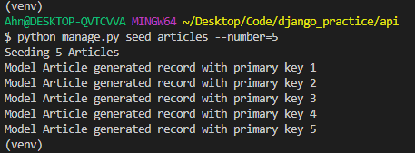
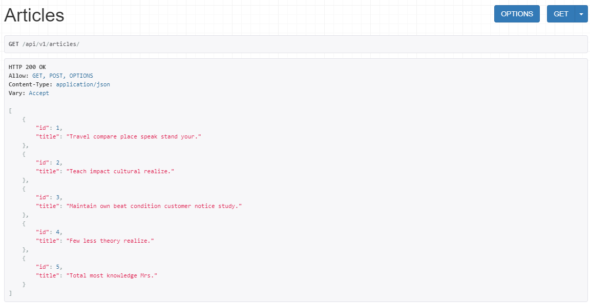
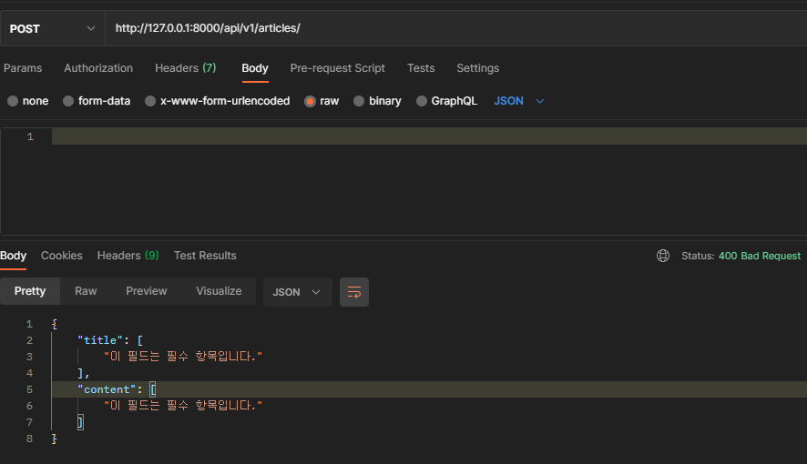
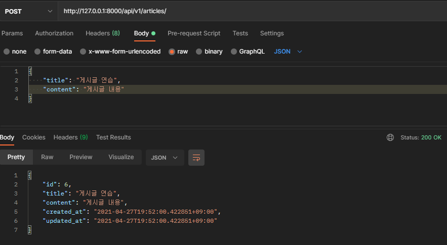
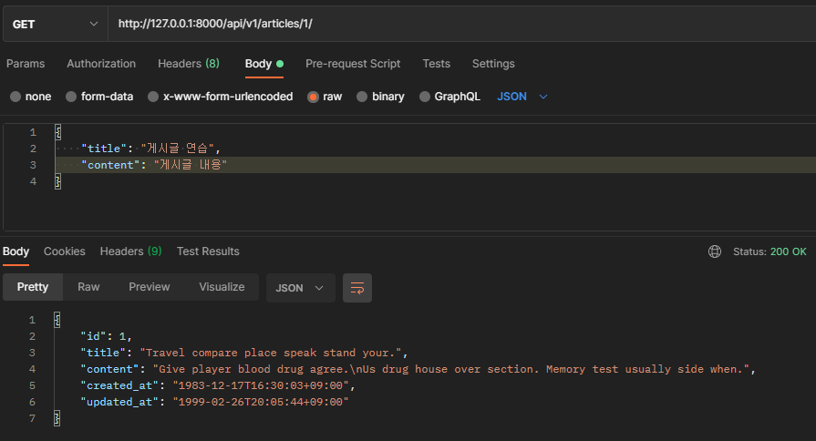
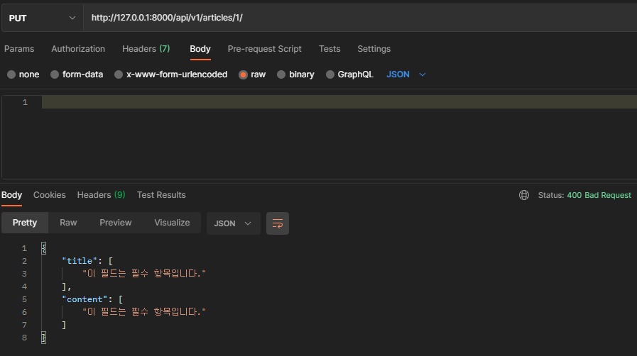
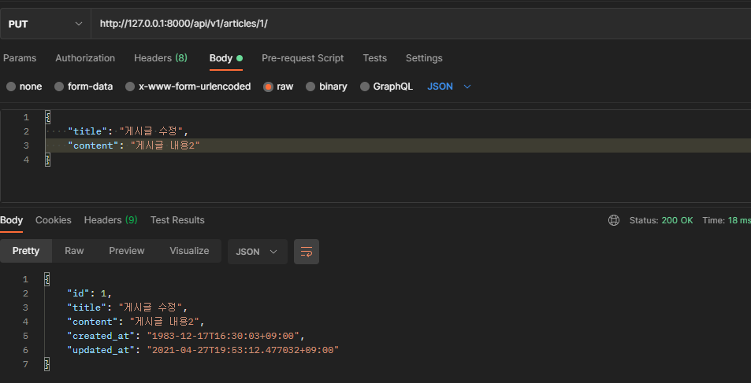
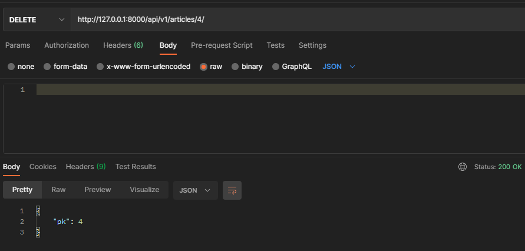

# django_16_workshop


### 시작 데이터




### 1. JSON 응답 결과

> GET api/v1/articles/
> • 모든 게시글의 id와 title 컬럼을 JSON으로 응답한다.

- GET



___


> POST api/v1/articles/
> • 검증에 성공하는 경우 새로운 게시글의 정보를 DB에 저장하고 저장된 게시글의 정
> 보를 응답한다.
> • 검증에 실패하는 경우 400 Bad Request 오류를 발생시킨다.

- POST 검증 실패



- POST 검증 성공



___


> GET api/v1/articles/<article_pk>/
> • 특정 게시글의 모든 컬럼을 JSON으로 응답한다.

- GET



___


> PUT & DELETE api/v1/articles/<article_pk>/
> • PUT 요청인 경우 특정 게시글의 정보를 수정한다.
> ▪ 검증에 성공하는 경우 수정된 게시글의 정보를 DB에 저장한다.
> ▪ 검증에 실패할 경우 400 Bad Request 오류를 발생시킨다.
> ▪ 수정이 완료되면 수정한 게시글의 정보를 응답한다.
> • DELETE 요청인 경우 특정 게시글의 정보를 삭제한다.
> ▪ 삭제가 완료되면 삭제한 게시글의 id를 응답한다.

- PUT 검증 실패



- PUT 검증 성공



- DELETE




___


### 2. views.py

> 명세서에 맞춰서 기능 구현

``` python
from django.shortcuts import render, get_list_or_404, get_object_or_404
from .models import Article
from .serializers import ArticleListSerializer, ArticleSerializer
from rest_framework.response import Response
from rest_framework.decorators import api_view

# Create your views here.


@api_view(['GET', 'POST'])
def articles(request):
    if request.method == 'GET':  
        article_list = get_list_or_404(Article)
        serializer = ArticleListSerializer(article_list, many=True)
        return Response(serializer.data)
    else:
        serializer = ArticleSerializer(data=request.data)
        if serializer.is_valid(raise_exception=True):
            serializer.save()
            return Response(serializer.data)


@api_view(['GET', 'DELETE', 'PUT'])
def article_detail(request, article_pk):
    article = get_object_or_404(Article, pk=article_pk)
    if request.method == 'GET':
        serializer = ArticleSerializer(article)
        return Response(serializer.data)

    elif request.method == 'PUT':
        serializer = ArticleSerializer(article, data=request.data)
        if serializer.is_valid(raise_exception=True):
            serializer.save()
            return Response(serializer.data)

    else: # Delete
        article.delete()
        response = {'pk': article_pk}
        return Response(response)

```


___


### 3. serializers.py

> 명세서에 맞게 구현하기

``` python
from rest_framework import serializers
from .models import Article


class ArticleListSerializer(serializers.ModelSerializer):

    class Meta:
        model = Article
        fields = ('id', 'title')

# 상세 페이지
class ArticleSerializer(serializers.ModelSerializer):

    class Meta:
        model = Article
        fields = '__all__'
```


___


