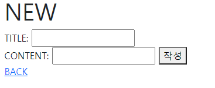
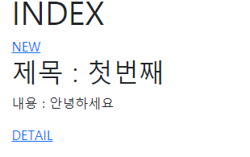

# django_03_workshop

처음 - 데이터 없을 때


입력창



데이터 입력 후




### 1. urls

> 메인프로젝트 urls 와 articles앱의 urls

``` python
# crud/urls.py
from django.contrib import admin
from django.urls import path, include

urlpatterns = [
    path('admin/', admin.site.urls),
    path('articles/', include('articles.urls')),
]

# articles/urls.py
from django.urls import path
from . import views

app_name = 'articles'

urlpatterns = [
    # 메인 화면
    path('', views.index, name='index'),
    # 게시판 글 생성 화면
    path('new/', views.new, name='new'),
    # 생성 후 리다이렉트
    path('create/', views.create, name='create'),
    path('detail/', views.detail, name='detail'),
]

```


### 2. articles/views.py

> articles 앱의 views

``` python
from django.shortcuts import render,redirect
from .models import Article

# Create your views here.

# 메인화면
def index(request):
    context = {
        'articles':Article.objects.all()
    }
    return render(request, 'articles/index.html', context)

# form 입력화면
def new(request):
    return render(request, 'articles/new.html')

# form catch받을 화면 데이터 db에 넣고 메인화면으로 돌아가기
def create(request):
    title = request.GET.get('title')
    content = request.GET.get('content')

    # 새로운 article data를 생성
    article = Article()
    article.title = title
    article.content = content
    article.save()

    return redirect('articles:index')

# detail을 눌렀을시 나올 화면
def detail(request, title, content):
    # title = request.GET.get('title')
    # content = request.GET.get('content')

    context = {
        'title':title,
        'content':content,
    }

    return render(request, 'articles/detial.html', context)
```


### 3. base.html

> 프로젝트 폴더에서 기본 파일이 되는 base.html

``` django
<!DOCTYPE html>
<html lang="en">
<head>
  <meta charset="UTF-8">
  <meta http-equiv="X-UA-Compatible" content="IE=edge">
  <meta name="viewport" content="width=device-width, initial-scale=1.0">
  <title>Document</title>
  <link href="https://cdn.jsdelivr.net/npm/bootstrap@5.0.0-beta2/dist/css/bootstrap.min.css" rel="stylesheet" integrity="sha384-BmbxuPwQa2lc/FVzBcNJ7UAyJxM6wuqIj61tLrc4wSX0szH/Ev+nYRRuWlolflfl" crossorigin="anonymous">
</head>
<body>
  <div class="container">
    
    
  </div>
  <script src="https://cdn.jsdelivr.net/npm/bootstrap@5.0.0-beta2/dist/js/bootstrap.bundle.min.js" integrity="sha384-b5kHyXgcpbZJO/tY9Ul7kGkf1S0CWuKcCD38l8YkeH8z8QjE0GmW1gYU5S9FOnJ0" crossorigin="anonymous"></script>
</body>
</html>
```


### 4. articles/template/articles/

> articles의 템플릿들 정리 - create의 경우 리다이렉트를 사용했기 때문에 따로 없음.

``` django
 detail.html 


  <h1>DETAIL</h1>
  <h2>{{ title }}</h2>
  <p>{{ content }}</p>
  
  <a href="">돌아가기</a>



 index.html 


  <h1>INDEX</h1>
  <a href="">NEW</a>

  
    <h2>제목 : {{article.title}}</h2>
    <p>내용 : {{article.content}}</p>
    <a href="">DETAIL</a>
  
    <p>데이터가 없습니다.</p>
  



 new.html 


  <h1>NEW</h1>
  <form action="">
    <label for="title">TITLE:</label>
    <input type="text" name="title" id="title">
    <br>
    <label for="content">CONTENT:</label>
    <input type="text" name="content" id="content">
    <button>작성</button>
  </form>
  <a href="">BACK</a>

```


### 4. models.py

> articles의 model

``` python
from django.db import models

# Create your models here.

# 모델 생성
class Article(models.Model):
    title = models.CharField(max_length=20)
    content = models.TextField()
    created_at = models.DateTimeField(auto_now_add=True)
    updated_at = models.DateTimeField(auto_now=True)
```

