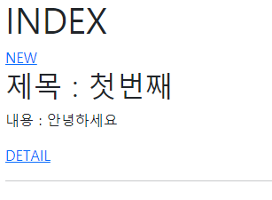
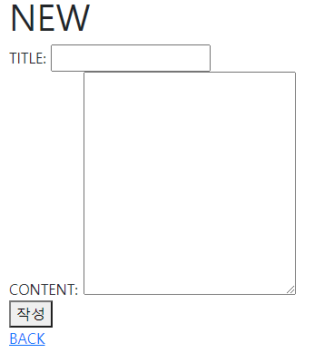
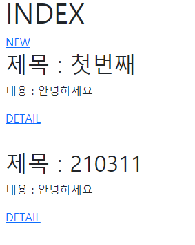
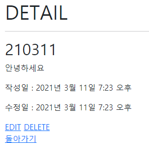
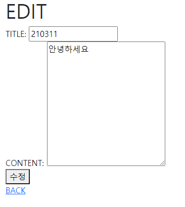
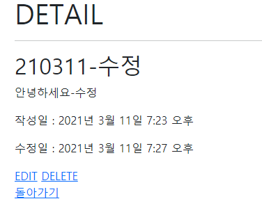

# django_04_workshop


### 1. urls

> urls 관련 코드

``` python
# crud/urls.py
from django.contrib import admin
from django.urls import path, include

urlpatterns = [
    path('admin/', admin.site.urls),
    path('articles/', include('articles.urls')),
]

# articles.urls.py
from django.urls import path
from . import views
app_name = 'articles'
urlpatterns = [
    # 메인 화면
    path('', views.index, name='index'),
    # 게시판 글 생성 화면
    path('new/', views.new, name='new'),
    # 생성 후 리다이렉트
    path('create/', views.create, name='create'),
    # 상세 페이지
    path('detail/<int:pk>/', views.detail, name='detail'),
    # 삭제 페이지
    path('delete/<int:pk>/', views.delete, name='delete'),
    # 수정 페이지
    path('edit/<int:pk>/', views.edit, name='edit'),
    # 수정을 반영하는 페이지
    path('update/<int:pk>/', views.update, name='update'),
]
```


### 2.  articles/views.py

> views 에는 기능에 맞춰 총 7개 뷰를 생성 해야 합니다.

``` python
from django.shortcuts import render, redirect, get_object_or_404
from .models import Article

# Create your views here.
# 어제 워크샵 기반에서 POST 기반 추가, 상세, 삭제, 수정페이지 추가(210311)

# 메인화면 read
def index(request):
    articles = Article.objects.all()
    context = {
        'articles': articles,
    }
    return render(request, 'articles/index.html', context)

# form 입력화면
def new(request):
    return render(request, 'articles/new.html')

# form catch받을 화면 데이터 db에 넣고 메인화면으로 돌아가기
def create(request):
    # title = request.GET.get('title')
    # content = request.GET.get('content')
    # POST로 변경
    if request.method == 'POST':
        title = request.POST.get('title')
        content = request.POST.get('content')
        # 2. 인스턴스 => 저장 과정이 꼭 필요하다!
        article = Article(title=title, content=content)
        article.save()
        # 2번이 추후에 유효성검사하기 편해서 자주사용하게 될것
    return redirect('articles:index')

# detail을 눌렀을시 나올 화면 read pk를 필요로 함(db에서 해당하는 부분만 추출하기 위해)
def detail(request, pk):
    # title = request.GET.get('title')
    # content = request.GET.get('content')
    article = get_object_or_404(Article, pk=pk)
    context = {
        'article': article,
    }
    return render(request, 'articles/detail.html', context)


def delete(request, pk):

    # 데이터 꺼내서 삭제 pk로 해당 행 찾음
    article = get_object_or_404(Article, pk=pk)
    article.delete()

    # 삭제후 메인화면으로 리턴
    return redirect('articles:index')

# 수정폼을 제공할 곳 throw
def edit(request, pk):
    article = get_object_or_404(Article, pk=pk)
    context = {
        'article': article,
    }
    return render(request, 'articles/edit.html', context)

# 실제 수정폼에서 받은 데이터를 기반으로 수정 할 곳 catch - 해당 열을 찾기위해 pk 필요
def update(request, pk):
    # POST 요청 아니면 무시
    if request.method == 'POST':
        article = get_object_or_404(Article, pk=pk)
        article.title = request.POST.get('title')
        article.content = request.POST.get('content')
        article.save()
    
    return redirect('articles:detail', pk)
```


### 3. template/articles

> articles의 템플릿 4개의 html 정보 (detail, edit, index, new)

``` django

 detail.html 

  <h1>DETAIL</h1>
  <hr>
  <h2>{{ article.title }}</h2>
  <p>{{ article.content }}</p>
  <p>작성일 : {{ article.created_at }}</p>
  <p>수정일 : {{ article.updated_at }}</p>

  <a href="">EDIT</a>
  <a href="">DELETE</a>
  <br>
  <a href="">돌아가기</a>



 edit.html 
 
  <h1>EDIT</h1>
   post 변경시 token 필수 
  <form action="" method="post">
    
    <label for="title">TITLE:</label>
    <input type="text" name="title" id="title" value="{{ article.title }}">
    <br>
    <label for="content">CONTENT:</label>
     textarea 도 가능 
    <textarea name="content" id="content" cols="30" rows="10">{{ article.content }}</textarea>
     <input type="text" name="content" id="content"> 
    <br>
    <button>수정</button>
  </form>
  <a href="">BACK</a>
 


 index.html 

  <h1>INDEX</h1>
  <a href="">NEW</a>
  
    <h2>제목 : {{article.title}}</h2>
    <p>내용 : {{article.content}}</p>
    <a href="">DETAIL</a>
    <hr>
  
    <p>데이터가 없습니다.</p>
  



 new.html 

  <h1>NEW</h1>
   post 변경시 token 필수 
  <form action="" method="post">
    
    <label for="title">TITLE:</label>
    <input type="text" name="title" id="title">
    <br>
    <label for="content">CONTENT:</label>
     textarea 도 가능 
    <textarea name="content" id="content" cols="30" rows="10"></textarea>
     <input type="text" name="content" id="content"> 
    <br>
    <button>작성</button>
  </form>
  <a href="">BACK</a>

```


### 4. articles/models.py

> 어제와 변한건 없지만 일단 구조이므로 추가

``` python
from django.db import models

# Create your models here.

# 모델 생성
class Article(models.Model):
    title = models.CharField(max_length=20)
    content = models.TextField()
    created_at = models.DateTimeField(auto_now_add=True)
    updated_at = models.DateTimeField(auto_now=True)
```


### 5. 실행 결과

첫 화면



NEW 화면(생성)



첫 생성 후 메인 페이지



상세 페이지



수정 페이지



수정 후 상세 페이지



삭제 후 메인 페이지

