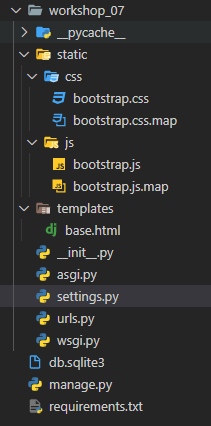

# django_07_homework


### 1. Compiled Bootstrap

> CSS, JS 파일을 다운로드 받아 Django 프로젝트에 Static 파일로 추가하시오.
>
> 부트스트랩이 적용되기 위해 작성해야 할 코드를 제출하시오.
>
> https://getbootstrap.com/docs/5.0/getting-started/download/

폴더 구조는 다음과 같이 되어있습니다. 



```python
'''
먼저 static url을 확인하고, 다음으로 메인 프로젝트 폴더에 static 폴더를 만들어 진행할 것이므로 STATICFILES_DIRS 키워드로 위치를 추가해줍니다. 현재로써는 STATIC_ROOT 까지는 필요가 없습니다.(배고하진 않으므로)
'''
# workshop_07/settings.py
STATIC_URL = '/static/'

STATICFILES_DIRS = [
    BASE_DIR / 'workshop_07' / 'static',
]
```


``` django

<!-- workshop_07/templtes/base.html -->
<!-- static 사용시 꼭 load 해야함 -->


<!DOCTYPE html>
<html lang="en">
<head>
  <meta charset="UTF-8">
  <meta http-equiv="X-UA-Compatible" content="IE=edge">
  <meta name="viewport" content="width=device-width, initial-scale=1.0">
  <title>Document</title>
    <!-- 기존 cdn 사용법 -->
   <link href="https://cdn.jsdelivr.net/npm/bootstrap@5.0.0-beta2/dist/css/bootstrap.min.css" rel="stylesheet" integrity="sha384-BmbxuPwQa2lc/FVzBcNJ7UAyJxM6wuqIj61tLrc4wSX0szH/Ev+nYRRuWlolflfl" crossorigin="anonymous"> 
    <!-- static 폴더에서 가져 오는 법 -->
  <link rel="stylesheet" href="">
  
  
</head>
<body>
  <div class="container">
    
    
  </div>
  <!-- static에서 js 가져오기 -->
  <script src=""></script>
  <!-- 기존 cdn 으로 js 가져오는 법 -->
   <script src="https://cdn.jsdelivr.net/npm/bootstrap@5.0.0-beta2/dist/js/bootstrap.bundle.min.js" integrity="sha384-b5kHyXgcpbZJO/tY9Ul7kGkf1S0CWuKcCD38l8YkeH8z8QjE0GmW1gYU5S9FOnJ0" crossorigin="anonymous"></script> 
</body>
</html>
```


