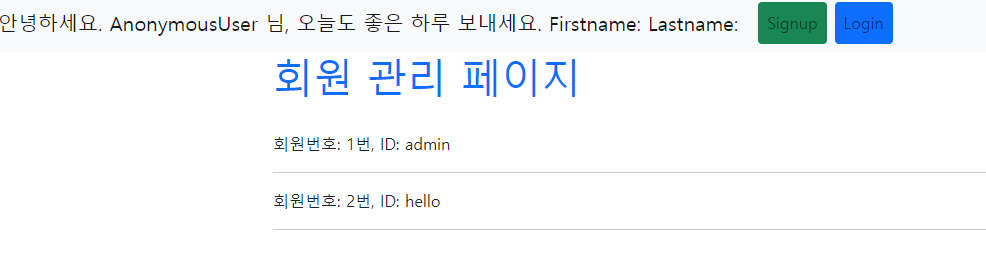
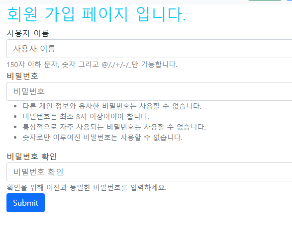

# django_08_workshop


### 1.  /accounts/

> 유저 목록을 출력하는 페이지를 나타낸다.
>

``` python
# accounts/views.py
def index(request):
    # user list 뽑아서 index.html에 전달
    users = get_user_model().objects.all()
    context = {
        'users': users,
    }
    return render(request, 'accounts/index.html', context)
```

```django
<!-- accounts/templates/accounts/index.html -->



  <h1 class="text-primary">회원 관리 페이지</h1>
  
    <p> 회원번호: {{ user.pk }}번, ID: {{ user.username }} </p>
    <hr>
  
    <p class="text-warning">생성된 아이디가 없습니다.</p>
  

```




### 2.   /accounts/signup/

> 회원가입 작성을 위한 페이지를 나타낸다.
>
> 유저를 생성하는 기능을 수행한다.

``` python
# accounts/views.py
@require_http_methods(['GET', 'POST'])
def signup(request):
    if request.user.is_authenticated:
        return redirect('accounts:index')
    
    if request.method == 'POST': # 회원 가입 반영
        form = UserCreationForm(request.POST)
        if form.is_valid():
            user = form.save()
            # 로그인까지 시켜주기
            auth_login(request, user)
            return redirect('accounts:index')

    else: # 회원 가입 폼 넘겨주기
        form = UserCreationForm()
    context = {
        'form': form,
    }
    return render(request, 'accounts/signup.html', context)
```

```django
<!-- accounts/templates/accounts/signup.html -->



  <h2 class="text-info">회원 가입 페이지 입니다.</h2>
  <form action="" method="post">
    
     {{ form.as_p }} 
    
    <input class="btn btn-primary" type="submit" value="회원가입">
  </form>

```

