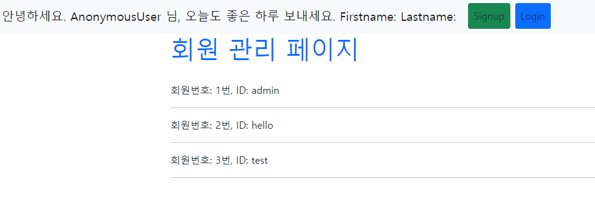
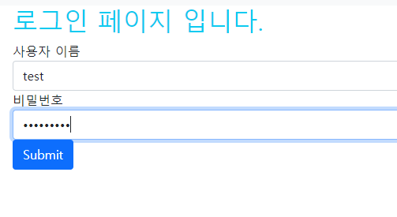
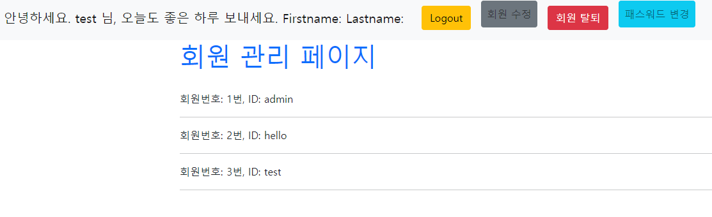
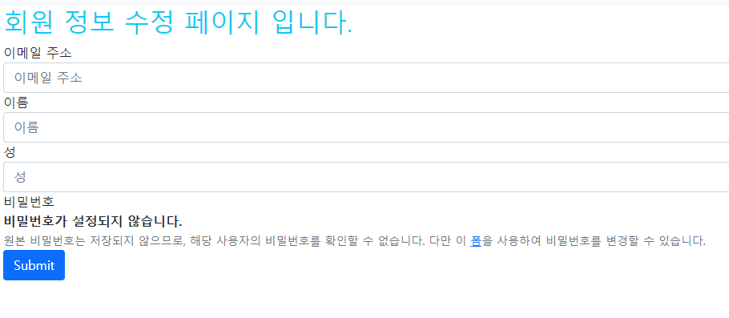
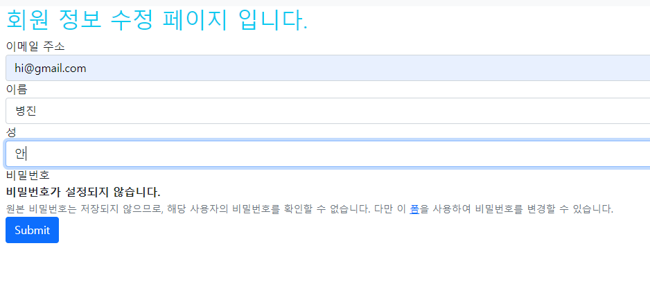
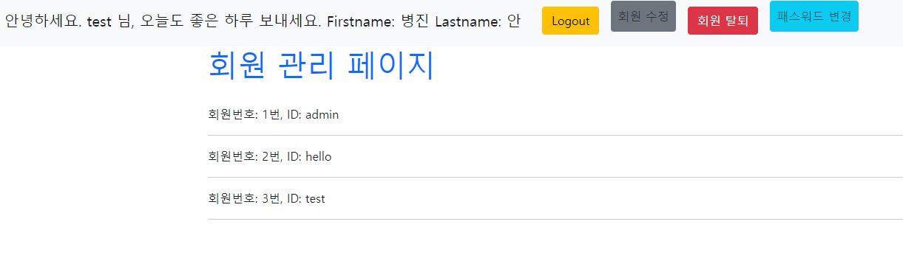
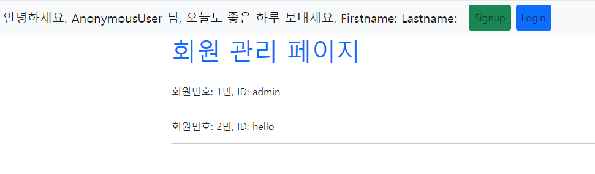

# django_09_practice


### 시작하기 앞서

> form이 필요한 views들은 하나의 forms.html 에서 작동합니다.

```django
<!-- accounts/templates/accounts/forms.html -->



  
    <h2 class="text-info">회원 가입 페이지 입니다.</h2>
  
    <h2 class="text-info">로그인 페이지 입니다.</h2>
  
    <h2 class="text-info">회원 정보 수정 페이지 입니다.</h2>
  
  <form action="" method="post">
    
     {{ form.as_p }} 
    
    <input class="btn btn-primary" type="submit" value="Submit">
  </form>

```


> base.html의 경우 로그인 되었을 때와 아닐 때를 구분하여 navbar의 메뉴가 바뀝니다.

```django


<!DOCTYPE html>
<html lang="en">
<head>
  <meta charset="UTF-8">
  <meta http-equiv="X-UA-Compatible" content="IE=edge">
  <meta name="viewport" content="width=device-width, initial-scale=1.0">
  
  <title>Document</title>
</head>
<body>
  <nav class="navbar navbar-expand-lg navbar-light bg-light">
    <div class="container-fluid">
      <a class="navbar-brand" href="#">안녕하세요. {{ request.user }} 님, 오늘도 좋은 하루 보내세요. Firstname: {{ request.user.first_name }} Lastname: {{request.user.last_name}}</a>
      <button class="navbar-toggler" type="button" data-bs-toggle="collapse" data-bs-target="#navbarSupportedContent" aria-controls="navbarSupportedContent" aria-expanded="false" aria-label="Toggle navigation">
        <span class="navbar-toggler-icon"></span>
      </button>
      <div class="collapse navbar-collapse" id="navbarSupportedContent">
        <ul class="navbar-nav me-auto mb-2 mb-lg-0">
          
            <!-- 로그인 된 경우 로그아웃 버튼, 회원정보 수정 버튼, 회원 탈퇴 버튼-->
            <li class="nav-item mx-1">
              <form action="" class="nav-link" method="post">
                
                <button class="btn btn-warning">Logout</button>
              </form>
            </li>              
            <li class="nav-item mx-1">
              <a href="" class="btn btn-secondary nav-link">회원 수정</a>
            </li>      
            </li>              
            <li class="nav-item mx-1">
              <form action="" class="nav-link" method="post">
                
                <button class="btn btn-danger">회원 탈퇴</button>
              </form>
            </li>             
          
            <!-- 로그인 실패한 경우 로그인 버튼, 회원가입 버튼-->
            <li class="nav-item mx-1">
              <a href="" class="btn btn-success nav-link">Signup</a>
            </li>              
            <li class="nav-item mx-1">
              <a href="" class="btn btn-primary nav-link">Login</a>
            </li>
                          
        </ul> 
      </div>
    </div>
  </nav>
  <div class="container">
    
    
  </div>
  
</body>
</html>
```


> 전체 사용하는 url에 대한 목록입니다.

```python
# accounts/urls.py
from django.urls import path
from . import views

app_name = 'accounts'

urlpatterns = [
    path('', views.index, name='index'),
    path('signup/', views.signup, name='signup'),
    path('login/', views.login, name='login'),
    path('logout/', views.logout, name='logout'),
    path('update/', views.update, name='update'),
    path('delete/', views.delete, name='delete'),
]
```


---


### 1. User Create

> /accounts/signup/ 회원가입 기능을 구현한다.

``` python
# accounts/views.py
@require_http_methods(['GET', 'POST'])
def signup(request):
    if request.user.is_authenticated:
        return redirect('accounts:index')
    
    if request.method == 'POST': # 회원 가입 반영
        form = UserCreationForm(request.POST)
        if form.is_valid():
            user = form.save()
            # 로그인까지 시켜주기
            auth_login(request, user)
            # login_required 에 의해 넘겨져 온 경우 next 인자를 확인 후 다시 원래 위치로 돌리기
            # return redirect(request.GET.get('next') or 'accounts:index')
            return redirect('accounts:index')

    else: # 회원 가입 폼 넘겨주기
        form = UserCreationForm()
    context = {
        'form': form,
    }
    return render(request, 'accounts/forms.html', context)
```

##### 가입 전


##### 가입 페이지


##### 가입 후



---


### 2. Login

> /accounts/login/ 로그인 기능을 구현한다. 로그인을 한 경우, nav에 다음과 같은 정보가 표시된다. 
>
> 1) 로그인 한 유저 정보, 2) 로그아웃, 3) 회원 수정, 4) 회원 탈퇴

``` python
# accounts/views.py
@require_http_methods(['GET', 'POST'])
def login(request):
    if request.user.is_authenticated:
        return redirect('accounts:index')

    if request.method == 'POST': # 로그인 프로세스
        form = AuthenticationForm(request, request.POST)
        if form.is_valid():
            # 로그인
            auth_login(request, form.get_user())
            return redirect('accounts:index')
    else: # id 비밀번호 입력 폼 제공
        form = AuthenticationForm(request)
    context = {
        'form': form,
    }
    return render(request, 'accounts/forms.html', context)
```

##### 로그인 페이지



##### 로그인 후 페이지



---


### 3. Logout

> /accounts/logout/ 로그아웃 기능을 구현한다.  로그아웃을 한 경우, nav에 다음과 같은 정보가 표시된다.
>
> 1) 회원가입, 2) 로그인

``` python
# accounts/views.py
@require_POST
def logout(request):
    if request.user.is_authenticated:
        auth_logout(request)
    return redirect('accounts:index')
```

##### 로그아웃 후 페이지


---


### 4. User Update

> /accounts/update/ 회원 정보 수정 기능을 구현한다.  회원 정보 수정 페이지에서는 아래의 정보만 수정 할 수 있도록 설정한다.
>
> 1) 이메일 주소, 2) 이름, 성

- 업데이트의 경우 UserChangeForm을 개량해서 사용해야 하므로 커스텀 form을 작성합니다.

```python
# accounts/forms.py
from django import forms
from django.contrib.auth import get_user_model
from django.contrib.auth.forms import UserChangeForm

class CustomUserChangeForm(UserChangeForm):

    class Meta:
        model = get_user_model()
        fields = ('email', 'first_name', 'last_name')
```


``` python
# accounts/views.py
@login_required
@require_http_methods(['GET', 'POST'])
def update(request):
    if not request.user.is_authenticated:
        return redirect('accounts:index')
    
    if request.method == 'POST': # 정보
        form = CustomUserChangeForm(request.POST, instance=request.user)
        if form.is_valid():
            form.save()
            return redirect('accounts:index')
    else: # 정보 수정 폼 제공
        form = CustomUserChangeForm(instance=request.user)
    context = {
        'form': form,
    }
    return render(request, 'accounts/forms.html', context)
```

##### 로그인 되어 있을 때 수정 페이지





##### 수정 후 메인 페이지



---


### 5. User Delete

> /accounts/delete/ 회원 삭제 기능을 구현한다.  단, POST method일 때만 삭제할 수 있도록 작성한다.

``` python
# accounts/views.py
@require_POST
def delete(request):
    if request.user.is_authenticated:
        # 순서를 꼭 삭제 후 로그아웃으로 진행 (로그아웃 먼저 진행시 request 객체 값이 사라짐)
        request.user.delete()
        auth_logout(request)
    return redirect('accounts:index')
```

##### 삭제 후 메인 페이지

