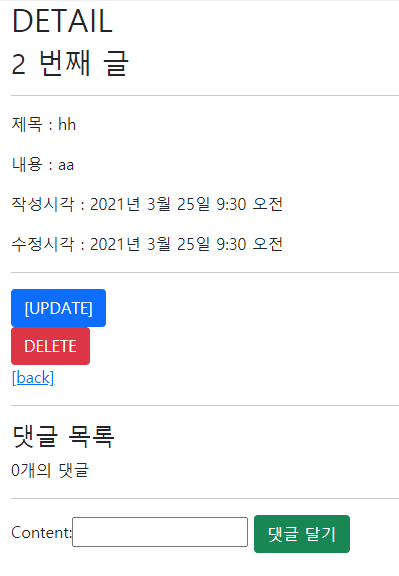
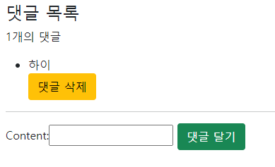
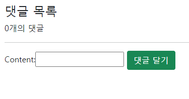

# django_10_workshop


### 시작하기 전에

> detail.html 을 수정합니다.

```django



  <h2>DETAIL</h2>
  <h3>{{ article.pk }} 번째 글</h3>
  <hr>
  <p>제목 : {{ article.title }}</p>
  <p>내용 : {{ article.content }}</p>
  <p>작성시각 : {{ article.created_at }}</p>
  <p>수정시각 : {{ article.updated_at }}</p>
  <hr>
  <a href="" class="btn btn-primary">[UPDATE]</a>
  <form action="" method="POST">
    
    <button class="btn btn-danger">DELETE</button>
  </form>
  <a href="">[back]</a>
  <hr>
  <h4>댓글 목록</h4>
  <p>{{ comments|length }}개의 댓글</p>
  <ul>
    
      <li>
        {{ comment }}
        <form action="" method="POST">
          
          <button class="btn btn-warning">댓글 삭제</button>
        </form>
      </li>
    
  </ul>
  <hr>
  <form action="" method="POST">
    
    {{ comment_form }}
    <button class="btn btn-success">댓글 달기</button>
  </form>

```


### 1. Model

> 댓글 작성을 위한 테이블을 정의한다.

``` python
# articles/models.py
class Comment(models.Model):
    article = models.ForeignKey(Article, on_delete=models.CASCADE)
    content = models.CharField(max_length=200)
    created_at = models.DateTimeField(auto_now_add=True)
    updated_at = models.DateTimeField(auto_now=True)

    def __str__(self):
        return self.content
# articles/forms.py
class CommentForm(forms.ModelForm):
    
    class Meta:
        model = Comment
        exclude = ('article',)
    
```


___


### 2. Comment Create

> /articles/<article_pk>/comments/ 댓글 작성 기능을 구현한다.

``` python
# articles/views.py
# 주어진 템플릿 프로젝트에는 로그인 등 어카운트 관련 기능이 제공되어 있지 않아 일단 로그인 없이 작성 할 수 있도록 했습니다.
@require_POST
def comment_create(request, pk):
    # if request.user.is_authenticated:
    article = get_object_or_404(Article, pk=pk)
    comment_form = CommentForm(request.POST)
    if comment_form.is_valid():
        comment = comment_form.save(commit=False)
        comment.article = article
        comment.save()
        return redirect('articles:detail', article.pk)
    context = {
        'comment_form': comment_form,
        'article': article,
    }
    return render(request, 'articles/detail.html', context)
    # return redirect('accounts:login')
```



___


### 3. Comment Read

> 댓글 읽기 기능을 구현한다. 상세 페이지 하단에 댓글 목록을 출력한다.

``` python
# articles/views.py
@require_safe
def detail(request, pk):
    article = get_object_or_404(Article, pk=pk)
    comment_form = CommentForm()
    comments = article.comment_set.all()
    context = {
        'article': article,
        'comment_form': comment_form,
        'comments': comments,
    }
    return render(request, 'articles/detail.html', context)
```



___


### 4. Comment Delete

> /articles/<article_pk>/comments/<comment_pk>/delete/ 댓글 삭제 기능을 구현한다.

``` python
# articles/views.py
@require_POST
def comment_delete(request, article_pk, comment_pk):
    # if request.user.is_authenticated:
    comment = get_object_or_404(Comment, pk=comment_pk)
    comment.delete()
    return redirect('articles:detail', article_pk)
```

