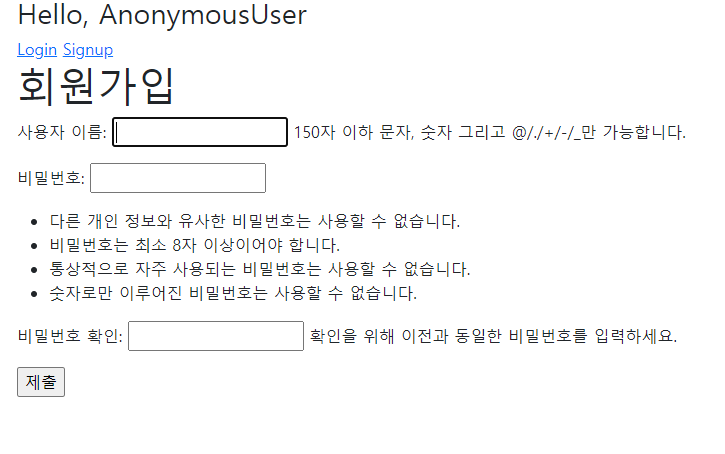
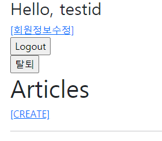
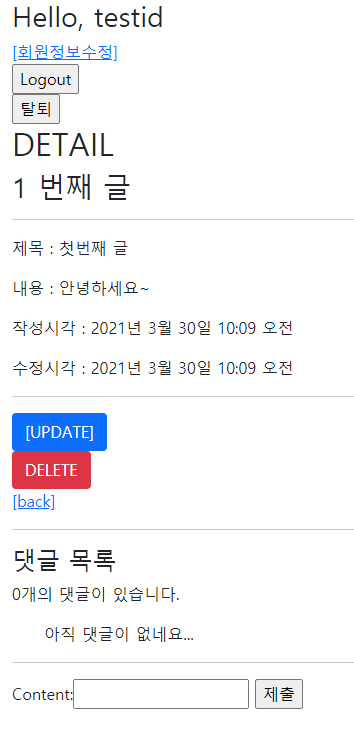
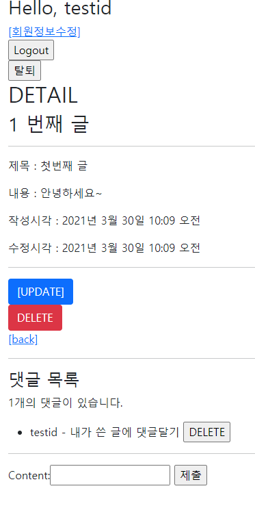
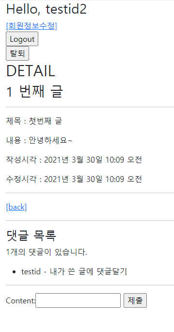

# django_12_workshop


## Django Project

> 사전 제공되는 프로젝트를 사용해 아래 해당하는 조건을 모두 구현 하시오.


### 1. 대체한 User model을 사용한다.

> custom user model 을 위해 
>
> 1. settings에 AUTH_USER_MODEL 위치 추가
> 2. accounts/models.py 에 커스텀 유저 모델 생성(상속받아서)
> 3. admin.py 에 커스텀 유저도 편집 가능하도록 연결

``` python
# settings.py
AUTH_USER_MODEL = 'accounts.User'

# accounts/models.py
from django.db import models
from django.contrib.auth.models import AbstractUser
# 커스텀 유저 모델 생성 
# 1 - 대체한 User model을 사용한다.
class User(AbstractUser):
    pass

# accounts/admin.py
from django.contrib import admin
from django.contrib.auth.admin import UserAdmin
from .models import User

# admin 페이지에 유저 링크(확인 및 편집 가능)
# 1 - 대체한 User model을 사용한다.
admin.site.register(User, UserAdmin)
```


___


### 2. 회원가입이 정상적으로 동작한다.

> 커스텀 모델 작성시, 회원가입, 회원 변경폼은 커스텀 유저용으로 생성해주어야 한다(기존 것은 연결이 안됨) 그래서 forms.py에 커스텀 폼을 생성하고(상속을 통해),  views.py에 커스텀 폼으로 변경
>
> 1. forms.py 커스텀 폼 생성(커스텀 유저용)
> 2. views.py signup 함수의 유저 생성 폼을  커스텀 폼과 연결

``` python
# accounts/forms.py
from django.contrib.auth.forms import UserChangeForm, UserCreationForm
from django.contrib.auth import get_user_model


class CustomUserChangeForm(UserChangeForm):

    class Meta:
        model = get_user_model()
        fields = ('email', 'first_name', 'last_name',)


# 커스텀 유저를 위한 폼 생성 - 일반 폼은 연결이 안됨
# 2 - 회원가입이 정상적으로 동작한다.
class CustomUserCreationForm(UserCreationForm):

    class Meta(UserCreationForm.Meta):
        model = get_user_model()
        fields = UserCreationForm.Meta.fields
```

```python
# accounts/views.py
@require_http_methods(['GET', 'POST'])
def signup(request):
    if request.user.is_authenticated:
        return redirect('articles:index')
    # 2 - 회원가입이 정상적으로 동작한다. - 커스텀 유저 모델 일시 폼도 커스텀으로 재생성
    if request.method == 'POST':
        form = CustomUserCreationForm(request.POST)
        if form.is_valid():
            user = form.save()
            auth_login(request, user)
            return redirect('articles:index')
    else:
        form = CustomUserCreationForm()
    context = {
        'form': form,
    }
    return render(request, 'accounts/signup.html', context)
```


##### 회원 가입 폼 정상 작동



##### 로그인 후 (정상 가입됨)



___


### 3. 메인 페이지에서 각 게시글의 작성자 정보가 출력된다.

> 작성자 정보를 사용하기 위해
>
> 1. models.py 에서 article에 외부 키로 user 필드 생성
> 2. 현재 article_form 에는 title과 content만 받도록 되어있으므로 수정할 필요 X
> 3. views.py 에서 create 함수에 article.user 항목을 집어넣도록 추가
> 4. detail.html 에서 작성자 항목이 나오도록 수정

``` python
# articles/models.py
from django.db import models
from django.conf import settings

# 게시글 모델과 댓글 모델에 모두 유저 키 추가
class Article(models.Model):
    title = models.CharField(max_length=10)
    # 3 - 메인 페이지에서 각 게시글의 작성자 정보가 출력된다.
    # 4 - 게시글 작성자 본인만 게시글을 수정 및 삭제할 수 있다.
    user = models.ForeignKey(settings.AUTH_USER_MODEL, on_delete=models.CASCADE)
    content = models.TextField()
    created_at = models.DateTimeField(auto_now_add=True)
    updated_at = models.DateTimeField(auto_now=True)

    def __str__(self):
        return self.title
```

```python
# articles/views.py
@login_required
@require_http_methods(['GET', 'POST'])
def create(request):
    if request.method == 'POST':
        form = ArticleForm(request.POST)
        if form.is_valid():
            article = form.save(commit=False)
            # 3 - 메인 페이지에서 각 게시글의 작성자 정보가 출력된다.
            article.user = request.user
            article.save()
            return redirect('articles:detail', article.pk)
    else:
        form = ArticleForm()
    context = {
        'form': form,
    }
    return render(request, 'articles/create.html', context)
```

```django
<!-- articles/index.html -->

     3 - 메인 페이지에서 각 게시글의 작성자 정보가 출력된다. 
    <p>작성자 : {{ article.user }}</p>
    <p>글 번호 : {{ article.pk }}</p>
    <p>글 제목 : {{ article.title }}</p>
    <p>글 내용 : {{ article.content }}</p>
    <a href="">[DETAIL]</a>
    <hr>

```


___


### 4. 게시글 작성자 본인만 게시글을 수정 및 삭제할 수 있다.

> 3번을 진행하며 작성자를 추가하기 위한 user 외래 키는 이미 생성 했으므로 수정 및 삭제시 작성자 본인인지 여부 기능만 추가 - 보안 안전을 위해 views 와 template 모두 수정하기
>
> 1. views.py 에서 delete, update 함수에 작성자와 현재 요청이 들어온 유저가 같은 사람인지 확인하는 기능 추가
> 2. detail.html 에서 작성자와 현재 유저를 확인하고 같을 경우만 수정 및 삭제 버튼을 보여주도록 변경

``` python
# articles/views.py
@require_POST
def delete(request, pk):
    if request.user.is_authenticated:
        article = get_object_or_404(Article, pk=pk)
        # 4 - 게시글 작성자 본인만 게시글을 수정 및 삭제할 수 있다.
        if request.user == article.user:
            article.delete()
    return redirect('articles:index')


@login_required
@require_http_methods(['GET', 'POST'])
def update(request, pk):
    article = get_object_or_404(Article, pk=pk)
    # 4 - 게시글 작성자 본인만 게시글을 수정 및 삭제할 수 있다.
    if request.user == article.user:
        if request.method == 'POST':
            form = ArticleForm(request.POST, instance=article)
            if form.is_valid():
                form.save()
                return redirect('articles:detail', article.pk)
        else:
            form = ArticleForm(instance=article)
        context = {
            'form': form,
            'article': article,
        }
        return render(request, 'articles/update.html', context)
    return redirect('articles:index')
```

```django
<!-- articles/detail.html -->
   4 - 게시글 작성자 본인만 게시글을 수정 및 삭제할 수 있다. 
  
    <a href="" class="btn btn-primary">[UPDATE]</a>
    <form action="" method="POST">
      
      <button class="btn btn-danger">DELETE</button>
    </form>
  
```


---


### 5. 각 댓글에는 댓글 작성자 정보가 출력된다.

> 댓글 작성자 정보를 출력하기 위해
>
> 1. models.py 에서 comment 모델에 user 외래키 추가
> 2. forms.py 에서 comment_form 에 id 를 exclude(작성자를 정해서 작성할 수 없게 해야 하므로)
> 3. views.py 에서 comment_create 함수에 user 외래키를 같이 입력하도록 추가
> 4. detail.html 에서 댓글 출력 부분에 작성자 정보가 같이 출력되도록 수정

``` python
# articles/models.py
class Comment(models.Model):
    article = models.ForeignKey(Article, on_delete=models.CASCADE)
    # 5 - 각 댓글에는 댓글 작성자 정보가 출력된다.
    # 6 - 댓글 작성자 본인만 댓글을 삭제할 수 있다.
    user = models.ForeignKey(settings.AUTH_USER_MODEL, on_delete=models.CASCADE)
    content = models.CharField(max_length=200)
    created_at = models.DateTimeField(auto_now_add=True)
    updated_at = models.DateTimeField(auto_now=True)

    def __str__(self):
        return self.content
```

```python
# articles/forms.py
class CommentForm(forms.ModelForm):

    class Meta:
        model = Comment
        # fields = '__all__'
        exclude = ('article', 'user')
```

```python
# articles/views.py
@require_POST
def comments_create(request, pk):
    if request.user.is_authenticated:
        article = get_object_or_404(Article, pk=pk)
        comment_form = CommentForm(request.POST)
        if comment_form.is_valid():
            comment = comment_form.save(commit=False)
            comment.article = article
            # 5 - 각 댓글에는 댓글 작성자 정보가 출력된다.
            comment.user = request.user
            comment.save()
            return redirect('articles:detail', article.pk)
        context = {
            'comment_form': comment_form,
            'article': article,
        }
        return render(request, 'articles/detail.html', context)
    return redirect('accounts:login')
    # return HttpResponse(status=401)
```

```django
<!-- articles/detail.html -->
{{ comment.user }} - {{ comment }}
```


---


### 6. 댓글 작성자 본인만 댓글을 삭제할 수 있다.

> 본인만 댓글을 삭제하기 위해
>
> 1. 이미 5번에서 user 외래키는 추가했으므로 모델은 수정 X
> 2. views.py 에서 comment_delete 함수에 작성자 본인 일 때만 기능하도록 수정
> 3. detail.html 에서 작성자 본인 일때만 delete 버튼이 나오도록 수정

``` python
# articles/views.py
@require_POST
def comments_delete(request, article_pk, comment_pk):
    if request.user.is_authenticated:
        comment = get_object_or_404(Comment, pk=comment_pk)
        # 6 - 댓글 작성자 본인만 댓글을 삭제할 수 있다.
        if request.user == comment.user:
            comment.delete()
    return redirect('articles:detail', article_pk)
```

```django
<!-- articles/detail.html -->
 6 - 댓글 작성자 본인만 댓글을 삭제할 수 있다. 
        
          <form action="" method="POST" class="d-inline">
            
            <input type="submit" value="DELETE">
          </form>
        
```


---

### 3,4,5,6 결과

##### 게시글 작성 - 작성자 본인일 때(3)



##### 게시글 작성 및 댓글 작성이 본인일 때 (3, 5)



##### 본인의 글과 댓글이 아닐 때 보이지 않게 (4, 6)

