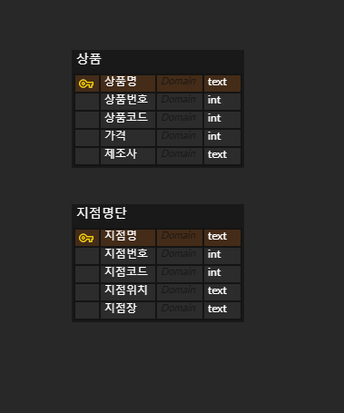

# django_13_homework


### 1. 다음 조건을 참고하여 ERD와 models.py를 자유롭게 작성하고, 작성한 모델링에 대한 소개와 작성하게 된 이유에 대해 간략히 설명하시오

> 1) 지점별 편의점들이 존재한다.
>
> 2) 각 상품들은 특정 조건별로 분류 할 수 있다.
>
> 3) 단, User는 고려하지 않는다.


``` 
먼저 지점명단, 상품 2가지 테이블은 필수라고 생각했습니다. 지점의 경우 지점명은 모든 지점의 이름이 다르므로 key로 두었고, 지점번호, 지점코드, 지점위치, 지점장이 기본적으로 필요한 요소 및 추후에 다른 테이블과 연결할 때 사용될 만한 요소라고 생각했습니다. 상품의 경우 상품명이 아무래도 모두 다를 것 이므로 상품명을 key로 두었고, 가격이나 제조사별로 분류할 수 있으며, 상품 번호와 코드가 추후에 결제 시스템에 이용될 것으로 생각하여 추가했습니다.
```

___




> 위의 ERD를 기반으로 하여 장고 모델 클래스로 모델링 해 보았습니다.

``` python
# models.py
class Goods(models.Model):
    name = models.CharField(max_length=20)
    num = models.IntegerField()
    code = models.IntegerField()
    price = models.IntegerField()
    maker = models.CharField(max_length=30)

class Branch(models.Model):
    name = models.CharField(max_length=20)
    branch_num = models.IntegerField()
    branch_code = models.IntegerField()
    location = models.TextField()
    manager = models.CharField(max_length=15)
```


