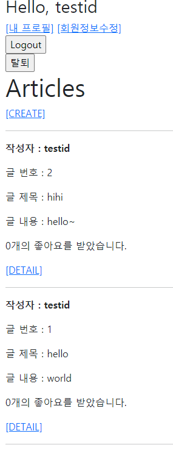
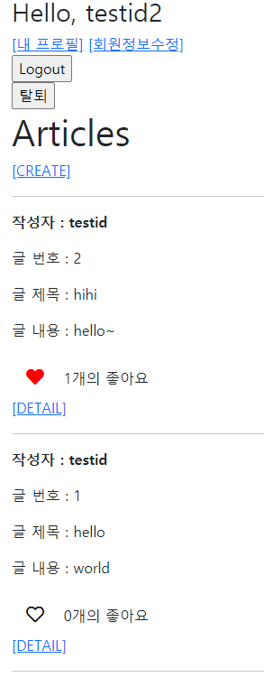
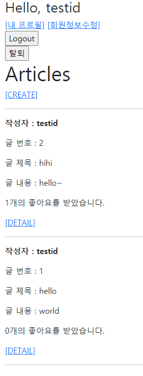

# django_14_workshop


### 1. Model

> 좋아요 기능 구현을 위한 컬럼을 추가한다.

``` python
like_users = models.ManyToManyField(settings.AUTH_USER_MODEL, related_name='like_articles')
```


___


### 2. url & view

> /articles/<article_pk>/like/
>
>  로그인한 유저의 요청만 처리한다.

``` python
# urls.py
path('<int:article_pk>/like/', views.likes, name='likes'),
```

```python
# views.py
@require_POST
def likes(request, article_pk):
    # 좋아요가 표시될 글
    article = get_object_or_404(Article, pk=article_pk)
    # 좋아요를 누를 나 - request.user
    # 로그인 여부 - 안했으면 로그인하러 리다이렉트
    if request.user.is_authenticated:
        # 조건 - 해당 게시글에 좋아요를 이미 누른 상태인지 여부 - 가져와서 확인
        # 1. 전체 리스트 확인 - 쉽지만 시간이 비효율
        # if request.user in article.like_users.all():
        # 2. 쿼리셋 필터, exists를 활용하여 확인
        if article.like_users.filter(pk=request.user.pk).exists():
            # 좋아요 취소
            article.like_users.remove(request.user)
        else:
            # 좋아요 등록
            article.like_users.add(request.user)
        return redirect('articles:index')
    return redirect('accounts:login')
```


___


### 3. Template

> font-awesome에서 활용할 로고를 선택한다.
>
> ▪ 개인 kit를 발급 받은 후 base.html에 붙여 넣는다.
>
> ▪ 좋아요에 활용되는 로고를 선택한다.
>
> index.html에 좋아요 여부에 따른 결과를 보여준다.
>
> ▪ 좋아요를 누른 경우 빨간색 하트, 그렇지 않은 경우 검은색 하트가 나타나도록 한다.
>
> ▪ 특정 글의 좋아요를 누른 전체 인원수를 출력한다.

``` django
<!-- base.html -->
<script src="https://kit.fontawesome.com/9cdad565a4.js" crossorigin="anonymous"></script>
```

```django
<!-- index.html --> 
	 본인일 때는 좋아요를 누르지 못하도록 
    
      <p>{{ article.like_users.all|length }}개의 좋아요를 받았습니다.</p>
    
      <form class="d-inline" action="" method="post"> 
        
         이미 좋아요를 누른 상태인지 체크 
        
          <button class="like-btns btn-lg" style="color: red"><i class="fas fa-heart"></i></button>
        
          <button class="like-btns btn-lg"><i class="far fa-heart"></i></button>
        
      </form>
      <span>{{ article.like_users.all|length }}개의 좋아요</span>
      <br>
    
```


___


### 4. 결과

#### 본인의 글을 보고 있는 상태 + 팔로우가 눌리기 전



#### 다른 유저에서 봤을 때 + 팔로우 



#### 다시 작성자 유저로 들어왔을 때 팔로우 카운트



