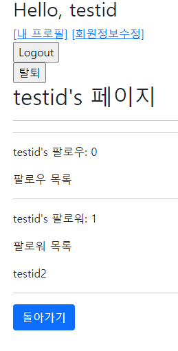
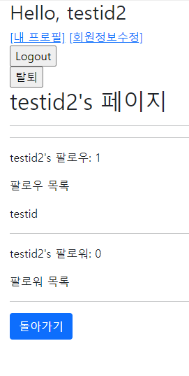
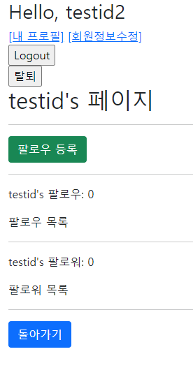
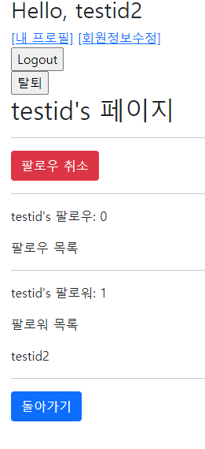
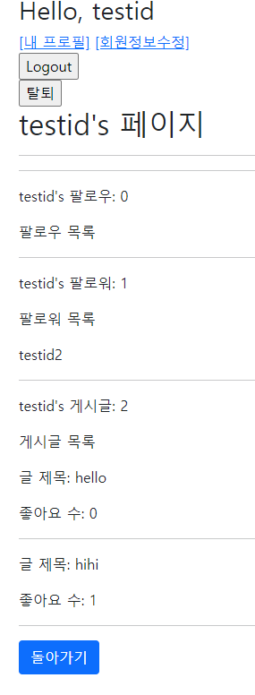

# django_15_workshop


### 1. Model & Form

> 팔로우 기능 구현을 위한 모델을 세팅한다.
>
> 팔로우 기능을 구현하기 위해 User 모델을 대체한다.

``` python
# models.py
from django.db import models
from django.contrib.auth.models import AbstractUser


class User(AbstractUser):
    followings = models.ManyToManyField('self', symmetrical=False, related_name='followers')
```

```python
# forms.py
from django.contrib.auth.forms import UserChangeForm, UserCreationForm
from django.contrib.auth import get_user_model


class CustomUserChangeForm(UserChangeForm):

    class Meta:
        model = get_user_model()
        fields = ('email', 'first_name', 'last_name',)


class CustomUserCreationForm(UserCreationForm):

    class Meta(UserCreationForm.Meta):
        model = get_user_model()
        fields = UserCreationForm.Meta.fields

```


___


### 2. url & view

> /accounts/<username>/
> 유저 프로필 페이지 기능을 구현한다.
>
> ▪ 로그인한 유저만 팔로우를 할 수 있다.
>
> /accounts/<username>/follow/
>
> 팔로우를 하기 위한 기능을 구현한다.
>
> ▪ 로그인한 유저만 팔로우를 할 수 있다.
>
> ▪ 본인은 팔로우를 할 수 없다.

``` python
# urls.py
    path('<str:username>/', views.profile, name='profile'),
    path('<str:username>/follow/', views.follow, name='follow'),
```

```python
# views.py
def profile(request, username):
    if request.user.is_authenticated:
        # 프로필 관련
        you = get_object_or_404(get_user_model(), username=username)
        context = {
            'you': you,   
        }
        return render(request, 'accounts/profile.html', context)
    return redirect('accounts:login')

@require_POST
def follow(request, username):
    # 내가 팔로우 대상(follower)에게 팔로우(following)
    # 나 - request.user
    # 대상 - username을 통해 찾은 유저
    you = get_object_or_404(get_user_model(), username=username)

    # 로그인 여부
    if request.user.is_authenticated:
        # 본인은 팔로우 할 수 없다 - 나와 대상이 같으면 바로 리턴
        if request.user == you:
            return redirect('article:index')
        # 현재 보는 대상이 이미 팔로우 되어있는지 여부
        if request.user.followings.filter(pk=you.pk).exists():
            # 팔로우 취소
            request.user.followings.remove(you)
            # you.followers.remove(request.user)
        else:
            # 팔로우 등록
            request.user.followings.add(you)
            # you.followers.add(request.user)
        return redirect('accounts:profile', you.username)
        
    return redirect('accounts:login')
```


___


### 3. template

> index.html의 username에 profile로 갈 수 있는 링크를 설정한다.
>
> 팔로잉 여부에 따라 팔로우와 언팔로우 버튼이 토글될 수 있도록 구성한다.
>
> ▪ 로그인한 유저 자신의 프로필 페이지에서는 팔로우 & 언팔로우 버튼이 보이지 않는다.
>
> ▪ 작성자의 팔로잉, 팔로워 숫자를 보여주고 유저의 이름을 모두 출력한다.
>
> (선택) 해당 프로필의 유저가 작성한 모든 글의 내용과 좋아요 숫자를 보여준다.

``` django
<!-- index.html -->
  
	{# 내 프로필로 가는 링크 #}
    <a href="">[내 프로필]</a>
    <a href="">[CREATE]</a>
  
    <a href="">[새 글을 작성하려면 로그인하세요.]</a>
  

{# 작성자 프로필로 가는 링크 #}
<p><b>작성자 : <a href="">{{ article.user }}</a></b></p>

```

```django
<!-- profile.html -->
<h2> {{ you.username }}'s 페이지 </h2>
  <hr>

  
    <form action="" method="post">
    
    
      <button class="btn btn-danger">팔로우 취소</button>
    
      <button class="btn btn-success">팔로우 등록</button>
     
    </form>
    <hr>
  
  

  <p>{{ you.username }}'s 팔로우: {{ you.followings.all|length }}</p>
  <p>팔로우 목록</p>
  
    <span>{{ following.username }} </span>
  
  <hr>

  <p>{{ you.username }}'s 팔로워: {{ you.followers.all|length }}</p>
  <p>팔로워 목록</p> 
  
    <span>{{ follower.username }} </span>
  
  <hr>
	
   선택사항 
  <p>{{ you.username }}'s 게시글: {{ you.article_set.all|length }}</p>
  <p>게시글 목록</p>
  
    <p>글 제목: {{ article.title }}</p>
    <p>좋아요 수: {{ article.like_users.all|length }}</p>
    <hr>
  

  <a class="btn btn-primary" href="">돌아가기</a>
```


___


### 4. 결과

#### 프로필 페이지(본인 프로필) - 팔로워 목록



#### 프로필 페이지(본인 프로필) - 팔로우 목록



#### 다른 사람의 프로필을 들어갔을 때 (팔로우 전)



#### 팔로우 후



#### 선택사항 - 게시글 목록, 좋아요 수

