# django_17_homework


### 사전 데이터

- Artist

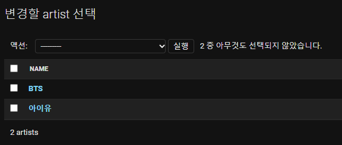

- Music

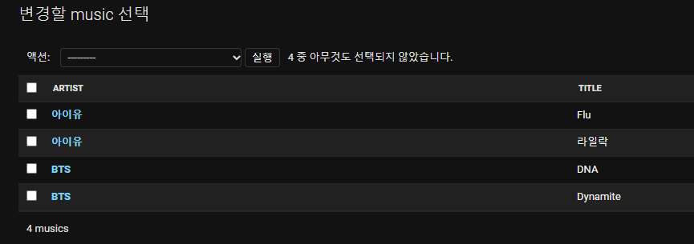


### 1. JSON 응답 결과

> GET & POST api/v1/artists/
> • GET 요청인 경우 모든 가수의 id와 name 컬럼을 JSON으로 응답한다.
> • POST 요청인 경우 가수의 정보를 생성한다.
> ▪ 검증에 성공하는 경우 가수의 정보를 DB에 저장하고
> 생성된 가수의 정보와 201 Created를 응답한다.
> ▪ 검증에 실패하는 경우 400 Bad Request를 응답한다.

- GET

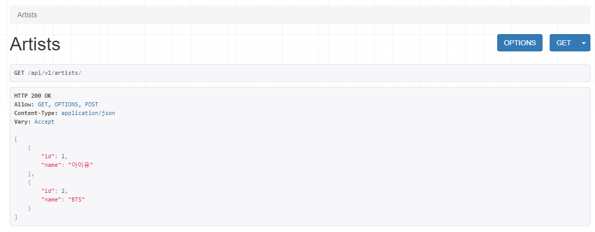

- POST 검증 실패

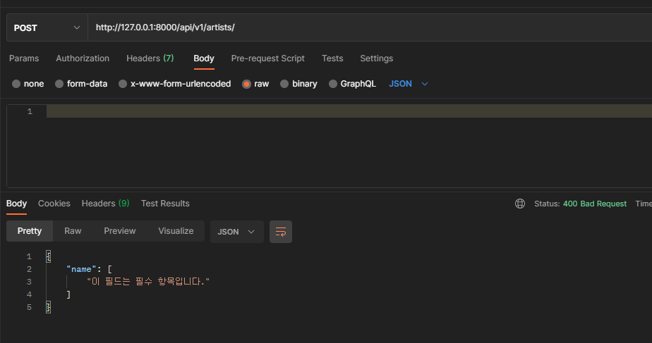

-  POST 검증 성공

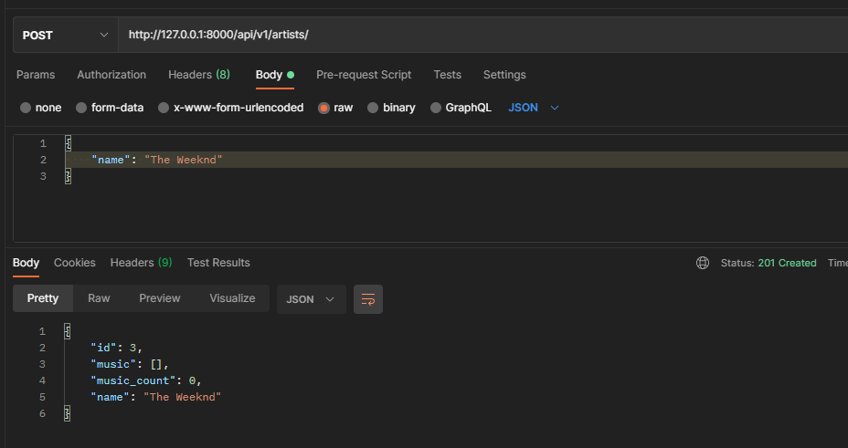

___


> GET api/v1/artists/<artist_pk>/
> • 특정 가수의 모든 컬럼을 JSON으로 응답한다.
> • 특정 가수의 노래 정보와 노래의 개수 정보를 함께 응답한다.

- GET

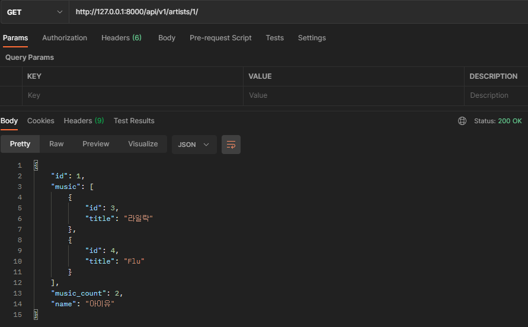


___


> POST api/v1/artists/<artist_pk>/music/
> • 특정 가수의 음악의 정보를 생성한다.
> • 검증에 성공하는 경우 음악의 정보를 DB에 저장하고
> 생성된 음악의 정보와 201 Created를 응답한다.
> • 검증에 실패하는 경우 400 Bad Request를 응답한다.

- POST 검증 실패

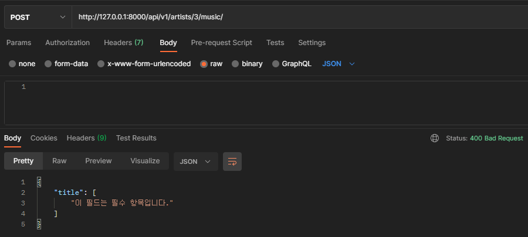

- POST 검증 성공

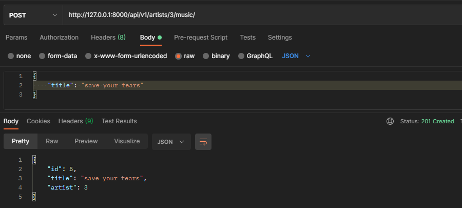

___


> GET api/v1/music/
> • 모든 음악의 id와 title 컬럼을 JSON으로 응답한다.

- GET

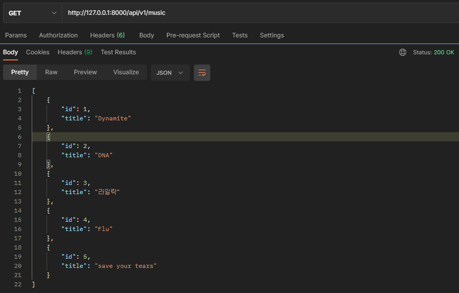


---


> GET & PUT & DELETE api/v1/music/<music_pk>/
> • GET 요청인 경우 특정 음악의 모든 컬럼을 JSON으로 응답한다.
> • PUT 요청인 경우 특정 음악의 정보를 수정한다.
> ▪ 검증에 성공하는 경우 수정된 음악의 정보를 DB에 저장한다.
> ▪ 검증에 실패하는 경우 400 Bad Request를 응답한다.
> ▪ 수정이 완료된 이후에 수정된 음악의 정보를 응답한다.
> • DELETE 요청일 경우 특정 음악의 정보를 삭제한다.
> ▪ 삭제가 완료된 이후에 삭제한 음악의 id와
> 204 No Content를 응답한다.

- GET

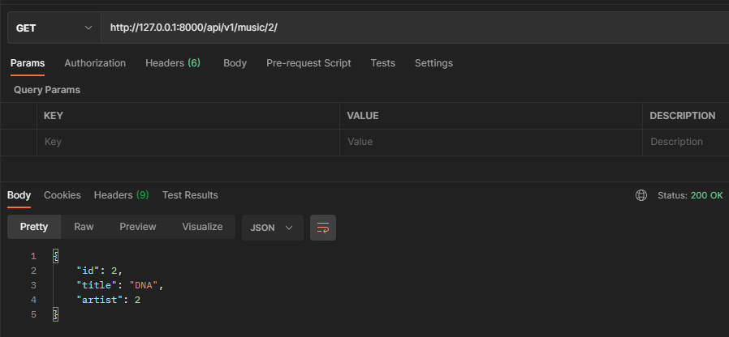

- PUT 검증 실패

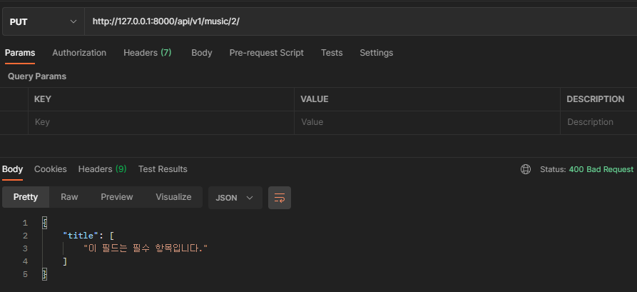

- PUT 검증 성공

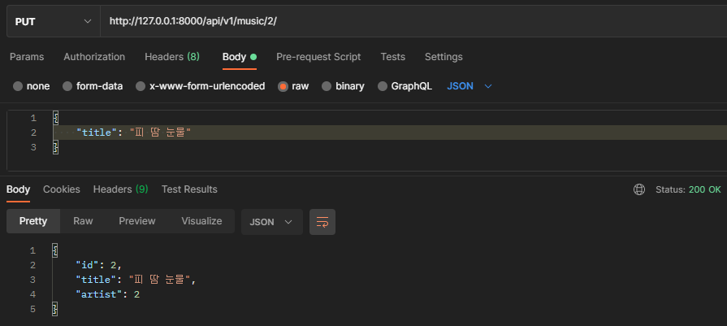

- DELETE

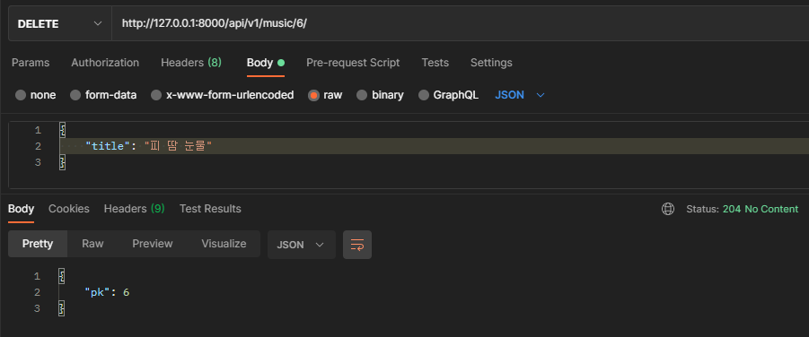

---


### 2. views.py

> 기능 별로 구성 - 명세서 참고

``` python
from django.shortcuts import render, get_list_or_404, get_object_or_404
from .serializer import ArtistListSerializer, ArtistSerializer, MusicListSerializer, MusicSerializer
from rest_framework.decorators import api_view
from rest_framework.response import Response
from rest_framework import status
from .models import Artist, Music
# Create your views here.

@api_view(['GET', 'POST'])
def artists(request):
    if request.method == 'GET':
        artist_list = get_list_or_404(Artist)
        serializer = ArtistListSerializer(artist_list, many=True)
        return Response(serializer.data)
    else:
        serializer = ArtistSerializer(data=request.data)
        if serializer.is_valid(raise_exception=True):
            serializer.save()
            return Response(serializer.data, status=status.HTTP_201_CREATED)

@api_view(['GET'])
def artist_detail(request, artist_pk):
    artist = get_object_or_404(Artist, pk=artist_pk)
    serializer = ArtistSerializer(artist)
    return Response(serializer.data)

@api_view(['POST'])
def music_create(request, artist_pk):
    artist = get_object_or_404(Artist, pk=artist_pk)
    serializer = MusicSerializer(data=request.data)
    if serializer.is_valid(raise_exception=True):
        serializer.save(artist=artist)
        return Response(serializer.data, status=status.HTTP_201_CREATED)

@api_view(['GET'])
def musics(request):
    music_list = get_list_or_404(Music)
    serializer = MusicListSerializer(music_list, many=True)
    return Response(serializer.data)

@api_view(['GET', 'PUT', 'DELETE'])
def music_detail(request, music_pk):
    music = get_object_or_404(Music, pk=music_pk)
    if request.method == 'GET':
        serializer = MusicSerializer(music)
        return Response(serializer.data)
    
    elif request.method == 'PUT':
        serializer = MusicSerializer(music, data=request.data)
        if serializer.is_valid(raise_exception=True):
            serializer.save()
            return Response(serializer.data)
    
    else: # delete
        music.delete()
        response = {
            'pk': music_pk,
        }
        return Response(response, status=status.HTTP_204_NO_CONTENT)
```


---


### 3. serializers.py

> 4가지 작성

``` python
from rest_framework import serializers
from .models import Artist, Music

class ArtistListSerializer(serializers.ModelSerializer):

    class Meta:
        model = Artist
        fields = ('id', 'name')


class MusicListSerializer(serializers.ModelSerializer):

    class Meta:
        model = Music
        fields = ('id', 'title')

class MusicSerializer(serializers.ModelSerializer):

    class Meta:
        model = Music
        fields = '__all__'
        read_only_fields = ('artist',)

class ArtistSerializer(serializers.ModelSerializer):
    # music = serializers.PrimaryKeyRelatedField(read_only=True, many=True)
    music = MusicListSerializer(read_only=True, many=True)
    music_count = serializers.IntegerField(read_only=True, source='music.count')
    class Meta:
        model = Artist
        fields = '__all__'
```

