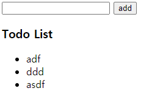
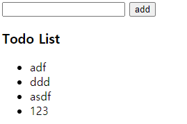

# javascript_01_workshop


### 1. 제시된 CREATE, READ 기능을 충족하는 todo app을 완성하시오.

>  필수사항
> - form 태그를 사용한다.
> - submit 되었을 시 todo가 작성된다.
> - 작성 된 todo는 ul 태그의 li 태그로 추가된다.
> - 작성 후 input value 값는 초기화 된다.
> - (선택) 빈 값인 데이터는 입력을 방지한다.

``` html
<!DOCTYPE html>
<html lang="en">
<head>
  <meta charset="UTF-8">
  <meta http-equiv="X-UA-Compatible" content="IE=edge">
  <meta name="viewport" content="width=device-width, initial-scale=1.0">
  <title>Document</title>
</head>
<body>
    <form action="" id='test_form'>
      <input type="text" name="ipt_text" id="ipt_text">
      <button>add</button>
      <button type="reset">이것과 event.target.reset()과 유사</button>
    </form>
    <h3>Todo List</h3>
    <ul id="todo_ul">
    </ul>
  <script>
    // form이 제출이 되면

    const formEvent = document.querySelector('#test_form')
    
    formEvent.addEventListener('submit', function (event) {
      // console.log(event)
      // alert('제출되었습니다.') // 실제 제출 되는지 테스트
      // form은 제출시 새로고침이 되며 데이터가 다 날아감 그래서 이벤트를 막아야됨
      event.preventDefault()

      // input의 텍스트를 꺼내서
      const myTextInput = document.querySelector('#ipt_text')
      const text = myTextInput.value
      // console.log(text)

      // 빈 값인 데이터는 입력을 방지한다.
      // 같다 ===
      // 같지 않다 !==
      if (text !== '') {
        // 새로운 li 요소를 만든 뒤
        const todoLi = document.createElement('li')
        todoLi.innerText = text
        todoLi.setAttribute('id', 'todo_list')
  
        // ul 요소에 삽입한다.
        const todoUl = document.querySelector("#todo_ul")
        todoUl.append(todoLi)
  
        // 제출하고 나면 input value 초기화 - form을 최초의 상태로 돌림
        event.target.reset()
      }

    })
  </script>
</body>
</html>
```


___

- 추가전



- 추가후



