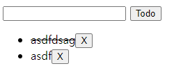
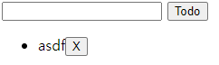
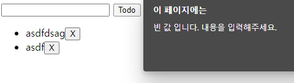

# javascript_02_workshop


### 1. 템플릿 코드를 통해 제시된 기능을 충족하는 todo app을 완성하시오.

> - TODO 아이템을 추가할 수 있다.
> - 아이템 클릭을 통해 아이템에 취소선을 추가하고 제거할 수 있다.
> - x 버튼을 통해 아이템을 삭제할 수 있다.
> - 선택사항
> - 빈 값의 데이터 입력 방지
> - 빈 값 입력 시 브라우저 팝업 출력하기
> - 데이터 작성 후 input value 초기화

``` html
<!DOCTYPE html>
<html lang="en">
<head>
  <meta charset="UTF-8">
  <meta http-equiv="X-UA-Compatible" content="IE=edge">
  <meta name="viewport" content="width=device-width, initial-scale=1.0">
  <title>Document</title>
  <style>
    .done {
      text-decoration: line-through;
    }
  </style>
</head>
<body>
  <form action="/todos/">
    <input type="text">
    <button>Todo</button>
  </form>
  <ul></ul>

<script>
  const form = document.querySelector('form')

  function addTodo (event) {
    // 이벤트를 취소한다.
    event.preventDefault()

    // input element와 input element의 value 값을 저장한다.
    const myTextInput = document.querySelector('input')
    const textValue = myTextInput.value

    if (textValue){
      // li element를 생성 후 input element의 value 값을 데이터로 저장한다
      const todoLi = document.createElement('li')
      todoLi.innerText = textValue

      // ul 태그의 자식 태그로 위에서 생성한 li element를 넣는다.
      const todoUl = document.querySelector("ul")
      todoUl.append(todoLi)

      // 삭제 버튼을 생성 후 li 태그의 자식 태그로 넣는다.
      const todoLiBtn = document.createElement('button') // <button></button>
      todoLiBtn.innerText = 'X'
      todoLi.append(todoLiBtn)

      // 삭제 버튼을 클릭하면 해당 li element를 삭제한다
      todoLiBtn.addEventListener('click', function () {
        todoLi.remove()
      })

      // li element를 클릭하면 취소선이 토글된다.
      todoLi.addEventListener('click', function (event) {
        todoLi.classList.toggle('done')
      })
      event.target.reset()
    } else {
      alert('빈 값 입니다. 내용을 입력해주세요.')
    }

  }

  form.addEventListener('submit', addTodo)
</script>
</body>
</html>

```


___

- 기본 값 추가 및 취소선



- x 버튼으로 값 삭제 후



- 빈 값 입력시 경고 표시



