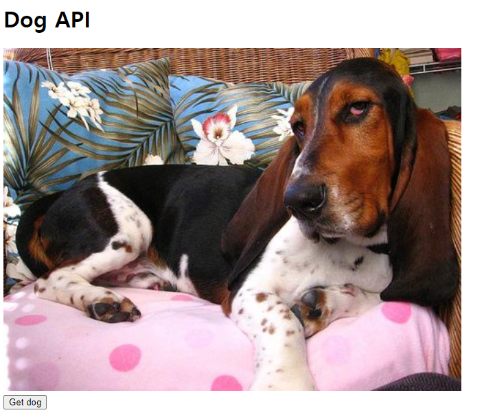
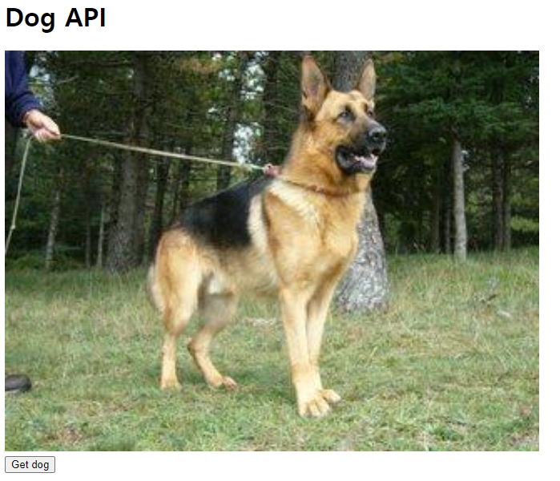

# javascript_03_workshop


### 1. 공유된 HTML코드의 주석과 마크업을 참고하여, 버튼을 클릭하면 axios를 통해 API 요청을 보내고 받아 온 이미지 데이터를 페이지에 렌더링 하는 앱을 완성하시오.

> 처음에 비어있을 시 바로 추가하는 기능도 추가

``` html
<!DOCTYPE html>
<html lang="en">
<head>
  <meta charset="UTF-8">
  <meta name="viewport" content="width=device-width, initial-scale=1.0">
  <title>Dog API</title>
  <style>
    img {
      height: 500px;
    }
  </style>
</head>
<body>
  <h1>Dog API</h1>
  
  <br>
  <button>Get dog</button>
  
  <!-- axios CDN을 삽입한다. -->
  <script src="https://cdn.jsdelivr.net/npm/axios/dist/axios.min.js"></script>
  <script>
    const API_URI = 'https://dog.ceo/api/breeds/image/random'
    const image_src = document.querySelector('img')
    if (!image_src.getAttribute('src')) {
      getDog()
    }

    function getDog () {
      axios.get(API_URI) // GET 요청 - 하나의 프로미스 인스턴스
      // .then 메서드를 통해 요청이 성공적인 경우의 콜백함수를 정의한다.
      .then(function (response){
        // 응답객체의 데이터에서 이미지에 대한 리소스를 img 요소의 src 속성으로 할당한다.
        image_src.setAttribute('src', response.data.message)
      }) 
    }

    const button = document.querySelector('button')
    button.addEventListener('click', getDog)
  </script>
</body>
</html>

```


___


#### 시작 화면 - 원래는 엑박이지만 src가 비어있으면 바로 추가하도록 기능 추가




#### Get dog 버튼을 눌렀을 때

