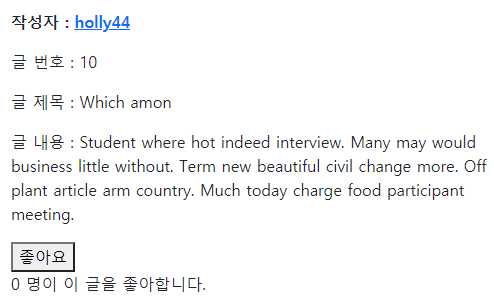
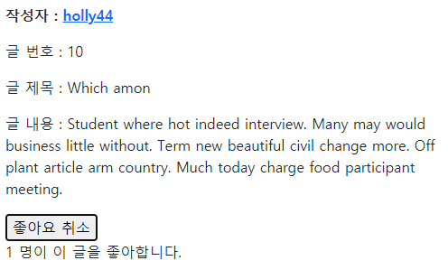

# javascript_04_workshop


### 1. 제공된 Django 프로젝트에서 게시글 좋아요 기능을 axios 라이브러리를 활용하여 AJAX 요청으로 구현하시오.

> • 로그인 사용자의 “좋아요” 여부에 따라 아이콘이 변경되어야 한다.
>
> • 변경된 총 “좋아요”를 누른 사용자의 수가 반영되어야 한다.
>
> • 위의 모든 요구 사항은 페이지의 새로 고침 없이 진행되어야 한다.

- base.html에 axios 라이브러리 추가 (상단 header 부분에) - 이유 -> 상속 받아 사용하는 다른 템플릿들은 block 안에서 처리되기 때문 그렇기에 block 보다 상단에 선언을 해야 사용 가능

```django
<script src="https://cdn.jsdelivr.net/npm/axios/dist/axios.min.js"></script>
```

``` js
// index.html
  <script>
    const forms = document.querySelectorAll('.like-form')
    const csrfToken = document.querySelector('[name=csrfmiddlewaretoken]').value
    forms.forEach(form => {
      // console.log(form)
      form.addEventListener('submit', event => {
        event.preventDefault()
        // console.log(event.target.dataset)
        const articleId = event.target.dataset.articleId

        // template literals
        // axios.post(`/articles/${articleId}/likes/`)

        // 새롭게 config 방법으로 post를 보낼 것 axios(config)
        // https://github.com/axios/axios#request-config
        axios({
          url: `/articles/${articleId}/likes/`,
          method: 'post',
          headers: {
            'X-CSRFToken': csrfToken,
          },
        }).then( function (response) {
          console.log(response.data)
          const { liked, count } = response.data
          // 내가 좋아요를 눌렀는지 여부
          const likeBtn = document.querySelector(`#like-btn-${articleId}`)
          likeBtn.innerText = liked ? '좋아요 취소' : '좋아요'
          // 몇 명이 좋아하는지
          const likeCount = document.querySelector(`#like-count-${articleId}`)
          likeCount.innerText = count
        }).catch( function (error) {
          console.log(error.response)
          switch (error.response.status) {
            case 401: {
              // 로그인 페이지로 보내준다.
              location.href = '/accounts/login/'
              break
            }
            default: {
              // 위에서 처리하지 않은 모든 에러 메세지를 경고창으로 표시한다.
              alert('알 수 없는 에러가 발생했습니다. 관리자를 통해 문의해주세요.')
            }
          }

        })
         
      })
    })
  </script>
```

```django
     index.html 
	<div>
       <form action="" method="POST"> 
       data-* = *이라는 이름의 data를 js에 넘겨 줄 수 있음 
      <form class="like-form" data-article-id="{{article.pk}}">
        
         선택자로 좋아요 버튼만 찾을 것이므로 id 추가 
         
          <button id="like-btn={{ article.pk }}">좋아요 취소</button>
        
          <button id="like-btn={{ article.pk }}">좋아요</button>
         

        <button id="like-btn-{{ article.pk }}">
          
            좋아요 취소
          
            좋아요
          
        </button>
      </form>
    </div>
     <p>{{ article.like_users.all|length }}명이 이 글을 좋아합니다.</p> 
    <p>
       <span id="like-count-{{ article.pk }}">{{ article.like_users.all|length }}</span>
       <span>명이 이 글을 좋아합니다.</span>
    </p>
```

```python
# views.py
@require_POST
def likes(request, article_pk):
    if request.user.is_authenticated:
        article = get_object_or_404(Article, pk=article_pk)

        if article.like_users.filter(pk=request.user.pk).exists():
        # if request.user in article.like_users.all():
            # 좋아요 취소
            article.like_users.remove(request.user)
            liked = False
        else:
            # 좋아요 누름
            article.like_users.add(request.user)
            liked = True
        # js 에서 응답 받을 데이터, json으로 보낼 것 받는 곳에서는 response 객체로 받음
        response_data = {
            'liked': liked,
            'count': article.like_users.count(),
        }
        return JsonResponse(response_data)
        # return redirect('articles:index')
    # return redirect('accounts:login')
    return HttpResponse(status=401)
```


___

- 좋아요 누르기 전




- 좋아요 누른 후



