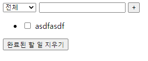

# vue_01_workshop


### 1. Vue 및 lodash 라이브러리를 활용하여 점심메뉴와 로또 앱을 완성하시오.

> Pick One 버튼을 클릭하면 미리 정의되어 있던 메뉴 리스트 중에서 랜덤한 아이템을 화면에 표시한다.
>
> Get Lucky Numbers 버튼을 클릭하면 1부터 45까지의 숫자 중 랜덤한 숫자 6개를선택하여 화면에 표시한다.

``` html
<!DOCTYPE html>
<html lang="en">
<head>
  <meta charset="UTF-8">
  <meta http-equiv="X-UA-Compatible" content="IE=edge">
  <meta name="viewport" content="width=device-width, initial-scale=1.0">
  <title>Document</title>
</head>
<body>
  <div id="app">
    <h2>점심메뉴</h2>
    <button @click="pickOne">Pick One</button>
    <p>{{ choice }}</p>
    <hr>

    <h2>로또</h2>
    <button @click="getLuckyNumbers">Get Lucky Numbers</button>
    <p v-if="luckyNumbers.length">{{ luckyNumbers }}</p>
  </div>
  <!-- Vue CDN & lodash 삽입 -->
  <script src="https://cdn.jsdelivr.net/npm/vue/dist/vue.js"></script>
  <script src="https://cdn.jsdelivr.net/npm/lodash@4.17.21/lodash.min.js"></script>
  <script>
    const app = new Vue ({
      el: '#app',
      data: {
        menus: ['태평소국밥', '오씨칼국수',  '성심당', '서래갈매기'],
        choice: '',
        luckyNumbers: [],
      },
      methods: {
        pickOne: function () {
          const randomIndex = _.random(this.menus.length - 1)
          this.choice = this.menus[randomIndex]
        },
        getLuckyNumbers: function () {
          const numbers = _.range(1, 46)  
          this.luckyNumbers = _.sampleSize(numbers, 6)
        }
      }
    })
  </script>
</body>
</html>
```

- 버튼을 누르기 전


- 누른 후


___


### 2. Vue를 활용하여 todo list 앱을 완성하시오.

> select 요소를 통해 todo list의 상태를 설정할 수 있다. (전체, 진행중, 완료)
>
> computed를 통해 상태별로 표시되는 todo list를 계산하고 화면에 todo list를 표시한다.
>
> Todo item의 체크박스를 통해 할 일의 완료 여부를 설정할 수 있다.
>
> “완료된 할 일 지우기” 버튼을 누르면 모든 완료된 todo item을 삭제한다.
>
>  Local Storage를 활용하여 브라우저 종료 시에도 데이터가 증발하지 않는다.

``` html
<!DOCTYPE html>
<html lang="en">
<head>
  <meta charset="UTF-8">
  <meta http-equiv="X-UA-Compatible" content="IE=edge">
  <meta name="viewport" content="width=device-width, initial-scale=1.0">
  <title>Document</title>
  <style>
    .completed {
      text-decoration: line-through;
    }
  </style>
</head>
<body>
  <div id="app">
    <select v-model="status">
      <option value="all">전체</option>
      <option value="inProgress">진행 중</option>
      <option value="completed">완료</option>
    </select>
    <input type="text" v-model="content">
    <button @click="addTodo">+</button>

    <ul>
      <!-- v-for 사용시 반드시 :key를 넣어줘야함 key를 통해 현재 todo가 제대로 된 데이터를 바라보고 있는지 확인하기 위함 -->
      <!-- <li v-for="todo in todoList" :key="todo.date"> -->
      <li v-for="todo in todoListByStatus" :key="todo.date">
        <!-- 체크 여부도 todo.completed 의 여부에 따라 체크 되도록 -->
        <input 
          type="checkbox"
          @click="toggleTodo(todo)"
          :checked="todo.completed"
        >
        <span :class="{ completed: todo.completed }">{{ todo.content }}</span>
      </li>
    </ul>
    <button @click="deleteCompleted">완료된 할 일 지우기</button>
  </div>

  <!-- Vue CDN 삽입 -->
  <script src="https://cdn.jsdelivr.net/npm/vue/dist/vue.js"></script>
  <script>
    const app = new Vue({
      el: '#app',
      data: {
        content: '',
        todoList: [],
        status: 'all',
      },
      methods: {
        addTodo: function () {
          // console.log(this.content)
          const todo = {
            content: this.content,
            date: Date.now(), // Unix timestamp
            completed: false,
          }
          // DOM 추가시에는 append, appendchild
          this.todoList.push(todo)
          this.content = ''
        },
        toggleTodo: function (todo) {
          todo.completed = !todo.completed
        },
        deleteCompleted: function () {
          // console.log(todo.completed)
          this.todoList = this.todoList.filter(todo => !todo.completed)
        }
      },

      watch: {
        status: function () {
          console.log('status가 바뀌었습니다. ', this.status)
        }
      },

      // methods와 마찬가지로, function 키워드로 선언
      computed: {
        todoListByStatus: function () {
          return this.todoList.filter(todo => {
            if (this.status === 'inProgress') {
              return !todo.completed // 완료하지 않았으면 true를 반환
            } else if (this.status === 'completed') {
              return todo.completed // 완료했으면 true를 반환
            } else { // this.status == all
              return true // 모든 아이템이 true를 반환
            }
          })
        }
      }
    })
  </script>
</body>
</html>
```

- 기본 추가한 상태 (완료, 비완료)


- 완료된 할 일 지운 상태



___


