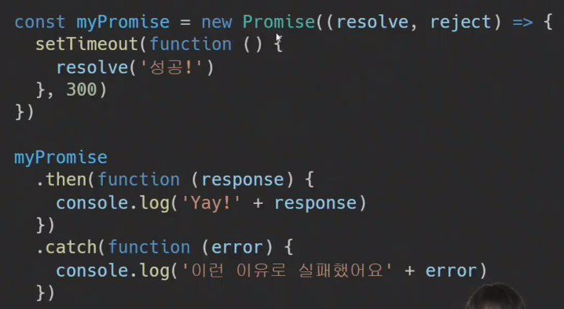
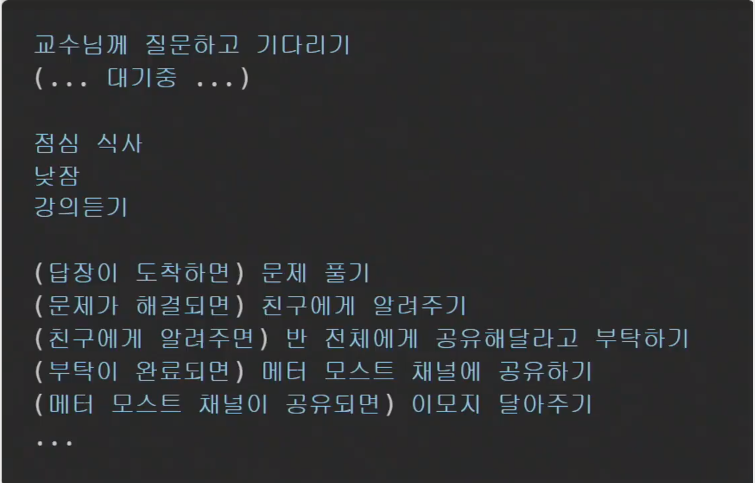
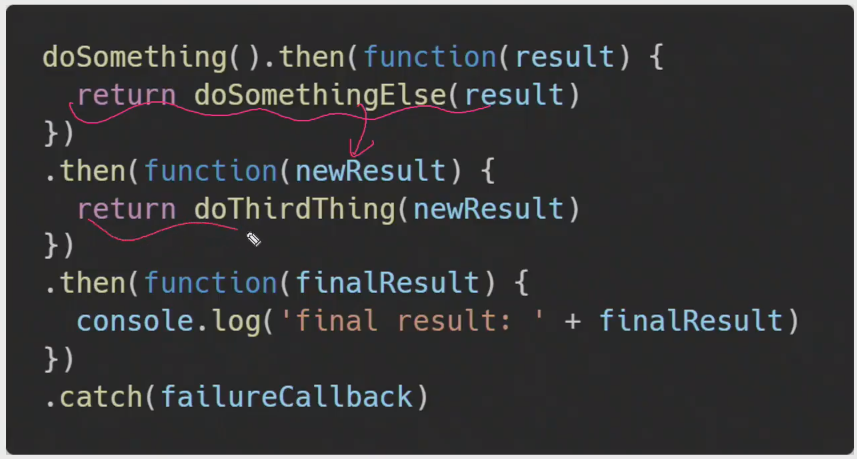
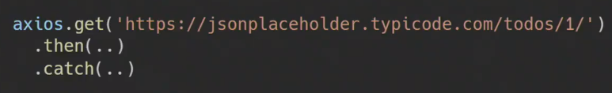
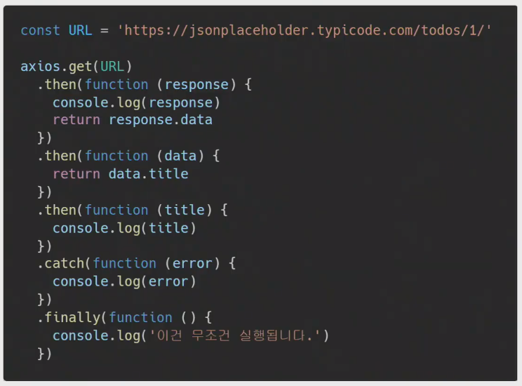

# JS 210503 - Javascript 02

## 오전 라이브

### 지난 시간 배운 것 정리

- js의 개념, 역사 복습
- dom 
  - 선택, 변경
  - event 개념 - 리스너, 개념
- ecmascript 6 공부

### JS 02

#### AJAX란

- AJAX - XML(비동기식 js와 xml)
  - XMLHttpRequest 라는 객체 (BOM에서 지원) 로 서버와 통신 - 브라우저에서 제공하는 기능으로 어딘가 요청하는 기능, 동기식과 비동기식 통신을 모두 지원
  - 현재 페이지에 영향을 주지 않고 자바스크립트 상에서 요청받아 일부분만 응답받을 수 있음(즉 새로고침을 하지 않고 일부분만 실시간으로 수정 가능하다.)
- 페이지 전체를 reload를 하지 않고서도 수행되는 '비동기성'
  - 사용자의 이벤트가 있으면 전체 페이지가 아닌 일부분 만을 업데이트
- AJAX의 X가 XML을 의미하긴 하지만, 요즘은 더 가벼운 용량과 js의 일부라는 장점 때문에 JSON을 더 많이 사용
- 즉 페이지 전체를 로드하지 않고 특정 부분만의 갱신을 통해 사용자 경험을 향상시킴 (매번 새로고침은 사용자 경험을 떨어트림)

#### 동기(Synchronous)와 비동기(Asynchronous)

- 동기식
  - 순차적, 직렬적 태스크 수행
  - 요청을 보낸 후 응답을 받아야만 다음 동작이 이루어짐 (blocking)
- 비동기식
  - 병렬적 태스크 수행
  - 요청을 보낸 후 응답을 기다리지 않고 다음 동작이 이루어짐 (non-blocking)
    - 즉, 요청을 보내놓고 다음 태스크로 진행
- 자바스크립트는 웹 페이지 상에서 여러가지 일을 하기 때문에 하나의 일을 맡겨놓고 응답을 기다리는 동기식 방법이면 먼저 실행되고 있는 요청(일)이 끝날 때 까지 다른 작업은 멈춘 채로 대기할 수 밖에 없다. (특히나 자바스크립트는 싱글 스레드로 일을 처리함) 그렇게 될 경우 사용자 입장에서는 일처리가 굉장히 느리게 처리되는 것으로 보이기 때문에 답답한 사용자 경험을 받게 될 것 -> 오래 걸릴 것 같은 일을 브라우저에게 맡기고 다른 일을 처리하다가 응답이 오면 아까 맡긴 일을 다시 받아서 처리를 하는 것 (비동기를 사용하는 이유)
- 동기식 예시
  - alert 메세지 출력시 확인 버튼이 눌리기 전까지 다음 코드가 실행이 되지 않는다.
  - 왜? js는 single threaded
- 비동기식 예시
  - 바로 실행되서 객체 돌아온 부분이 없다.(응답 받기 전에 실행을 다 해버림)
  - 이러한 객체를 실제로 받아서 사용하려면 이벤트 리스너를 통해 응답 받았을 때 처리하도록 구성 (콜백 함수)

#### JS는 싱글스레드

- 컴퓨터가 여러 개의 cpu를 가지고 있어도 main thread라 불리는 단일 스레드에서만 작업 수행
- 즉, 이벤트를 처리하는 call stack이 하나인 언어라는 의미
- 이 문제를 해결하기 위해 js는 즉시 처리하지 못하는 이벤트들을 다른 곳(web api)으로 보내서 처리하도록 하고, 처리된 이벤트들은 처리된 순서대로 대기실(task queue)에 줄을 세워 놓고 call stack이 비면 담당자(event loop)가 대기 줄에서 가장 오래 된(제일 앞의) 이벤트를 call stack으로 보냄
- 즉, 싱글 스레드를 사용해(js는 설계가 싱글 스레드로 설계됨) 병렬 처리를 하기 위해 이벤트 루프를 도입

#### Concurrency model

- Event loop를 기반으로 하는 동시성 모델 (Concurrency model)

1. Call Stack - 요청을 보낼 일이 있어요. Web API에 전달
2. Web API (Browser API) - 실제로 요청과 응답을 주고 받는 기능을 담당
3. Task Queue (Event Queue, Message Queue) - API 요청에 따른 응답을 받아 왔어요. JS에서 확인해주세요.
4. Event Loop - 1~3의 작업을 계속 확인하면서 반복

## 오후 웹코칭

- ECMAScript - 자바스크립트로 데이터를 조작해보는것 연습해보기 - 꼭 해보는 것을 추천 (강사님 추천)
- AJAX 
  - 개념 - 자바스크립트로 특정한 부분만 요청해서 응답받는 기법 (AJAX 프로그래밍)
  - 배경
- XMLHttpRequest 객체
  - AJAX 프로그래밍 하기 위해 사용하는 객체 - 즉 자바스크립트로 브라우저의 기능인 XMLHttpRequest  기능을 사용
- 동기와 비동기
  - 개념
  - 비동기를 사용하는 이유
  - 예시
- js가 싱글스레드 이기에 채택한 비동기 방법 (병렬 처리) - 이벤트 루프
  - 메인스레드에서 요청을 순차적으로 처리한다고하는데 메인스레드에서는 무슨일을하는건가요?
    - js는 dom, bom, ECMAScript 3가지 기능이 있는데 dom, bom은 웹 브라우저에 리모콘 조종하듯이 이 행동을 하라고 지시하는 것 -> web api는 bom 쪽에 해당하며 요청 응답을 받은 후 데이터 가공, 처리 후 화면을 변경해줌
    - js는 시키는 일을 하고 실제 시키는 일은 웹 브라우저가 하게됨

## 오후 라이브

### 코드를 통한 예제

- 3가지 - 오전에서 보여줬던거 복습 하는 느낌

### 콜백 함수

- 다른 함수의 인자로 들어갈 수 있는 함수
- 단 모든 콜백 함수가 비동기적으로 실행되진 않음 - 동기식, 비동기식 모두 사용됨
- 외부 함수 내에서 호출되어 일종의 루틴 또는 작업을 완료함
- 비동기 작업이 완료된 후 코드 실행을 계속하는 데 사용되는 경우 비동기 콜백이라고 함

#### js의 함수는 일급 객체

- 일급 객체 (일급 함수)
  - 다른 객체들에 적용 가능한 연산을 모두 지원하는 객체(함수)
- 일급 객체의 조건
  1. 인자로 넘길 수 있어야함
  2. 함수의 반환 값으로 사용 할 수 있어야함
  3. 변수에 할당 할 수 있어야 함

#### 비동기 콜백 - 백그라운드에서 실행됨

- 백그라운드에서 코드 실행을 시작할 함수를 호출할 때 인자로 지정된 함수
- 백그라운드 코드 실행이 끝나면 콜백 함수를 호출하여 작업이 완료되었음을 알리거나, 다음 작업을 실행하게 할 수 있음

#### 왜 비동기에서 콜백을 사용할까?

- 콜백 함수는 명시적인 호출이 아닌 특정 routine 혹은 action에 의해 호출되는 함수
- Django의 경우 '요청이 들어오면', event의 경우 '특정 이벤트가 발생하면' 이라는 조건하에서 함수를 호출 할 수 있었던 건 'callback function' 메커니즘이 있기 때문에 가능
- 비동기 로직을 수행 할 때 콜백 함수는 필수
  - 명시적인 호출이 아닌 특정 시점에 '알아서' 호출되도록 만들어야 하기 때문이며 기다려주지 않고 언젠가 처리해야 하는 일은 콜백 함수를 활용

#### Callback Hell

- 순차적인 연쇄 비동기 작업을 처리하기 위해 "콜백 함수를 호출하고, 그 다음 콜백 함수를 호출하고, 또 그 함수의 콜백 함수를 호출하고.." 의 패턴이 지속적으로 반복 됨
- 즉, 여러 개의 연쇄 비동기 작업을 할 때 마주하는 상황
- 이를 Callback Hell 혹은 pyramid of doom 라 함
- 위와 같은 상황이 벌어질 경우 아래 사항들을 통제하기 어려움
  - 디버깅
  - 코드 가독성

#### Callback Hell 해결하기

1. Keep your code shallow (코드의 깊이를 얕게 유지)
2. Modularize (모듈화)
3. Handle every single error (모든 단일 오류 처리)
4. Promise way (Promise 방식 사용)

### Promise

- 비동기 작업의 최종 완료 또는 실패를 나타내는 객체
  - 미래의 완료 또는 실패와 그 결과 값을 나타냄
  - 미래의 어떤 상황에 대한 약속
- 성공(이행)에 대한 약속
  - .then()
- 실패(거절)에 대한 약속
  - .catch()

#### Promise의 상태

1. 대기 (pending)
   - 이행하거나 거부되지 않는 초기 상태
2. 이행 (fulfilled)
   - 연산이 성공적으로 완료됨
3. 거부 (rejected)
   - 연산이 실패함

#### Promise methods

- .then (callback)
  - 이전 작업(promise)이 성공했을 때 (이행했을 때) 수행할 작업을 나타내는 콜백 함수
  - 그리고 각 콜백 함수는 이전 작업의 성공 결과를 인자로 전달 받음
  - 따라서 성공했을 때의 코드를 콜백 함수 안에 작성
- .catch (callback)
  - .then이 하나라도 실패하면 (거부 되면) 동작 (동기식의 'try .. catch' 구문과 유사)
  - 이전 작업의 실패로 인해 생성된 error 객체는 catch 블록 안에서 사용할 수 있음

- 각각의 .then() 블록은 서로 다른 promise를 반환
  - 즉, .then()을 여러 개 사용(chaining)하여 연쇄적인 작업을 수행할 수 있음
  - 결국 여러 비동기 작업을 차례대로 수행할 수 있다는 뜻
- 마찬가지로 .then()과 .catch() 메서드는 모두 promise를 반환하기 때문에 chaining 가능
- 주의
  - 반환 값이 반드시 있어야 함
  - 없다면 콜백 함수가 이전의 promise 결과를 받을 수 없음
- .finally (callback)
  - Promise 객체를 반환
  - 결과와 상관없이 무조건 지정된 콜백 함수가 실행
  - 어떠한 인자도 전달 받지 않음
    - Promise가 성공되었는지 거절되었는지 판단 할 수 없기 때문
  - 무조건 실행되어야 하는 절에서 활용
    - .then() 과 .catch() 블록에서의 코드 중복을 방지

#### Promise 기본 구조

- 두 개의 콜백 함수를 인자로 받음
- 하나는 Promise 가 이행했을 때,
  - resolve()

- 다른 하나는 거부했을 때를 위함
  - reject()

#### Promise가 보장하는 것

- Async callback 작성 스타일과 달리 Promise가 보장하는 특징

1. 콜백은 자바스크립트 Event Loop가 현재 실행중인 콜 스택을 완료하기 이전에는 절대 호출되지 않음
   - Promise 콜백은 event queue에 배치되는 엄격한 순서로 호출 됨
2. 비동기 작업이 성공하거나 실패한 뒤에 .then() 메서드를 이용하여 추가한 경우에도 1번과 똑같이 동작
3. .then()을 여러 번 사용하여 여러 개의 콜백을 추가할 수 있음 (Chaining)
   - 각각의 콜백은 주어진 순서대로 하나 하나 실행하게 됨
   - Chaining은 Promise의 가장 뛰어난 장점

### Axios

- Promise based HTTP client for the browser and Node.js
- 브라우저를 위한 Promise 기반의 클라이언트
- 원래는 'XHR'이라는 브라우저 내장 객체를 활용해 AJAX 요청을 처리하는데, 이보다 편리한 AJAX 요청이 가능하도록 도움을 줌
  - 확장 가능한 인터페이스와 함께 패키지로 사용이 간편한 라이브러리를 제공

- 예시

## 웹코칭 2

- js도 python 처럼 콜스택 존재 foo 함수 이후에 setTimeout 함수를 0초로 했음에도 foo 함수가 끝나고 실행되는 것은 콜스택상에서 foo함수가 먼저 끝나고 콜스택 다음 차례인 setTimeout이 실행되기 때문
- 콜백 함수 개념 복습 - 비동기적으로 사용했을 때 과도한 콜백은 call back hell -> 이것을 개선하기 위해 나온 개념 -> promise
- axios.get() - promise 객체
  - .then() - promise 객체 리턴도 promise 그렇기 때문에 .then 으로 chaining이 가능한 것
- 사용 예시
  - 데이터 서버와 인증 서버가 각각 다르게 관리되고 있을 때
    - .then() - 인증 서버에서 사용자의 권한을 확인한다 -> 비동기
    - .then() - 사용자가 원하는 데이터를 받아온다. -> 비동기
    - .catch() - 위 비동기 과정 중 하나라도 에러가 발생하면 catch 구문 호출
  - return imgUrl 를 하면 다음 then의 function() 도 imgUrl로 이름을 통일해야 하나요? 인자 명은 달라도 괜찮음
- 직접 구현까지 하면 과부하가 올 것 같으니 오늘은 직접 사용법 까지만 알아봄 + 개념

