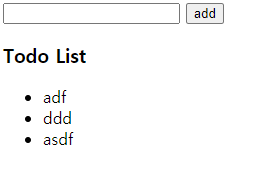
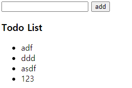

# javascript_01_workshop


### 1. 제시된 CREATE, READ 기능을 충족하는 todo app을 완성하시오.

>  필수사항
> - form 태그를 사용한다.
> - submit 되었을 시 todo가 작성된다.
> - 작성 된 todo는 ul 태그의 li 태그로 추가된다.
> - 작성 후 input value 값는 초기화 된다.
> - (선택) 빈 값인 데이터는 입력을 방지한다.

``` html
<!DOCTYPE html>
<html lang="en">
<head>
  <meta charset="UTF-8">
  <meta http-equiv="X-UA-Compatible" content="IE=edge">
  <meta name="viewport" content="width=device-width, initial-scale=1.0">
  <title>Document</title>
</head>
<body>
    <form action="" id='test_form'>
      <input type="text" name="ipt_text" id="ipt_text">
      <button>add</button>
    </form>
    <h3>Todo List</h3>
    <ul id="todo_ul">
    </ul>
  <script>
    const formEvent = document.querySelector('#test_form')
    const todoUl = document.querySelector("#todo_ul")
    formEvent.addEventListener('submit', function (event) {
      // console.log(event)
      const myTextInput = document.querySelector('#ipt_text')
      event.preventDefault()
      
      let tmp = document.createElement('li')
      tmp.setAttribute('id', 'todo_list')
      tmp.innerText = myTextInput.value
      todoUl.append(tmp)
      event.target.reset()
    })
  </script>
</body>
</html>
```


___

- 추가전



- 추가후

