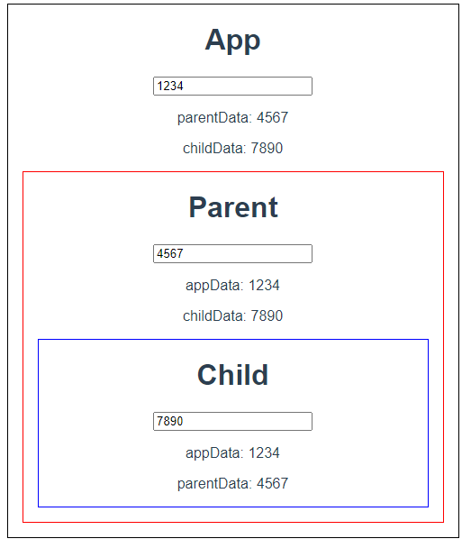

# vue_02_workshop


## Props와 emit event를 활용하여 아래와 같이 데이터를 주고받는 Application을 완성하시오.


### 1. App.vue

``` vue
<template>
  <div id="app">
    <h1>App</h1>
    <input type="text" v-model="appData">
    <p>parentData: {{ parentData }}</p>
    <p>childData: {{ childData }}</p>
    <!-- 3. 사용하기 -->
    <Parent :appData="appData" @child-input="onChildInput" @parent-input="onParentInput" />
  </div>
</template>

<script>
// 1. 불러오기
import Parent from '@/components/Parent.vue'

export default {
  name: 'App',
  // 양방향 바인딩, 데이터를 받을 함수 데이터 지정 (꼭 함수 형태여야함)
  data: function () {
    return {
      appData: '',
      childData: '',
      parentData: '',
    }
  },
  components: {
    // 2. 등록하기
    Parent,
  },
  methods: {
    onParentInput: function (parentData) {
      this.parentData = parentData
    },
    onChildInput: function (childData) {
      // console.log('child input @ App.vue')
      this.childData = childData
    },
  }
}
</script>

<style>
#app {
  font-family: Avenir, Helvetica, Arial, sans-serif;
  -webkit-font-smoothing: antialiased;
  -moz-osx-font-smoothing: grayscale;
  text-align: center;
  color: #2c3e50;
  margin-top: 60px;

  /* 추가 */
  width: 500px;
  margin: 0 auto;
  border: 1px solid black  
}
</style>

```


___


### 2. Parent.vue

``` vue
<template>
  <div id="parent">
    <h1>Parent</h1>
    <input type="text" @input="onInput" v-model="parentData">
    <p>appData: {{ appData }}</p>
    <p>childData: {{ childData }}</p>
    <!-- 자식에서 child-input이라는 이벤트가 발생하면 onChildInput 리스너로 처리하겠다. -->
    <Child :appData="appData" :parentData="parentData" @child-input="onChildInput" />
  </div>
</template>

<script>
import Child from '@/components/Child.vue'
export default {
  name: 'Parent',
  data: function () {
    return {
      childData: '',
      parentData: '',
    }
  },
  // App.vue(상위 컴포넌트)에서 전달 받은 데이터
  props: {
    appData: {
      type: String,
      required: true, // 데이터가 항상 필요 - 데이터가 안 들어오면 에러나 경고 나오게 관리 가능
    }
  },
  components: {
    Child,
  },
  methods: {
    onChildInput: function (childData) {
      // console.log(childData)
      this.childData = childData
      this.$emit('child-input', this.childData)
    },
    // 이벤트 함수 - 위에서 input이 일어났을 때 child-input 이라는 이벤트를 발생 시킴
    onInput: function () {
      this.$emit('parent-input', this.parentData)
    },
  }
}
</script>

<style>
#parent {
  margin: 1rem;
  border: 1px solid red;
}
</style>
```


___


### 3. Child.vue

``` vue
<template>
  <div id="child">
    <h1>Child</h1>
    <input type="text" @input="onInput" v-model="childData">
    <p>appData: {{ appData }}</p>
    <p>parentData: {{ parentData }}</p>
  </div>
</template>

<script>
export default {
  name: 'Child',
  data: function () {
    return {
      childData: '',
    }
  },
  // App.vue(상위 컴포넌트)에서 전달 받은 데이터
  props: {
    appData: {
      type: String,
      required: true, // 데이터가 항상 필요 - 데이터가 안 들어오면 에러나 경고 나오게 관리 가능
    },
    parentData: {
      type: String,
      required: true, // 데이터가 항상 필요 - 데이터가 안 들어오면 에러나 경고 나오게 관리 가능
    },
  },
  methods: {
    // 이벤트 함수 - 위에서 input이 일어났을 때 child-input 이라는 이벤트를 발생 시킴
    onInput: function () {
      this.$emit('child-input', this.childData)
    }
  }
}
</script>

<style>
#child {
  margin: 1rem;
  border: 1px solid blue;
}
</style>
```


___


### 4. 결과



