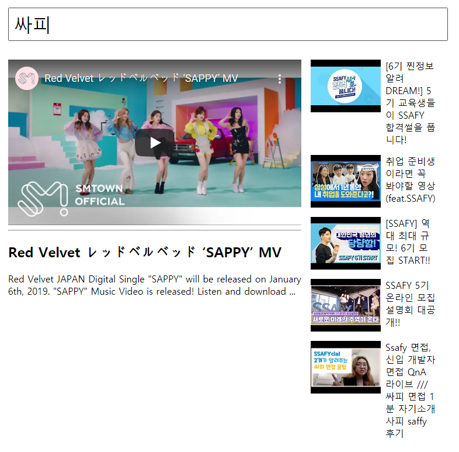

# vue_03_workshop


## Vue CLI 및 Youtube API를 활용하여 Youtube 앱을 완성하시오.


### 1. App.vue

``` vue
<template>
  <div id="app">
    <header>
      <SearchBar @search="onSearch" :video-length="videoList.length" />
    </header>
    <!-- <h1>My First Youtube Project</h1> -->
    <!-- <p> {{query}} </p> -->
    <section>
      <VideoDetail :selectedVideo="selectedVideo" />
      <VideoList :videoList="videoList" @select-video="onSelectVideo" />
    </section>
  </div>
</template>

<script>
import axios from 'axios'
import SearchBar from '@/components/SearchBar.vue'
import VideoList from '@/components/VideoList.vue'
import VideoDetail from '@/components/VideoDetail.vue'


export default {
  name: 'App',
  components: {
    SearchBar,
    VideoList,
    VideoDetail,
  },
  data: function () {
    return {
      // query: '',
      videoList: [],
      selectedVideo: null,
    }
  },
  methods: {
    // Youtube API 로 데이터 요청
    onSearch: function (query) {
      // this.query = query
      const API_KEY = process.env.VUE_APP_YOUTUBE_API_KEY
      // console.log(API_KEY)
      const API_URL = 'https://www.googleapis.com/youtube/v3/search'
      const params = {
        key: API_KEY,
        part: 'snippet',
        type: 'video',
        q: query,
      }
      axios({
      method: 'GET',
      url: API_URL,
      params,
      }).then(response => {
        // console.log(response)
        this.videoList = response.data.items
        if(!this.selectedVideo) {
          this.selectedVideo = this.videoList[0]
        }
      }).catch(error => {
        console.log(error)
      })
    },
    onSelectVideo: function (video){
      this.selectedVideo = video
    }
  },
}
</script>

<style>
header, section {
  width: 80%;
  margin: 0 auto;   /** 양 옆 margin을 균등하게 배분 (가운데 정렬) */
  padding: 1rem 0;  /** 위, 아래 padding */
}
section {
  display: flex; /** 가로 배치 */
}

</style>

```


___


### 2. SearchBar.vue

``` vue
<template>
  <div id="search-bar" :style="{ margin: videoLength? '0' : '40vh 0' }">
    <input
      type="text"
      v-model="query" 
      @keyup.enter="onEnter" 
      placeholder="Search"
    >
  </div>
</template>

<script>
export default {
  name: 'SearchBar',
  props: {
    videoLength: {
      type: Number,
    }
  },
  data: function () {
    return {
      query: '',
    }
  },
  methods: {
    onEnter: function () {
      return this.$emit('search', this.query)
    },
  },
}
</script>

<style>
#search-bar {
  transition: margin 0.5s;
}
#search-bar > input {
  width: 100%;      /* 가로 너비 배치를 화면의 끝과 끝으로 배치 */
  padding: 0.5rem;  /* input 안쪽의 margin을 여유롭게 */
  font-size: 2rem;
}
</style>
```


___


### 3. VideoList.vue

``` vue
<template>
  <ul id="video-list">
    <!-- for문의 key는 항상 유니크한 값 -->
    <VideoListItem 
      v-for="video in videoList"
      :key="video.etag" 
      :video="video"
      @select-video="onSelectVideo"
    />
  </ul>
</template>

<script>
import VideoListItem from '@/components/VideoListItem.vue'

export default {
  name: 'VideoList',
  props: {
    videoList: {
      type: Array,
      required: true,
    }
  },
  components: {
    VideoListItem,
  },
  methods: {
  onSelectVideo: function(video) {
    return this.$emit('select-video', video)
    }
  }
}
</script>

<style>
#video-list {
  /* 기본 margin, padding, 그리고 list-style 속성 초기화 */
  padding: 0;
  margin: 0;
  list-style-type: none;
  width: 30%; /* Detail, List의 7:3 가로비율 설정*/
}
</style>
```


___


### 4. VideoListItem.vue

``` vue
<template>
  <li class="video-list-item" @click="onVideoClick">
    
    <!-- <span>{{ video.snippet.title | unescape }}</span> -->
    <!-- <span>{{ unescape(video.snippet.title)  }}</span> -->
    <span>{{ videoTitle }}</span>
  </li>
</template>

<script>
import _ from 'lodash'

export default {
  name: 'VideoListItem',
  props: {
    video: {
      type: Object,
    }
  },
  // filters: {
  //   unescape: function (text) {
  //     return _.unescape(text)
  //   }
  // },
  computed: {
    videoTitle: function () {
      return _.unescape(this.video.snippet.title)
    }
  },
  methods: {
    onVideoClick: function() {
      return this.$emit('select-video', this.video)
    },
  },
}
</script>

<style>
.video-list-item {
  display: flex;        /* 가로 배치 및 flex의 CSS 적용 */
  margin-bottom: 1rem;  /* item의 상하 여백 */
  cursor: pointer;      /* 마우스를 포인터로 변경 */
}
.video-list-item:hover {
  background: #eee;
}
.video-list-item img {
  height: fit-content;   /* 텍스트가 길어져도 이미지는 늘어나지 않게 설정 */
  margin-right: 0.5rem;  /* 이미지와 텍스트 사이의 여백 */
}
</style>
```


### 5. VideoDetail.vue

``` vue
<template>
  <div v-if="selectedVideo" id="video-detail">
    <!-- 
    <p>{{ videoTitle }}</p> -->
    <div class="video-container">
      <iframe 
        id="ytplayer" 
        type="text/html"
        :src="videoURI"
        frameborder="0">
      </iframe>
    </div>
    <hr>
    <h2>{{ videoTitle }}</h2>
    <p>{{ videoDescription }}</p>
  </div>
  
</template>

<script>
import _ from 'lodash'

export default {
  name: 'VideoDetail',
  props: {
    selectedVideo: {
      type: Object,
    }
  },
  computed: {
    videoTitle: function () {
      return _.unescape(this.selectedVideo.snippet.title)
    },
    videoDescription: function () {
      return _.unescape(this.selectedVideo.snippet.description)
    },
    videoURI: function () {
      const videoId = this.selectedVideo.id.videoId
      return `https://www.youtube.com/embed/${videoId}`
    }
  },
}
</script>

<style>
#video-detail {
  width: 70%;           /* Detail, List를 전체 가로 비율 대비 7:3으로 설정 */
  padding-right: 1rem;  /* Detail과 List 사이의 margin */
}
.video-container {
  position: relative;   /* iframe을 container를 기준으로 위치를 지정 */
  padding-top: 56.25%;  /* 유튜브 비디오 비율을 맞추기 위한 높이 설정 */
}
.video-container > iframe {
  position: absolute;   /* container를 기준으로 위치를 지정*/
  top: 0;               /* container의 가장 위쪽으로 위치를 지정 */
  left: 0;
  width: 100%;
  height: 100%;
}
</style>
```


___


### 결과

