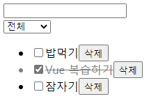
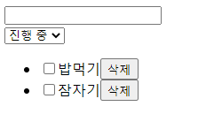
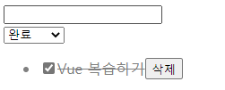

# vue_04&05_workshop


## Vue CLI 및 Vuex를 활용하여 todo 앱을 완성하시오.


### 1. App.vue

``` vue
<template>
  <div id="app">
    <TodoForm />
    <TodoList />
  </div>
</template>

<script>
import TodoForm from '@/components/TodoForm'
import TodoList from '@/components/TodoList'


export default {
  name: 'App',
  components: {
    TodoForm,
    TodoList,
  },
  data: function () {
    return {
      content: '',
    }
  },
  methods: {
    onEnter: function () {
      this.$store.dispatch('addTodo', this.content)
    },
  },
  computed: {

  }
}
</script>

<style>

</style>

```


___


### 2. index.js

``` js
import Vue from 'vue'
import Vuex from 'vuex'
import _ from 'lodash'
import createPersistedState from 'vuex-persistedstate'

Vue.use(Vuex)

export default new Vuex.Store({
  plugins: [
    createPersistedState(),
  ],
  state: {
    // todoList를 vuex에서 관리 (전체 공유 데이터)
    todoList: [],
    status: 'all', // all, completed, inProgress
  },
  getters: {
    todoListByStatus: function (state) {
      switch (state.status) {
        case 'completed': {
          return state.todoList.filter(todo => todo.completed)
        }
        case 'inProgress': {
          return state.todoList.filter(todo => !todo.completed)
        }
        default:
          return state.todoList
      }
    },
  },
  mutations: {
    // todoList에 데이터를 넣는 방법
    ADD_TODO: function (state, todoItem) {
      state.todoList.push(todoItem)
    },
    DELETE_TODO: function (state, id) {
      state.todoList = state.todoList.filter(todo => {
        return todo.id !== id
      })
    },
    UPDATE_TODO: function (state, todoItem) {
      // todoItem.completed = !todoItem.completed
      state.todoList = state.todoList.map(todo => {
        if (todo.id === todoItem.id) {
          return todoItem
        }
        return todo
      } )
    },
    UPDATE_STATUS: function (state, status) {
      state.status = status
    },

  },
  actions: {
    // 컴포넌트에서 dispatch로 호출할 함수
    // 액션 함수는 항상 첫 번째 인자로 context가 들어감 addTodo 기능을 위한 모든 행동을 추가함
    addTodo: function (context, content) {
      if (!content) return
      const todo = {
        id: _.uniqueId(),
        content: content,
        createdAt: Date.now(),
        completed: false,
      }
      
      // mutation 함수 호출 (commit)
      context.commit('ADD_TODO', todo)
    },
    toggleTodo: function (context, todoItem) {
      context.commit('UPDATE_TODO', {...todoItem, completed: !todoItem.completed})
    }
  }
})

```


___


### 3. TodoForm.vue

``` vue
<template>
  <div>
    <input type="text" v-model="content" @keyup.enter="onEnter">
  </div>
</template>

<script>
import { mapActions } from 'vuex'
export default {
  name: 'TodoForm',
  data: function () {
    return {
      content: '',
    }
  },
  methods: {
    ...mapActions(['addTodo']),
    onEnter: function () {
      this.addTodo(this.content.trim())
      // this.$store.dispatch('addTodo', this.content)
      this.content = ''
    }
  }
}
</script>

<style>

</style>
```


___


### 4. TodoList.vue

``` vue
<template>
<div>  
  <select v-model="status">
    <option value="all">전체</option>
    <option value="inProgress">진행 중</option>
    <option value="completed">완료</option>
  </select>
  <ul>
    <!-- key는 고유값이어야 함 index로 할 경우 추후에 오류가 발생할 여지 다분 -->
    <!-- 완료 목록 미완 목록 분리했다가 키 중복돼서 에러났습니다.. -->
    <TodoListItem 
      v-for="todo in todoListByStatus"
      :key="todo.id"
      :todo="todo"
    />
  </ul>
</div>
</template>

<script>
import { mapState, mapGetters } from 'vuex' 
import TodoListItem from '@/components/TodoListItem'

export default {
  name: 'TodoList',
  components: {
    TodoListItem,
  },
  computed: {
    // todoList: function () {
      //   return this.$store.state.todoList
    // }
    ...mapState(['todoList']),
    ...mapGetters(['todoListByStatus']),
    status: {
      get: function () {
        return this.$store.state.status
      },
      set: function (value) {
        this.$store.commit('UPDATE_STATUS', value)
      },
      
    },
  }
}
</script>

<style>

</style>
```


---


### 5. TodoListItem.vue

``` vue
<template>
  <li @click="onTodoClick" :class="{ completed: todo.completed }">
    <input type="checkbox" :checked="todo.completed">
    <span>{{ todo.content }}</span>
    <button @click="onDeleteButtonClick">삭제</button>
  </li>
</template>

<script>
export default {
  name: 'TodoListItem',
  props: {
    todo: {
      type: Object,
      required: true,
    },
  },
  methods: {
    onDeleteButtonClick: function () {
      this.$store.commit('DELETE_TODO', this.todo.id) 
    },
    onTodoClick: function () {
      // this.$store.commit('UPDATE_TODO', this.todo)
      // this.$store.commit('UPDATE_TODO', {...this.todo, completed: !this.todo.completed })
      this.$store.dispatch('toggleTodo', this.todo)
    },
  }
}
</script>
  
<style>
  li {
    cursor: pointer;
  }
  .completed {
    text-decoration: line-through;
    color: gray;
  }
</style>
```


---

### 결과

- 전체



- 진행 중



- 완료

