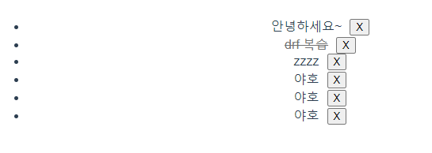
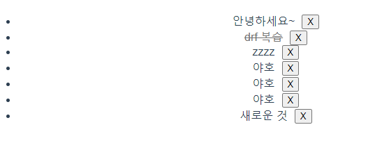
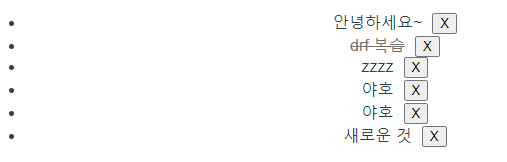
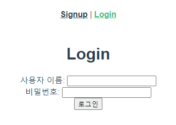

# vue_06&07_workshop


### 1. 사전 제공된 django와 vue 프로젝트를 통해 Todo를 가져오는 과정에서 발생하는 CORS 관련 이슈를 해결하고 Todo의 작성/수정(취소선 토글)/삭제를 구현하시오.

- CORS setting

```python
# settings.py

INSTALLED_APPS = [
	# django cors
    'corsheaders',
]

MIDDLEWARE = [
    # django cors middleware setting
    'corsheaders.middleware.CorsMiddleware',
]
CORS_ALLOWED_ORIGINS = [
    "http://localhost:8080",
]
```


- App.vue

``` vue
<template>
  <div id="app">
    <div id="nav">
      <span v-if="isLogin">
        <router-link :to="{ name: 'TodoList' }">Todo List</router-link> | 
        <router-link :to="{ name: 'CreateTodo' }">Create Todo</router-link> |
        <router-link to="#" @click.native="onLogout">Logout</router-link>
      </span>
      <span v-else>
        <router-link :to="{ name: 'Signup' }">Signup</router-link> |
        <router-link :to="{ name: 'Login' }">Login</router-link> 
      </span>
    </div>
    <router-view @login="onLogin" :isLogin="isLogin" />
  </div>
</template>

<script>
import axios from 'axios'

export default {
  name: 'App',
  data: function () {
    return {
      isLogin: false,
    }
  },
  methods: {
    onLogin: function () {
      this.isLogin = true
      axios.defaults.headers.common['Authorization'] = `JWT ${localStorage.getItem('jwt')}`
    },
    onLogout: function () {
      localStorage.removeItem('jwt')
      this.isLogin = false
      this.$router.push({ name: 'Login' })
      axios.defaults.headers.common['Authorization'] = ''
    }
  },
  created: function () {
    const jwt = localStorage.getItem('jwt')
    if (jwt) {
      this.isLogin = true
      axios.defaults.headers.common['Authorization'] = `JWT ${jwt}`
    }
  }
}
</script>

<style>
#app {
  font-family: Avenir, Helvetica, Arial, sans-serif;
  -webkit-font-smoothing: antialiased;
  -moz-osx-font-smoothing: grayscale;
  text-align: center;
  color: #2c3e50;
}

#nav {
  padding: 30px;
}

#nav a {
  font-weight: bold;
  color: #2c3e50;
}

#nav a.router-link-exact-active {
  color: #42b983;
}
</style>

```

- CreateTodo.vue

```vue
<template>
  <div>
    <input type="text" v-model.trim="title" @keyup.enter="createTodo">
    <button @click="createTodo">+</button>
  </div>
</template>

<script>
import axios from'axios'

const SERVER_URL = process.env.VUE_APP_SERVER_URL

export default {
  name: 'CreateTodo',
  props: {
    isLogin: {
      type: Boolean,
      required: true,
    }
  },
  data: function () {
    return {
      title: '',
    }
  },
  methods: {
    createTodo: function () {
      const todoItem = {
        title: this.title,
      }

      if (todoItem.title) {
        axios({
          method: 'post',
          // 둘 다 상관 없음 같은 결과
          url: SERVER_URL + '/todos/',
          // url: `${SERVER_URL}/todos/`,
          // headers: {
          //   Authorization: `JWT ${localStorage.getItem('jwt')}`
          // },
          data: todoItem
        }).then((res) => {
          console.log(res)
          this.$router.push({ name: 'TodoList' })
        }).catch((err) => {
          console.log(err)
        })
      }
    },
  },
  created: function () {
    if (!this.isLogin) {
      this.$router.push({ name: 'Login' })
    }
  }
}
</script>
```

- TodoList.vue

```vue
<template>
  <div>
    <ul>
      <li v-for="todo in todos" :key="todo.id">
        <span @click="updateTodoStatus(todo)" :class="{ completed: todo.completed }">{{ todo.title }}</span>
        <button @click="deleteTodo(todo)" class="todo-btn">X</button>
      </li>
    </ul>
<!--     필요 없음?
    <button @click="getTodos">Get Todos</button> -->
  </div>
</template>

<script>
import axios from 'axios'
const SERVER_URL = process.env.VUE_APP_SERVER_URL

export default {
  name: 'TodoList',
  props: {
    isLogin: {
      type: Boolean,
      required: true,
    }
  },
  data: function () {
    return {
      todos: [],
    }
  },
  methods: {
    // asyne 비동기 함수로 만듬 - 현업에서 많이 사용
    getTodos: async function () {
      const response = await axios ({
        method: 'get',
        url: SERVER_URL + '/todos/',
        // headers: {
        //   Authorization: `JWT ${localStorage.getItem('jwt')}`
        // }
      })
      this.todos = response.data
      // 일반 함수
      // axios({
      //   method: 'get',
      //   url: SERVER_URL + '/todos/',
      // })
      //   .then((res) => {
      //     // console.log(res)
      //     this.todos = res.data
      //   })
      //   .catch((err) => {
      //     console.log(err)
      //   })
    },
    deleteTodo: function (todo) {
      axios({
        method: 'delete',
        url: `${SERVER_URL}/todos/${todo.id}/`,
        // headers: {
        //   Authorization: `JWT ${localStorage.getItem('jwt')}`
        // }
      })
        .then(() => {
          // console.log(res)
          // 데이터 삭제 후 전체 새로고침 같이 갱신
          this.getTodos()
        })
        .catch((err) => {
          console.log(err)
        })
    },
    updateTodoStatus: function (todo) {
      const todoItem = {
        ...todo, // 기존 todo의 모든 속성을 그대로 가져오되,
        completed: !todo.completed // completed 속성만 반대로 바꿈
      }

      axios({
        method: 'put',
        url: `${SERVER_URL}/todos/${todo.id}/`,
        // headers: {
        //   Authorization: `JWT ${localStorage.getItem('jwt')}`
        // },
        data: todoItem,
      })
        .then(() => {
          // console.log(res)
          // 동적으로 직접 업데이트 (취소선)
          // todo.completed = !todo.completed
          // 그냥 바뀐 값으로 갱신해서 가져오기 (이게 조금더 적절한 듯)
          this.getTodos()
        })
      },
    },
  created: function () {
    if (this.isLogin) {
      this.getTodos()
    } else {
      this.$router.push({ name: 'Login' })
    }
  }
}
</script>

<style scoped>
  .todo-btn {
    margin-left: 10px;
  }

  .completed {
    text-decoration: line-through;
    color: rgb(112, 112, 112);
  }
</style>

```


#### 결과

- 처음 화면



- 추가 후



- 삭제 후



___


### 2. 이전 워크샵 프로젝트에 이어서 JWT를 사용해 로그인과 로그아웃 그리고 인증된 사용자만 Todo API를 이용할 수 있도록 프로젝트를 구현하시오.

``` python
# accounts/serializers
from rest_framework import serializers
from django.contrib.auth import get_user_model

User = get_user_model()

class UserSerializer(serializers.ModelSerializer):
    password = serializers.CharField(write_only=True)
    class Meta:
        model = User
        fields = ('username', 'password',)

```

```python
# accounts/urls.py
from django.urls import path
from . import views
from rest_framework_jwt.views import obtain_jwt_token, verify_jwt_token


urlpatterns = [
    path('signup/', views.signup),
    path('api-token-auth/', obtain_jwt_token),
    path('api-token-verify/', verify_jwt_token),
]
```

```python
# accounts/views.py
from rest_framework import status
from rest_framework.decorators import api_view
from rest_framework.response import Response
from .serializers import UserSerializer


@api_view(['POST'])
def signup(request):
	#1-1. Client에서 온 데이터를 받아서
    password = request.data.get('password')
    password_confirmation = request.data.get('passwordConfirmation')
		
	#1-2. 패스워드 일치 여부 체크
    if password != password_confirmation:
        return Response({'error': '비밀번호가 일치하지 않습니다.'}, status=status.HTTP_400_BAD_REQUEST)
		
	#2. UserSerializer를 통해 데이터 직렬화
    serializer = UserSerializer(data=request.data)
    
	#3. validation 작업 진행 -> password도 같이 직렬화 진행
    if serializer.is_valid(raise_exception=True):
        user = serializer.save()
        #4. 비밀번호 해싱 후 
        user.set_password(request.data.get('password'))
        user.save()
    # password는 직렬화 과정에는 포함 되지만 → 표현(response)할 때는 나타나지 않는다.
    return Response(serializer.data, status=status.HTTP_201_CREATED)
```

```python
# todos/views.py
from django.shortcuts import get_object_or_404
from rest_framework import status
from rest_framework.response import Response
from rest_framework.decorators import api_view

from rest_framework.decorators import authentication_classes, permission_classes
from rest_framework.permissions import IsAuthenticated
from rest_framework_jwt.authentication import JSONWebTokenAuthentication

from .serializers import TodoSerializer
from .models import Todo


@api_view(['GET', 'POST'])
# 인증 여부 판단
@authentication_classes([JSONWebTokenAuthentication])
# 인증 확인 되었을 때만 권한 부여
@permission_classes([IsAuthenticated])
def todo_list_create(request):
    if request.method == 'GET':
        # todos = Todo.objects.all() # 모든 유저에 대한 todos
        # 로그인한 유저의 todos만 보여줄 수 있도록 변경
        todos = request.user.todos
        serializer = TodoSerializer(todos, many=True)
        return Response(serializer.data)

    elif request.method == 'POST':
        serializer = TodoSerializer(data=request.data)
        if serializer.is_valid(raise_exception=True):
            serializer.save(user=request.user)
            return Response(serializer.data, status=status.HTTP_201_CREATED)


@api_view(['PUT', 'DELETE'])
# 인증 여부 판단
@authentication_classes([JSONWebTokenAuthentication])
# 인증 확인 되었을 때만 권한 부여
@permission_classes([IsAuthenticated])
def todo_update_delete(request, todo_pk):
    todo = get_object_or_404(Todo, pk=todo_pk)
    if request.method == 'PUT':
        serializer = TodoSerializer(todo, data=request.data)
        if serializer.is_valid(raise_exception=True):
            serializer.save()
            return Response(serializer.data)

    elif request.method == 'DELETE':
        todo.delete()
        return Response({ 'id': todo_pk })

```

```vue
<template>
  <div>
    <h1>Signup</h1>
    <div>
      <label for="username">사용자 이름: </label>
      <input type="text" id="username" v-model="credentials.username">
    </div>
    <div>
      <label for="password">비밀번호: </label>
      <input type="password" id="password" v-model="credentials.password">
    </div>
    <div>
      <label for="passwordConfirmation">비밀번호 확인: </label>
      <input type="password" id="passwordConfirmation" v-model="credentials.passwordConfirmation">
    </div>
    <button @click="signup">회원가입</button>
  </div>
</template>

<script>
import axios from 'axios' 
// 환경 변수 VUE_APP_SERVER_URL 설정이 필요함
const SERVER_URL = process.env.VUE_APP_SERVER_URL

export default {
  name: 'Signup',
  props: {
    isLogin: {
      type: Boolean,
      required: true,
    }
  },
  data: function () {
    return {
      credentials: {
        username: '',
        password: '',
        passwordConfirmation: '',
      }
    }
  },
  methods: {
    signup: function () {
      axios({
        method: 'POST',
        url: SERVER_URL + '/accounts/signup/',
        data: this.credentials,
      }).then(res => {
        console.log(res)
      }).catch(err => {
        console.log(err)
      })
    }
  },
  created: function () {
    if (this.isLogin) {
      this.$router.push({ name: 'TodoList' })
    }
  },
}
</script>

```

```vue
<template>
  <div>
    <h1>Login</h1>
    <div>
      <label for="username">사용자 이름: </label>
      <input type="text" id="username" v-model="credentials.username">
    </div>
    <div>
      <label for="password">비밀번호: </label>
      <input type="password" id="password" v-model="credentials.password" @keyup.enter="login">
    </div>
    <button @click="login">로그인</button>
  </div>
</template>


<script>
import axios from 'axios'

const SERVER_URL = process.env.VUE_APP_SERVER_URL

export default {
  name: 'Login',
  props: {
    isLogin: {
      type: Boolean,
      required: true,
    }
  },
  data: function () {
    return {
      credentials: {
        username: '',
        password: '',
      }
    }
  },
  methods: {
    login: function () {
      axios({
        method: 'POST',
        url: SERVER_URL + '/accounts/api-token-auth/',
        data: this.credentials,
      }).then(response =>{
        // console.log(response)
        // 로컬에 토큰 저장
        localStorage.setItem('jwt', response.data.token)
        // App.vue에서 login이라는 이벤트를 전달
        this.$emit('login')
        // todo 리스트 페이지로 이동
        this.$router.push({ name : 'TodoList' })
      }).catch(err => {
        console.log(err)
      })
    }
  },
  created: function () {
    if (this.isLogin) {
      this.$router.push({ name: 'TodoList' })
    }
  },
}
</script>
```

#### 결과

- 로그인 전



- 로그인 후


___


