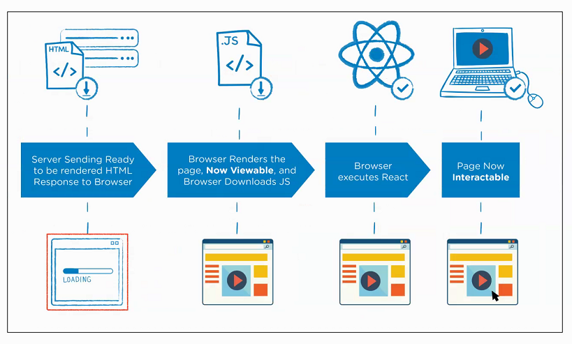
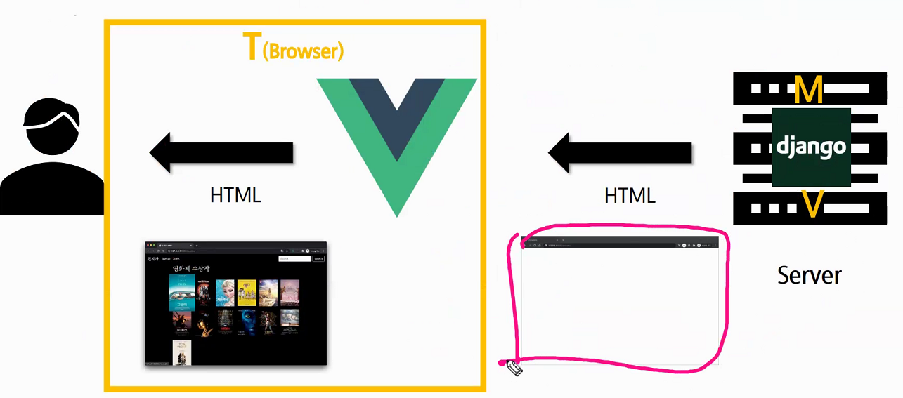
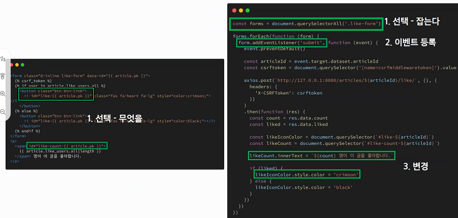
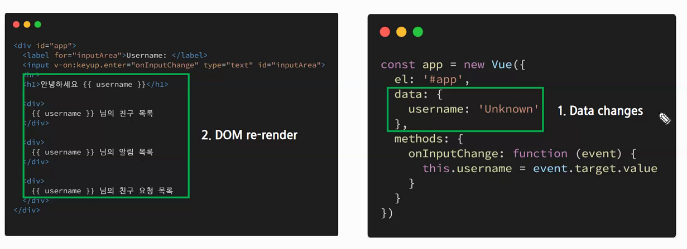
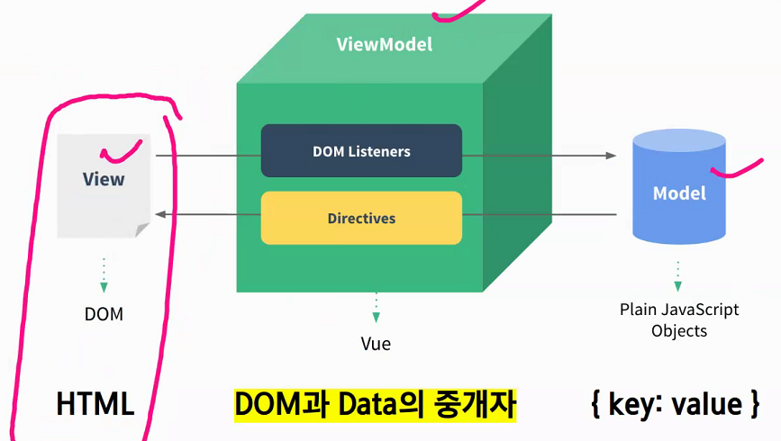

# JS 210506 - vue js


## 오전

- vue.js를 들어가기전 node.js
- node.js는 chrome v8 javascript 엔진으로 빌드
- v8 엔진 - 자바스크립트를 실행시키는 엔진 (크롬이 인기를 얻게된 이유 중 하나 - js 속도의 향상 -> 화면이 빨리 처리되어서 보이게됨 -> 성능이 빠르다고 느낌)
- 크롬의 v8 엔진으로 자바스크립트 성능이 매우 향상 되었고, 프로그래밍 언어로 쓰여도 손색없다고 생각해서 브라우저 만이 아닌 프로그래밍 언어화 시켜서 컴퓨터 환경에서도 사용가능 하게끔 만든 것이 node.js
- node.js 설치
  - chocolatey를 저는 맥에서의 homebrew역할과 동일하게 생각을 하고 있었는데 homebrew는 그러면 chocolatey와 달리 내부 기반까지는 건드리지 않고 설치를 진행하는건가요?
  - chocolatey를 설치하지 않는 이유 - windows 환경에서 안정적으로 제공되는 경우 보다 이슈가 발새아는 경우가 많다 + 기존에 설치 되었던 c++, python 등의 언어가 중복 설치 되거나 하는 등의 이유로 여러 문제가 발생할 가능성이 있음

- DOM, BOM이 없고 js 기능만 있음 (브라우저로 실행하지 않으므로)


### Vue.js


#### Front-End Development

- 프론트엔드 개발은 HTML, CSS, 그리고 JavaScript를 활용해서 데이터를 볼 수 있게 만들어 줌
  - 이 작업을 통해 사용자는 데이터를 눈으로 볼 수 있고 데이터와 상호작용 할 수 있음
- 장고 MTV 를 기준
- 대표적인 프론트엔드 프레임워크 - 주로 템플릿 개발 (T)
  - Vue.js, React, Angular (HTML, CSS, JS)
- 백엔드 - DB, CRUD, Auth ... (MV)


#### What is Vue.js

- 사용자 인터페이스를 만들기 위한 프로그레시브 프레임워크
- 현대적인 tool과 다양한 라이브러리를 통해 **SPA(Single Page Aplication)**를 완벽하게 지원
- Evan You에 의해 발표 (2014)
  - 구글의 Angular 개발자 출신
  - 학사 미술, 미술사 전공 / 석사 디자인 & 테크놀로지 전공
  - 구글 Angular 보다 더 가볍고, 간펴나게 사용할 수 있는 프레임워크를 만들기 위해 개발


#### SPA

- 단일 페이지 어플리케이션(Single Page Application)
- 현재 페이지를 동적으로 작성함으로써 사용자와 소통하는 웹 어플리케이션
- 단일 페이지로 구성되며 서버로부터 처음에만 페이지를 받아오고 이후에는 **동적으로 DOM을 구성**
  - 즉, 처음 페이지를 받은 이후에는 서버로부터 완전한 새로운 페이지를 불러오지 않고 현재 페이지를 동적으로 다시 작성함
  - 연속되는 페이지 간의 **사용자 경험 (UX)을 향상 **(반응형 웹)
  - 모바일 사용이 증가하고 있는 **현재 트래픽의 감소와 속도, 사용성, 반응성의 향상은 매우 중요한 이슈**이기 때문 - 사용자에게는 반응속도, 서비스 제공자 입장에서는 경제성 측면에서 중요한 이슈
- 기본 html 파일은 body가 거의 비어져 있는 상태에서 특정 페이지를 클릭하거나 넘어갈시 동적으로 body 부분을 가져와서 보여줌 (js로)
- 동작 원리의 일부가 **CSR**의 구조를 따름 - Client Side Rendering
  - html을 만드는 것을 서버에서 만드느냐 js에서 만드느냐 (장고는 대표적인 서버 사이드 - DTL사용)
  - 문서를 줄 때 빈 상태로 주고 js로 어떤 내용을 생성해서 제공할지 구상해놓음
  - 페이지가 이동 되는 느낌을 주게하지만 실제로는 같은 페이지 (js가 그렇게 보이게끔 동적으로 반응)


#### SPA 등장 배경

- 과거 웹 사이트들은 요청에 따라 매번 새로운 페이지를 응답하는 방식이었음
  - Multi Page Form (MPA) - 장고에서와 유사
- 스마트폰이 등장하면서 모바일 최적화에 대한 필요성이 생김
  - 모바일 네이티브 앱과 같은 형태의 웹 페이지가 필요해짐
- 이러한 문제를 해결하기 위해 Vue와 같은 프론트엔드 프레임워크가 등장
  - **CSR, SPA**의 등장
- 1개의 웹페이지에서 여러 동작이 이루어지며 모바일 앱과 비슷한 형태의 사용자 경험을 제공
- 이러한 개념의 시초는 React (페북에서 개발 - 왜 개발됐는지는 위의 문제 해결을 위해)


#### CSR

- Client Side Rendering
- 최초 요청 시 서버에서 빈 문서를 응답하고 이후 클라이언트에서 데이터를 요청해 데이터를 받아 DOM을 렌더링 하는 방식
- SSR보다 초기 전송되는 페이지의 속도는 빠르지만, 서비스에서 필요한 데이터를 클라이언트(브라우저)에서 추가로 요청하여 재구성해야 하기 때문에 전체적인 페이지 완료 시점은 SSR 보다 느림
- SPA가 사용하는 렌더링 방식



- 그림 기준 1단계는 CSR이 더 빨리 가져옴 (빈 문서이므로)

- 2단계 - js 파일을 받고,  3단계 - React나 Vue를 통해 처리 이후 4단계 - 페이지 화면을 보여줌 

- 장점
  - 서버와 클라이언트 간의 트래픽 감소
    - 웹 애플리케이션에 필요한 모든 정적 리소스를 최초에 한번 다운로드 (html, js)
  - 사용자 경험 향상
    - 전체 페이지를 다시 렌더링하지 않고 변경되는 부분만을 갱신
- 단점
  - **SEO (검색엔진 최적화) 문제가 발생할 수 있음**
  - 구글이나 다양한 검색 엔진은 페이지를 돌아다니며 html 문서를 읽고 해당 페이지의 키워드를 읽고 어떤 검색 키워드에 맞는 지를 체크하게 됨
  - CSR은 기본적으로 빈 페이지로 제공하기 때문에 검색 엔진은 이 페이지가 특정한 검색 키워드가 없다고 판단하여 페이지를 수집하지 않을 수 있다. 이는 사용자 접근을 어렵게 할 수 있음


#### SSR

- Server Side Rendering
- 서버에서 사용자에게 보여줄 페이지를 모두 구성하여 사용자에게 페이지를 보여주는 방식
- 서버를 이용해서 페이지를 구성하기 때문에 클라이언트에서 구성하는 CSR 보다 페이지를 구성하는 속도는 늦지만 사용자에게 보여주는 콘텐츠 구성이 완료되는 시점은 빨라짐
- 위의 그림으로 설명을 하자면 (SSR + Vue.js) 1단계는 CSR 보다 느리다. (HTML에 들어있는 컨텐츠 만큼)
- HTML 문서에 내용이 들어있기 때문에 검색엔진 최적화에 좋다 + html에 어느정도 화면 구성이 이미 이루어져 있으므로 사용자가 CSR 보다 먼저 화면을 볼 수 있다. 다만 이후 js를 불러오는 시간은 CSR보다 조금 늦으므로 특정 기능을 이용하는게 CSR 보다 늦을 수 있다. 
- 장점
  - 초기 로딩 속도가 빠르기 때문에 사용자가 컨텐츠를 빨리 볼 수 있음 (처음 페이지는 html 기반으로 보여주고, 이후의 특정 버튼 기능 작동한 동적 페이지는 js가 담당)
  - SEO (검색엔진 최적화)가 가능
- 단점 - SSR만 사용할 때 (장고와 같은) -> SSR + vue.js 같이 사용하면 어느정도 완화가 됨
  - 모든 요청에 새로고침이 되기 때문에 사용자 경험이 떨어짐
    - 상대적으로 요청 횟수가 많아져 서버 부담이 커짐


#### SEO

- Search Engine Optimization (검색 엔진 최적화)
- 웹 페이지 검색 엔진이 자료를 수집하고 순위를 메기는 방식에 맞게 웹페이지를 구성해서 검색 결과를 상위에 노출될 수 있도록 하는 작업
- 인터넷 마케팅 방법 중 하나
- 구글 등장 이후 검색엔진들이 컨텐츠의 신뢰도를 파악하는 기초 지표로 사용됨
  - 다른 웹사이트에서 얼마나 인용되었나를 반영
  - 결국 타 사이트에 인용되는 횟수를 늘리는 방향으로 최적화


#### SEO 문제 대응

- Vue.js 또는 React 등의 SPA 프레임워크는 SSR을 지원하는 SEO 대응 기술이 이미 존재
  - SEO 대응이 필요한 페이지에 대해서는 선별적 SEO 대응 가능 (메인 페이지는 SEO에 넣고, 관리자 페이지는 SEO에 보이지 않게끔 하고)
- 혹은 추가적으로 프레임워크를 사용하기도 함
  - Nuxt.js
    - Vue.js 응용 프로그램을 만들기 위한 Framework
    - SSR을 지원
  - Next.js
    - React 응용 프로그램을 만들기 위한 Framework
    - SSR을 지원
- 혹은 SEO를 대응하기 위한 특정 라이브러리를 활용


#### SPA with SSR

- CSR 과 SSR을 적절히 사용
  - 예를 들어, Django에서 Axios를 활용한 좋아요 / 팔로우 로직의 경우 대부분은 Server에서 완성된 HTML을 제공하는 구조 (SSR)
  - 다만, 특정 요소 (좋아요/팔로우)만 AJAX를 활용한 비동기 요청으로 필요한 데이터를 Client에서 서버로 직접 요청을 보내 받아오고 js를 활용해 DOM 조작 (CSR)


- 앞으로 우리가 구현하게될 웹사이트 구조




#### 그래서 Vue.js 는 뭔데?

- HTML, js 만을 만들기 위한 프레임워크
- 왜 Vue를 씀?
  - 가장 인기있는 프론트엔드 프레임워크 (Github star ranking)


#### Vue.js는 왜 사용해야 할까?

- 현대 웹 페이지는 페이지 규모가 계속해서 커지고 있으며 그만큼 사용하는 데이터도 늘어나고 사용자와의 상호작용도 많이 이루어짐 - 프론트엔드에서 프레임워크를 사용하는 이유 1
- 결국 Vanilla JS만으로는 관리하기가 어려움 (특정 데이터 하나 수정하는데 코드가 너무 길다) - 이유 2
  - 예시) - "페이스북의 친구가 이름을 변경했을 경우 변경되어야 하는 것들"
  - 타임라인의 이름, 페이스북 메시지 상의 이름, 내 주소록에서의 친구 이름 등
  - -> 페이스북이 React를 개발한 이유

- 기존 좋아요 하나를 만들기위해 필요한 코드



- 프레임워크화를 통해 데이터를 한번에 변경을 가능하도록 변경




#### 결론

- Vanilla JS
  - 한 유저가 100만개의 게시글을 작성했다고 가정
  - 이 유저가 닉네임을 변경하면, 100만개의 게시글의 작성자 이름이 모두 수정되어야 함
  - **'모든 요소'를 선택** 해서 **'이벤트를' 등록**하고 **값을 변경**해야 함
- Vue.js
  - DOM과 Data가 연결되어 있으면
  - Data를 변경하면 이에 연결된 DOM은 알아서 변경
  - 즉, 우리가 신경 써야 할 것은 오로지 **Data에 대한 관리 뿐**


### Vue.js Concepts


#### MVVM Pattern  (Vue에서만 해당하는 패턴)

- 어플리케이션 로직을 UI로부터 분리하기 위해 설계된 디자인 패턴
- 장고의 MTV와 착각하면 안됨 (장고는 서버측, 클라이언트 측 모두 고려했음)
  - 같은 단어지만 사용하는 의미는 완전히 다름 - 별개라고 인식해야함
- 구성 요소
  - Model - JS (CSR) (장고에서는 DB를 의미했음)
  - View - HTML (장고에서는 데이터 처리 부분(서버)을 의미했음)
  - View Model - DOM과 Data의 중개자 (View와 Model), 특정 이벤트를 받아서 그것을 View(HTML)에 화면을 바꿔주고, 특정 한 값의 변경을 js 상에 반영하는 것도 함




### Quick Start of Vue.js


#### Django & Vue.js 코드 작성 순서

- 어떤 개발이든 어떤 데이터를 작성해서 사용할지를 먼저 정함
  - django -  Model.py 모델 작성
  - vue.js - data 로직 작성

- Django
  - url -> views -> template
  - 데이터의 흐름

- Vue.js
  - "Data가 변화하면 DOM이 변경된다."
  - Data 로직 작성
  - DOM 작성


- 실제 코드 작성

  1. Vue CDN 가져오기

  2. 선언적 렌더링

  3. 엘리먼트 속성 바인딩 - v-bind
     - v-bind 뒤에 있는 title이나 value는 제가 지정해주는건가요? 그 이름이 title이랑 value인지는 어떻게 확인해요?
     - 해당 HTML 태그가 어떤 속성을 가지는 지는 검색이나 스스로 알고 있어야 사용 가능

  4. 조건 - v-if
  5. 반복 - v-for
  6. 사용자 입력 핸들링 - v-on
  7. 양방향 핸들링 - v-model


## 오후

- 오전 복습
  - vue.js
  - SPA
  - CSR - 빈 html + js => react, vue.js 등으로 처리 => 화면 보여줌
  - SSR + SPA - 이미 작성된 html (서버에서 저장되어 있음) + js => 다음 동작부터 react, vue.js 등이 처리 하여 화면을 보여줌, 조금이라도 html을 채워서 주는 이유 -> SEO 최적화를 위해, 사용자 체감 상으로 조금 빠르게 화면이 출력되서 (이미 기본 html은 만들어져있으므로) 빠르다고 느껴짐
  - 그냥 SSR만 사용 -> 장고 생각하면됨 (저장된 html 바로 뿌리고 끝)
  - SEO 개념, 대응방안
  - 본격적인 Vue.js 개념, 사용법 복습


### Basic syntax of Vue.js


#### Vue instance == Vue component


#### Options/Data - 'data'

- Vue template에서 interpolation - {{}} 을 통해 접근 가능
- Vue 인스턴스의 데이터 객체
- Vue 앱의 상태 데이터를 정의하는 곳
- v-bind, v-on과 같은 디렉티브에서도 사용 가능
- Vue 객체 내 다른 함수에서 this 키워드를 통해 접근 가능
- 주의
  - 화살표 함수를 'data'에서 사용하면 안됨
  - 화살표 함수가 부모 컨텐스트를 바인딩하기 때문에, 'this'는 예상과 달리 Vue 인스턴스를 가리키지 않음


#### Options/Data - 'methods'

- Vue 인스턴스에 추가할 메서드
- Vue template에서 interpolation - {{}} 을 통해 접근 가능
- v-on과 같은 디렉티브에서도 사용 가능
- Vue 객체 내 다른 함수에서 this 키워드를 통해 접근 가능
- 주의
  - 화살표 함수를 메서드를 정의하는데 사용하면 안됨
  - 화살표 함수가 부모 컨텐스트를 바인딩하기 때문에, 'this'는 Vue 인스턴스가 아니며 'this.a'는 정의되지 않음
- **메서드 안에서 정의할 때 반드시 function 키워드를 사용해야함**
- 해당 인스턴스에서 접근하는 data, method는 인스턴스명.(data or method) 이므로 메서드와 데이터의 이름을 겹치게 지어선 안된다. (애초에 다른 언어에서도 함수와 데이터명은 겹치게 짓지 않음)


####  this keyword in vue.js

- Vue 함수 객체 내에서 vue 인스턴스를 가리킴
- 단, js 함수에서의 this 키워드는 다른 언어와 조금 다르게 동작하는 경우가 있으니 제공되는 별도 handout 참고
- 화살표 함수를 사용하면 안되는 경우
  1. data
  2. method 정의
- 내가 누구한테서 실행됐는지를 가리킴
  - home.call() - home 기준으로 찾아나감 (김재석)
  - call() - 전역 객체를 기준으로 찾아나감 (유재석)

```js
const name = '유재석'

const home = {
  name: '김재석',
}

function call() {
  console.log(this.name)
}

// 유재석
call()

// 김재석
home.call = call
home.call()
```

- vue 에서 this는 항상 vue 객체를 가리킴
- 화살표 함수를 사용할 경우 window 객체(전역 객체)를 가르키게됨
- 그럼 arrow function으로 접근하려면 객체.data이름 으로 접근 가능한가요? - 가능은한데 하지말아야 할 것 (this 사용법으로 접근)


#### Interpolation (보간법)

- Text
  - 메세지: {{ msg }}

- Raw HTML
  - v-html=""
- Attribute
  - v-bind:id=""
- Js 표현식
  - {{ number + 1 }}


#### Directive (디렉티브)

- v- 접두사가 있는 특수 속성
- 속성 값은 단일 js 표현식이 됨 (v-for는 예외)
- 표현식의 값이 변경될 때 반응적으로 DOM에 적용하는 역할을 함
- 전달인자 (Artuments)
  - ':' (콜론)을 통해 전달인자를 받을 수도 있음
- 수식어 (Modifiers)
  - '.' (점)으로 표시되는 특수 접미사
  - 디렉티브를 특별한 방법으로 바인딩 해야 함을 나타냄


- v-show는 항상 렌더링 (스타일로 보였다 가렸다가), v-if는 조건에 따라 렌더링을 했다가 안했다가
- v-if 는 조건문에 해당하지 않으면 html 상에서 아예 요소가 없음
- v-show는 해당 조건에 해당하지 않으면 렌더링은 했지만 style="display: none;" 으로 css 를 이용해 가려버림


- 응답되는 시점에 자동으로 실행되는 함수 -> 콜백함수
  - 콜백함수의 특징은 전역 객체에서 실행됨(function 키워드 사용시) -> window 객체에서 실행

- callback 함수를 function 키워드로 생성하면 기본적으로 전역 객체에서 함수가 실행이 됨
  -  => this == window 그러므로 현재 vue instance 객체와 다른 객체에서 실행되므로 접근이 안됨

- 우리가 원하는 것 this == vue instance 이렇게 만들기 위해선 arrow 함수로 구성하는데 arrow 함수의 경우
  - this == 작성하고 있는 함수의 this -> 현재 함수의 객체 -> vue instance 를 가르킴
- console로 this를 둘 다 찍어보니까 편안하네요 - 테스트 (function 사용 -> window, arrow 사용 -> vue)


- v-for
  - 원본 데이터를 기반으로 엘리먼트 또는 템플릿 블록을 여러 번 렌더링
  - item in items 구문 사용
- v-on
  - 엘리먼트에 이벤트 리스너를 연결
  - 이벤트 유형은 전달인자로 표시
  - 특정 이벤트가 발생했을 때, 주어진 코드가 실행 됨
  - 약어 (shorthand)
    - v-on = @
    - v-on:click = @click
- v-bind
  - HTML 요소의 속성에 Vue의 상태 데이터를 값으로 할당
  - Object 형태로 사용하면 value가 true인 key가 class 바인딩 값으로 할당
  - 약어
    - v-bind = : (콜론)
    - v-bind:href = :href
- v-model - 사용자 입력을 받을 때 (사용자 입력에 따라 데이터도 바뀌고 값도 바뀌고)
  - HTML form 요소의 값과 data를 양방향 바인딩
  - 수식어
    - .lazy - input 대신 change 이벤트 이후에 동기화
    - .number - 문자열을 숫자로 변경 (항상 숫자로 받음)
    - .trim - 입력에 대한 trim을 진행 (양쪽 끝 띄어쓰기 없앰)


- 실습 - todo 페이지 만들기
- v-for 사용시 반드시 :key를 넣어줘야함 - key를 통해 현재 todo가 제대로 된 데이터를 바라보고 있는지 확인하기 위함

- 추가하고나서 input의 써둔 값을 리셋하려면 어떻게 하나요? `this.content = ''`

- 특정 매개변수가 필요할 경우 (매개변수)로 그냥 넣어줘도 된다 `@click="toggleTodo(todo)" `


#### Options/Data - 'computed'

- 데이터를 기반으로 하는 계산된 속성 (변수처럼 사용 () 옆에 넣지 말기)
- 함수의 형태로 정의하지만 함수가 아닌 함수의 반환 값이 바인딩 됨
- 종속된 대상을 따라 저장(캐싱) 됨
- **종속된 대상이 변경될 때만 함수를 실행** - 자동으로 실행됨
- 즉, Date.now() 처럼 아무 곳에도 의존하지 않는 computed 속성의 경우 절대로 업데이트 되지 않음
- 반드시 반환 값이 있어야 함.

- todoListByStatus는 todoList와 status에 의존하여 값이 결정됨 -> 둘 중에 하나라도 수정이 되면 다시 계산되어 새로운 값을 반환하게됨 => computed의 예시

- html은 클릭했을 때
- 함수는 보통 동사형태의 이름이 많고, computed는 보통 명사형태의 이름이 많다.


#### Options/Data - 'watch'

- 특정 데이터 감시
- 감시하던 데이터의 변화가 일어났을 때 실행되는 함수


- You are running Vue in development mode. Make sure to turn on production mode when deploying for production 
  - vue cdn이 개발에 도움이 되는 콘솔 경고를 포함한 버전이라서 나오는 것 - 개발 중 오류나 의견에 대해 나옴

- lodash 사용

- luckyNumbers변수를 보여줄 때 처음에 빈 배열이면 숨길 수 없나요?
  - `<p v-if="luckyNumbers.length">{{ luckyNumbers }}</p>`

- 배열 초기값을 null 주는건 좋지 않은 방법일까요?
  - js에는 크게 문제가 없지만 type script 사용시엔 값을 핸들링하기 까다로워질 수 있음
  - 외부에서 데이터를 가져올거면 null 주는것도 나쁘진 않을듯?


#### Lifecycle Hooks

- 각 Vue 인스턴스는 생성될 때 일련의 초기화 단계를 거침
  - 예를 들어 관찰 설정이 필요한 경우, 인스턴스를 DOM에 마운트하는 경우, 그리고 데이터가 변경되어 DOM을 업데이트하는 경우 등
- 그 과정에서 사용자 정의 로직을 실행할 수 있는 **라이프사이클 훅**도 호출됨
- 공식문서를 통해 각 라이프사이클 훅의 상세 동작을 참고

- 주로 created, mounted, updated 사용 - function 키워드로 사용


