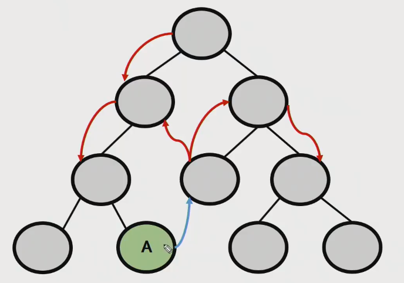
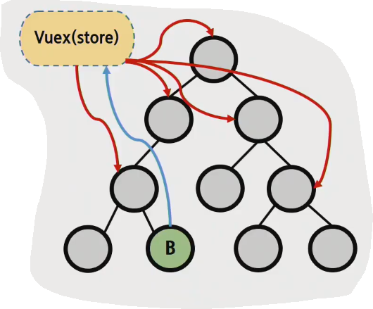
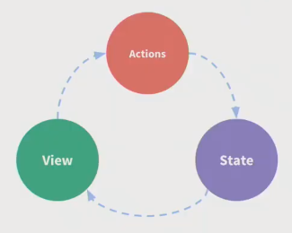
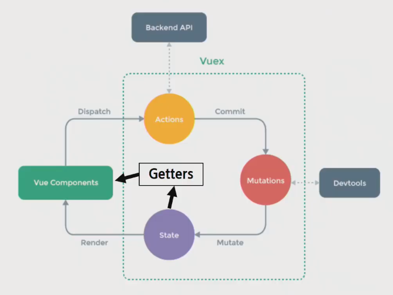

# Vue_210512_컴포넌트통신

## 오전 라이브

#### 지난시간

- SFC
- Vue CLI & VUe Router
  - Bable & Webpack
- Pass Props & Emit Event
  - Youtube Project

### Vuex

- statement management pattern + library for vue.js
  - 상태 관리 패턴 + 라이브러리
- 상태를 전역 저장소로 관리할 수 있도록 지원하는 라이브러리
  - state가 예측 가능한 방식으로만 변경될 수 있도록 보장하는 규칙 설정
  - 애플리케이션의 모든 컴포넌트에 대한 중앙 집중식 저장소 역할
- Vue의 공식 devtools와 통합되어 기타 고급 기능을 제공

#### state

- state는 data이며, 해당 어플리케이션의 핵심이 되는 요소
- 각 컴포넌트에서 관리 (.html의 경우 new Vue({}), SFC에서는 .vue에 해당)
- DOM은 data(state)에 반응하여 DOM을 렌더링
- **state = data**

#### In Vuex

- props와 emit event는 독립적으로 데이터를 관리하여 흐름을 직관적으로 파악 가능하지만, 컴포넌트의 중첩이 깊어지는 경우 다른 컴포넌트 (특히 동위 컴포넌트)로의 데이터 전달이 불편해지는 문제가 있음

- 중앙 저장소에서 state를 모아놓고 관리
- 규모가 큰 (컴포넌트 중첩이 깊은) 프로젝트에 매우 편리
- 각 컴포넌트에서는 중앙 집중 저장소의 state만 신경쓰면 됨
- 이를 공유하는 다른 컴포넌트는 알아서 동기화

### Vuex Core Concept

#### 단방향 데이터 흐름

- 상태(state)는 앱을 작동하는 원본 소스(data)
- 뷰(view)는 상태의 선언적 매핑
- 액션(action)은 뷰에서 사용자 입력에 대해 반응적으로 상태를 바꾸는 방법 (methods)

- 단점
  - 공통의 상태를 공유하는 여러 컴포넌트가 있는 경우 빠르게 복잡해짐
  - 예를 들면, 지나치게 중첩된 컴포넌트를 통과하는 prop

#### 상태 관리 패턴

- 컴포넌트의 공유된 상태를 추출하고 이를 전역에서 관리 하도록 함
- 컴포넌트는 커다란 뷰가 되며 모든 컴포넌트는 트리에 상관없이 상태에 액세스 하거나 동작을 트리거 할 수 있음
- 상태 관리 및 특정 규칙 적용과 관련된 개념을 정의하고 분리함으로써 코드의 구조와 유지 관리 기능 향상

#### Vuex 구성 요소

1. State
2. Actions
3. Mutations
4. Getters

