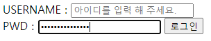
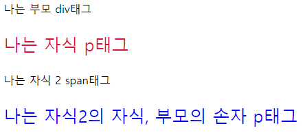

# Web_02_homework


### 1. Semantic Tag

> 보기 중 콘텐츠의 의미를 명확히 하기 위해 HTML5에서 새롭게 추가된 시맨틱(semantic)
> 태그를 모두 고르시오.

시맨틱 태그는 기존의 div와 같은 범위를 구분만 하는 태그에서 각 의미별 태그를 설정함으로써 개발자가 해당 태그가 어떤 역할을 하는지 명확히 이해할 수 있도록 돕기 위해 HTML5에서 생겨난 태그입니다. 

현재 문제에 있는 시맨틱 태그는 header, section, footer 3가지가 있으며 추가적으로 aside, nav, article이 있습니다.


### 2. input Tag

> 아래 이미지와 같이 로그인 Form을 생성하는 HTML코드를 작성하시오.
> 단, USERNAME 글자를 클릭하면 아이디를 입력하는 input에, PWD 글자를 클릭하면
> 비밀번호를 입력하는 input에 focusing 되도록 하시오.

``` html
<!-- form으로 생성, 각 구역을 article로 나눔(div도 가능), 
패스워드 옆엔 로그인 버튼이므로 같은 구역 안에 있어야함 -->
<form action="#">
    <article>
        <label for="id">USERNAME : </label>
        <input type="text" id="id" name="id" placeholder="아이디를 입력 해 주세요.">
    </article>
    <article>
        <label for="password">PWD : </label>
        <input type="password" name="password" id="password">
        <button>로그인</button>
    </article>
</form>
```

결과




### 3. 크기 단위

> 크기 단위 em은 요소에 지정된 상속된 사이즈나 기본 사이즈에 대해 상대적인 사이즈를
> 설정한다. 즉, 상속의 영향으로 사이즈가 의도치 않게 변경될 수 있는데 이를 예방하기
> 위해 HTML 최상위 요소의 사이즈를 기준으로 삼는 크기 단위는 무엇인가?

최상위 요소를 기준으로 삼는 크기는 rem입니다.


### 4. 선택자

> 다음 예제를 통해 ‘자손 결합자’와 ‘자식 결합자’의 차이를 설명하시오.

``` html
  <style>
    /* 본문에 적용으로는 예시를 보기가 쉽지 않아 수정 */
    /* 자손 결합자 */
    div p {
      color: blue;
      font-size: 25px;
    }
    /* 자식 결합자 */
    div > p {
      color: crimson;
    }
  </style>

  <div>나는 부모 div태그
    <p>나는 자식 p태그</p>
    <span>나는 자식 2 span태그
      <p>나는 자식2의 자식, 부모의 손자 p태그</p>
    </span>
  </div>
```

결과



자손 결합자의 경우 자신의 자손에 해당되면(자식의 자식 등) 모두 해당 스타일을 적용시킵니다.

자식 결합자의 경우 자신의 자식까지만 해당 스타일을 적용시킵니다.(손자 등등 대상 아님)