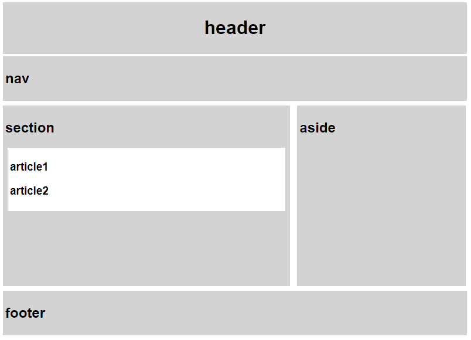

# Web_02_workshop


### 1. Semantic Tag

> 제시된 semantic.html과 semantic.css를 수정하여 다음 이미지와 같은 형태가 되도록
> 코드를 작성하시오.

``` html
<!-- 몸체 부분에 해당하는 클래스 추가 -->
<body>
  <header class="header">
    <h1>header</h1>
  </header>
  <nav class="nav">
    <h2>nav</h2>
  </nav>
  <section class="section">
    <h2 >section</h2>
    <article class="article">
      <h3>article1</h3>
      <h3>article2</h3>
    </article>
  </section>
  <aside class="aside">
    <h2>aside</h2>
  </aside>
  <footer class="footer">
    <h2>footer</h2>
  </footer>
</body>
```


``` css
/* 각 클래스별 설명대로 설정 */
.header {
  background-color: lightgray;
  margin: 4px;
  padding: 4px;
  text-align: center;
  border: 4px;
}

.nav {
  background-color: lightgray;
  margin: 4px;
  padding: 4px;
  border: 4px;
}

.section {
  background-color: lightgray;
  margin: 4px;
  padding: 4px;
  display: inline-block;
  width: 482px;
  height: 300px;
  border: 4px;
}

.article {
  background-color: white;
  margin: 4px;
  padding: 4px;
  border: 4px;
}

.aside {
  background-color: lightgray;
  margin: 4px;
  padding: 4px;
  display: inline-block;
  width: 280px;
  height: 300px;
  vertical-align: top;
  border: 4px;
}

.footer {
  background-color: lightgray;
  margin: 4px;
  padding: 4px;
  border: 4px;
}
```

결과

