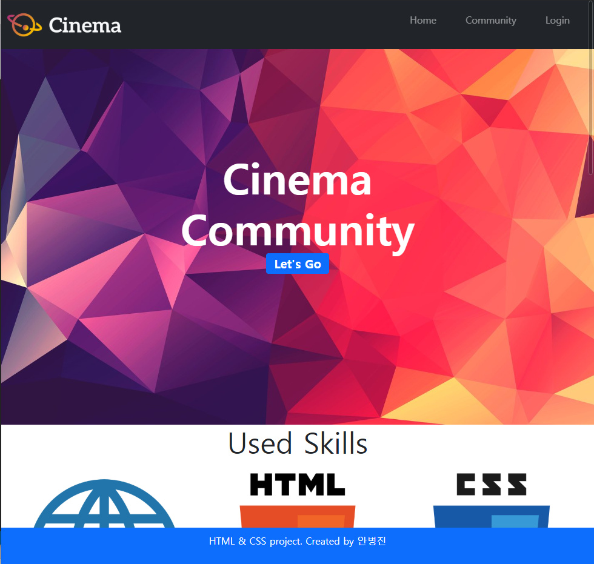

# Web_03_workshop


### 1.  Bootstrap Component

> 아래의 페이지를 Bootstrap Class를 활용하여 작성하시오.

``` html
<!-- 부트스트랩 cdn을 이용 -->
<link href="https://cdn.jsdelivr.net/npm/bootstrap@5.0.0-beta1/dist/css/bootstrap.min.css" rel="stylesheet" integrity="sha384-giJF6kkoqNQ00vy+HMDP7azOuL0xtbfIcaT9wjKHr8RbDVddVHyTfAAsrekwKmP1" crossorigin="anonymous">
<body>
  <!-- 1. Nav -->
  <nav class="bg-dark d-flex justify-content-between  fixed-top">
    <a href="#">
      
    </a>
    <ul class="p-3 d-flex justify-content-row text-warp align-items-center ">
      <li class="p-4"><a href="#" class="text-decoration-none text-white-50">Home</a></li>
      <li class="p-4"><a href="#" class="text-decoration-none text-white-50">Community</a></li>
      <li class="p-4"><a href="#" class="text-decoration-none text-white-50">Login</a></li>
    </ul>
  </nav>

  <!-- 2. Header -->
  <header class="d-flex flex-column justify-content-center align-items-center text-white ">
      <div class="display-1 fw-bold">Cinema</div>
      <div class="display-1 fw-bold">Community</div>
      <a href="#" class="badge bg-primary text-warp fs-5 text-decoration-none fw-bold ">Let's Go</a>
  </header>

  <!-- 3. Section -->
  <section >
    <h2 class="d-flex justify-content-center" >Used Skills</h2>
    <article class="col d-flex justify-content-evenly text-center ">
      <div>
        
        <p>Web</p>
      </div>
      <div>
        
        <p>HTML5</p>
      </div>
      <div>
        
        <p>CSS3</p>
      </div>
    </article>
  </section>

  <!-- 4. Footer -->
  <footer class="bg-primary d-flex justify-content-center align-items-center text-white fixed-bottom">
    <p>HTML & CSS project. Created by 안병진</p>
  </footer>
  <script src="https://cdn.jsdelivr.net/npm/bootstrap@5.0.0-beta1/dist/js/bootstrap.bundle.min.js" integrity="sha384-ygbV9kiqUc6oa4msXn9868pTtWMgiQaeYH7/t7LECLbyPA2x65Kgf80OJFdroafW" crossorigin="anonymous"></script>
</body>
```

결과


