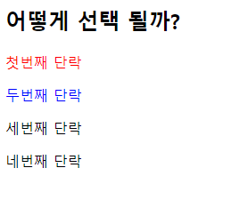

# Web_01_workshop


### 1. img tag

> 아래 그림과 같은 폴더 구조가 있다. resume.html에서 코드를 작성 중일 때, image
> 폴더 안의 my_photo.png를 보여주는  tag를 작성하시오.
> 단, 이미지가 제대로 출력되지 않을 때는 ssafy 문자열이 출력 되도록 작성하시오.

``` html

  <!-- src = 이미지의 경로 source alt = 이미지가 나오지 않을시 대체 텍스트(alter?) -->
```


### 2. 파일 경로

> 위와 같이 경로를 __(a)__로 작성 할 시, github에 업로드 하거나 전체 폴더의 위치가
> 변경 되었을 때 이미지를 불러 올 수 없게 된다. 이를 해결 하려면 이미지 경로를 __(b)__
> 로 바꾸어 작성하면 된다.
> __(a)__와 __(b)__에 들어갈 말과 __(b)__ 로 변경한 코드를 작성하시오.

``` html
<!-- a-절대 경로 b- 상대 경로 -->

```


### 3. Hyper Link

> 출력된 my_photo.png 이미지를 클릭하면 ssafy.com으로 이동하도록 하시오.

``` html
<a href="https://www.ssafy.com"></a>
```

a(anchor)태그 사이에 어떠한 값이 있어야 링크가 생성되는데 그것을 이미지로 끼워넣으면 a태그 링크가 이미지에 붙어서 링크를 걸게 됩니다.


### 4. 선택자

> 1) 아래의 코드를 작성하고 결과를 확인 하시오.
>
> 2) nth-child를 nth-of-type으로 변경하고 결과를 확인 하시오.

``` html
<div id="ssafy">
    <h2>어떻게 선택 될까?</h2>
    <p>첫번째 단락</p>
    <p>두번째 단락</p>
    <p>세번째 단락</p>
    <p>네번째 단락</p>
  </div>

  <style>
    #ssafy > p:nth-child(2) {
      color: red;
    }
    #ssafy > p:nth-of-type(2) {
      color: blue;
    }
  </style>
```



3) 작성한 코드를 참고하여 nth-child()와 nth-of-type()의 차이점을 작성하시오

nth-child는 전체 자식들의 순서 기준으로 하여 특정 순서의 자식만 효과를 적용합니다. 전체 자식이 대상이므로 p만이 아닌 h2 또한 포함 되기 때문에 전체 자식 중 2번째의 자식이 p인 경우에만 적용 됩니다. 그래서 2번째 순서인 첫번째 단락에서 효과가 적용 되었습니다. 만약 위에 p가 아닌 다른 속성이 있었다면 효과는 적용되지 않습니다.

nth-of-type은 효과를 적용하려는 대상의 자식들 중에서 해당 순서의 자식에만 적용됩니다. 여기 코드의 경우 p 속성의 2번째 순서인 두번째 단락에 효과가 적용되는 것을 봄으로써 알 수 있습니다.